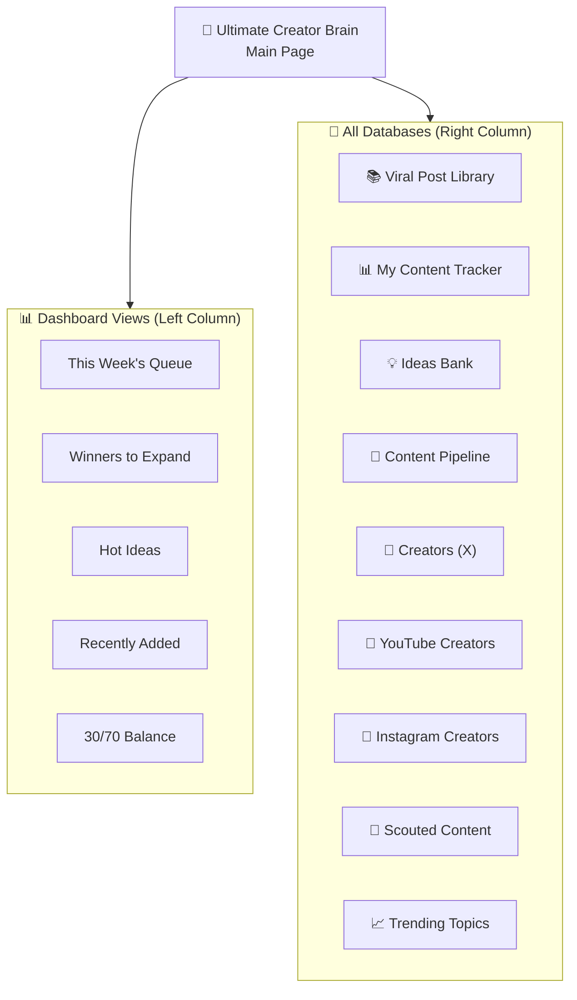
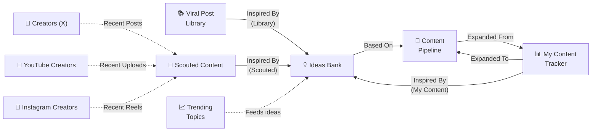

# 🗺️ Notion Database Map — Live MCP Snapshot

> Last updated: **July 9, 2026** — aligned with Idea Scout v4 code (`src/lib/notion.ts`, draft/write tasks).

---

## Database IDs & Data Source IDs

> ⚠️ **Notion API v5 breaking change:** `databases.query` was removed. All reads must use `dataSources.query` with `data_source_id`. Use `pages.create` with `database_id` for writes.

| Database              | Database ID (writes / `pages.create`)  | Data Source ID (reads / `dataSources.query`) |
| --------------------- | -------------------------------------- | -------------------------------------------- |
| 📚 Viral Post Library | `9c392141-a928-4813-a18e-676560fc4f62` | `93504640-6cf8-4676-9b4a-f74c8b706387`       |
| 💡 Ideas Bank         | `38f85f8c-eccf-4679-a2d3-6c0e6d386e7d` | `553eb2c3-82cb-4fb7-abff-6652cb694e4a`       |
| 📈 Trending Topics    | `3174a5db-f371-80cc-94a0-e4753a115f3a` | `3174a5db-f371-800c-b1a4-000bbeb4c669`       |
| 📅 Content Pipeline   | `8cc7a479-7eea-4092-a11b-81381d4524b0` | `4bfdc801-348f-4203-8966-9720d3e11088`       |
| 📊 My Content Tracker | `69f828a6-5d4d-4ae1-bd62-b415abefe757` | `75600b9e-4eba-4594-92ac-ce01fa85b0a8`       |
| 👤 Creators           | `18d75163-a3d6-455d-9d3d-2076f20d2fed` | `24e6bb9b-b226-4ff6-86b4-f6a72493029d`       |
| 📡 Scouted Content    | `3674a5db-f371-80ad-8ec6-f3e99bdd4191` | `3674a5db-f371-802c-b23e-000b7d73be04`       |
| 🎥 YouTube Creators   | `3674a5db-f371-80f9-8822-c0459d34168e` | `3674a5db-f371-80d3-bac9-000befffdd42`       |
| 📸 Instagram Creators | `3674a5db-f371-809a-88a9-d122c712139b` | `3674a5db-f371-80d2-bece-000b0dd38da2`       |

---

## Dashboard Architecture



---

## Cross-Database Relationships



---

## Database Schemas

### 1. 📚 Viral Post Library (PRIMARY)

**ID:** `9c392141-a928-4813-a18e-676560fc4f62`  
**Data Source ID:** `93504640-6cf8-4676-9b4a-f74c8b706387`  
**Role:** External intelligence — curated collection of high-performing content from other creators

| Property             | Type         | Description                                                                            |
| -------------------- | ------------ | -------------------------------------------------------------------------------------- |
| `Post Title`         | title        | Main concept/headline                                                                  |
| `Post URL`           | url          | Direct link to the post                                                                |
| `Author`             | rich_text    | @handle of the creator                                                                 |
| `Post Content`       | rich_text    | Full text of the post                                                                  |
| `Short Description`  | rich_text    | One-line summary                                                                       |
| `Platform`           | select       | X, YouTube, Newsletter                                                                 |
| `Format`             | select       | Short, Mid-length, Thread, Article, Video                                              |
| `Hook Type`          | select       | Story, Hot Take, How-To, Proof, Question, Vulnerable, Data                             |
| `Category`           | multi_select | 15 broad categories (Tech/AI, Web3/Crypto, Vibe Coding, etc.)                          |
| `⭐ Rating`          | select       | `⭐`, `⭐⭐`, `⭐⭐⭐`, `⭐⭐⭐⭐`, `⭐⭐⭐⭐⭐`, `⭐⭐⭐⭐⭐ (Holy Grail)` — 6 levels |
| `❤️ Likes`           | number       | Signal for agreement/vibe                                                              |
| `🔖 Bookmarks`       | number       | **High signal for value**                                                              |
| `🔁 Retweets`        | number       | Signal for virality                                                                    |
| `💬 Replies`         | number       | Signal for controversy/engagement                                                      |
| `👀 Views`           | number       | Signal for reach                                                                       |
| `💡 Why It Works`    | rich_text    | Psychological breakdown                                                                |
| `Steal-able Pattern` | rich_text    | Reusable template/structure                                                            |
| `Tweet Structure`    | rich_text    | Reusable outline (hook → build → proof → CTA)                                          |
| `Added Date`         | date         | When it was added                                                                      |

> **Automation note:** Idea Scout `draft-ideas` loads top ~30 posts rated ⭐⭐⭐⭐+ via `dataSources.query`. `research-tweets` (manual) writes new analyses here. Fields `Steal-able Pattern` and `Tweet Structure` feed packaging in the strategist plan.

**Views (live):**

- `Recently Added` — table, sort: Added Date ↓
- `By Category` — board, group by Category
- `By Format` — table, group by Format
- `By Hook Type` — gallery, group by Hook Type
- `By Rating` — table, group by ⭐ Rating
- `Top Views` — table, sort: 👀 Views ↓
- `Top Bookmarks` — table, sort: 🔖 Bookmarks ↓
- `Top Likes` — table, sort: ❤️ Likes ↓
- `Top Replies` — table, sort: 💬 Replies ↓

---

### 2. 📊 My Content Tracker

**ID:** `69f828a6-5d4d-4ae1-bd62-b415abefe757`  
**Data Source ID:** `75600b9e-4eba-4594-92ac-ce01fa85b0a8`  
**Role:** Internal intelligence — tracks YOUR post performance, identifies Winners

| Property              | Type                            | Description                                                                                                                                        |
| --------------------- | ------------------------------- | -------------------------------------------------------------------------------------------------------------------------------------------------- |
| `Post Title`          | title                           | The post title                                                                                                                                     |
| `Post URL`            | url                             | Link to the post                                                                                                                                   |
| `Content`             | rich_text                       | The actual post text                                                                                                                               |
| `Platform`            | select                          | X, YouTube, Newsletter                                                                                                                             |
| `Format`              | select                          | Short, Mid-length, Thread, Article, Video                                                                                                          |
| `Hook Type`           | select                          | Story, Hot Take, How-To, Proof, Question, Vulnerable, Data                                                                                         |
| `Category`            | multi_select                    | **10 Content Pillars** (Agentic, Automation, Vibe Coding, AI Tools, AI Workflows, Copywriting, Psychology, Creator Economy, Web3, AI as a Service) |
| `Status`              | select                          | Posted, Winner 🏆, Expanded, Archived                                                                                                              |
| `Date Posted`         | date                            | When it was posted                                                                                                                                 |
| `Metrics - Likes`     | number                          |                                                                                                                                                    |
| `Metrics - Bookmarks` | number                          |                                                                                                                                                    |
| `Metrics - RTs`       | number                          |                                                                                                                                                    |
| `Metrics - Replies`   | number                          |                                                                                                                                                    |
| `Metrics - Views`     | number                          |                                                                                                                                                    |
| `Performance Score`   | **formula**                     | `(Likes + RTs×2 + Replies×3) / Views × 100`                                                                                                        |
| `Lessons Learned`     | rich_text                       | What worked/didn't work                                                                                                                            |
| `Expanded To`         | **relation → Content Pipeline** | One-way link                                                                                                                                       |

---

### 3. 💡 Ideas Bank

**ID:** `38f85f8c-eccf-4679-a2d3-6c0e6d386e7d`  
**Data Source ID:** `553eb2c3-82cb-4fb7-abff-6652cb694e4a`  
**Role:** Synthesis hub — comprehension-first ExecutionPlans → drafted content

| Property                   | Type                              | Description |
| -------------------------- | --------------------------------- | ----------- |
| `Idea`                     | title                             | Working title; often format-suffixed (`— Thread`, `— Article`) |
| `Source`                   | select                            | Automation writes `Idea Scout` (other options may exist for manual/legacy) |
| `Status`                   | select                            | Pipeline: `💭 Raw` → Writer sets `📝 Drafted`. User may set `Rejected` (archived on next draft run). Other board statuses may exist for human workflow. |
| `Priority`                 | select                            | `🔥 Hot`, `💡 Good`, `📝 Maybe` — assigned by strategist |
| `Category`                 | multi_select                      | 8 active content pillars (Web3/Psychology frozen; filtered on write) |
| `Format Idea`              | select                            | `Short`, `Mid-length`, `Thread`, `Article`, `Video` |
| `Variation Set`            | rich_text                         | Shared label for multi-format ideas from one scouted source |
| `Hook Angle`               | rich_text                         | Opening angle / filled hook |
| `Why it works`             | rich_text                         | Strategic/psychological rationale (code property name) |
| `Steal-able Pattern`       | rich_text                         | Packaging pattern from Viral Library |
| `Tweet Structure`          | rich_text                         | Body structure skeleton |
| `Draft Tweet`              | rich_text                         | First ~2000 chars of draft; full text in page toggle |
| `Inspired By (Scouted)`    | **relation → Scouted Content**    | Source lineage (UUID from pipeline) |
| `Inspired By (Library)`    | **relation → Viral Post Library** | Optional template link |
| `Inspired By (My Content)` | **relation → My Content Tracker** | Manual/human lineage |

> **Automation note (v4):** `draft-ideas` creates pages at `Status = 💭 Raw`, `Source = "Idea Scout"`, with optional **Variation Set**. Page body: variation preamble → Hook + Output → collapsed strategist brief (outline, talking points, steps, gems) → Writer appends `▶️ Draft — {format}` and sets `📝 Drafted`. Up to 2 formats per rich source; `maxSourcesPerRun` caps how many scouted sources are processed per run.

**Views (live):**

- `Ready to Use` / drafted views — filter by `📝 Drafted` or human board statuses as configured
- `By Category` — table, group by Category
- `By Source` — table, group by Source
- `🔥 Hot Ideas Only` — table, filter: Priority = 🔥 Hot
- `Backlog` — table, filter: Status = 💭 Raw

---

### 4. 📅 Content Pipeline

**ID:** `8cc7a479-7eea-4092-a11b-81381d4524b0`  
**Data Source ID:** `4bfdc801-348f-4203-8966-9720d3e11088`  
**Role:** Execution engine — manages drafting through posting

| Property          | Type                              | Description                                    |
| ----------------- | --------------------------------- | ---------------------------------------------- |
| `Title`           | title                             | The content title                              |
| `Status`          | select                            | 📝 Drafting, ✅ Ready, 📅 Scheduled, 🚀 Posted |
| `Category`        | multi_select                      | **10 Content Pillars**                         |
| `Content Type`    | select                            | **30% Proven ✅** or **70% Experiment 🧪**     |
| `Format`          | select                            | Short, Mid-length, Thread, Article, Video      |
| `Draft`           | rich_text                         | Actual content draft                           |
| `Scheduled Date`  | date                              | When scheduled to post                         |
| `Posted URL`      | url                               | Link after publishing                          |
| `Move to Tracker` | checkbox                          | When done, triggers add to My Content Tracker  |
| `Based On`        | **relation → Ideas Bank**         |                                                |
| `Expanded From`   | **relation → My Content Tracker** | For Winner expansion                           |

---

### 5. 👤 Creators (X)

**ID:** `18d75163-a3d6-455d-9d3d-2076f20d2fed`  
**Data Source ID:** `24e6bb9b-b226-4ff6-86b4-f6a72493029d`  
**Role:** Research targets — X (Twitter) creators to study and scrape

| Property         | Type         | Description                                                                                                                                                                                                                                          |
| ---------------- | ------------ | ---------------------------------------------------------------------------------------------------------------------------------------------------------------------------------------------------------------------------------------------------- |
| `Handle`         | title        | The @username                                                                                                                                                                                                                                        |
| `Profile URL`    | url          | Link to X profile                                                                                                                                                                                                                                    |
| `Niche`          | multi_select | **30 options** — live tags: `Web3`, `AI`, `Growth`, `Creator Economy`, `Copywriting`, `Shitposting`, `Artificial Intelligence`, `Digital Entrepreneurship`, `Web3 & AI`, `Automation`, `Tech & Startups`, `Tech & AI`, `Entrepreneurship`, + 17 more |
| `Sub-Niches`     | multi_select | **175+ granular sub-niches** — `Vibe Coding`, `n8n Workflows`, `Agentic AI`, `Prompt Engineering`, `AI Agents`, `Content Automation`, `Shitposting`, `Crypto Culture`, `NFTs`, `Memecoins`, `Personal Branding`, `X Growth`, etc.                    |
| `Why I Follow`   | rich_text    | What patterns/skills they're known for                                                                                                                                                                                                               |
| `Posts Analyzed` | number       | Count of their posts in Viral Post Library                                                                                                                                                                                                           |
| `Last Checked`   | date         | When the automated pipeline last checked their tweets                                                                                                                                                                                               |

---

### 6. 🎥 YouTube Creators

**ID:** `3674a5db-f371-80f9-8822-c0459d34168e`  
**Data Source ID:** `3674a5db-f371-80d3-bac9-000befffdd42`  
**Role:** Research targets — YouTube channels to monitor for high-performing video analysis

| Property       | Type   | Description                                                              |
| -------------- | ------ | ------------------------------------------------------------------------ |
| `Name`         | title  | Name of the channel                                                      |
| `Channel URL`  | url    | Link to the YouTube channel page                                         |
| `Status`       | status | `Active` or `Inactive` — pipeline only checks `Active` creators           |
| `Last Checked` | date   | When the automated pipeline last checked their channel for new uploads    |

---

### 7. 📸 Instagram Creators

**ID:** `3674a5db-f371-809a-88a9-d122c712139b`  
**Data Source ID:** `3674a5db-f371-80d2-bece-000b0dd38da2`  
**Role:** Research targets — Instagram profiles to monitor for high-performing Reels analysis

| Property           | Type      | Description                                                           |
| ------------------ | --------- | --------------------------------------------------------------------- |
| `Name`             | title     | Name of the profile                                                   |
| `Instagram Handle` | rich_text | The handle (username) without `@`                                     |
| `Profile URL`      | url       | Link to the Instagram profile page                                    |
| `Last Checked`     | date      | When the automated pipeline last checked their profile for new reels  |

---

### 8. 📡 Scouted Content

**ID:** `3674a5db-f371-80ad-8ec6-f3e99bdd4191`  
**Data Source ID:** `3674a5db-f371-802c-b23e-000b7d73be04`  
**Role:** Raw database containing scraped posts, summaries, metrics, and transcripts from target platforms

| Property             | Type                             | Description                                                                          |
| -------------------- | -------------------------------- | ------------------------------------------------------------------------------------ |
| `Title`              | title                            | Title of the post/video/reel                                                         |
| `Platform`           | select                           | `X`, `YouTube`, `Instagram`                                                          |
| `URL`                | url                              | Direct link to the content                                                           |
| `Likes`              | number                           | Total likes at time of scrape                                                        |
| `Views`              | number                           | Total views (or plays) at time of scrape                                             |
| `Comments`           | number                           | Total comments at time of scrape                                                     |
| `Published Date`     | date                             | When the post was originally published by the creator                                |
| `Scouted Date`       | date                             | When the automated pipeline scraped the content                                      |
| `AI Summary`         | rich_text                        | Brief summary of the content's message (split in 2k-char chunks if needed)           |
| `Key Takeaways`      | rich_text                        | Bulleted list of strategic lessons/insights (split in 2k-char chunks if needed)      |
| `Niche`              | multi_select                     | The AI-classified content pillar(s) assigned to the post during ingestion.           |
| `Transcript`         | rich_text                        | Raw text of tweet, or audio transcript of reel/video. Stored as a multi-chunk rich text array (up to 200k chars) and appended inside a collapsible toggle block (`▶️ Full Transcript`) in the page body to prevent truncation. |
| `YouTube Creators`   | **relation → YouTube Creators**   | Backlink to the YouTube Creator (if Platform = YouTube)                              |
| `Instagram Creators` | **relation → Instagram Creators** | Backlink to the Instagram Creator (if Platform = Instagram)                          |
| `👤 Twitter Creators` | **relation → Creators (X)**      | Backlink to the Twitter Creator (if Platform = X)                                    |

---

### 9. 📈 Trending Topics (LEGACY)

**ID:** `3174a5db-f371-80cc-94a0-e4753a115f3a`  
**Data Source ID:** `3174a5db-f371-800c-b1a4-000bbeb4c669`  
**Role:** [LEGACY] Real-time context — current trends mapped to your content pillars (from legacy Trend Scout cron)

| Property             | Type         | Description                                                                     |
| -------------------- | ------------ | ------------------------------------------------------------------------------- |
| `Topic/Trend`        | title        | The trend name                                                                  |
| `Status`             | select       | `🔥 Hot`, `📉 Fading`, `💀 Dead` — automation always sets `🔥 Hot` on ingest    |
| `Urgency`            | select       | `🔴 24 Hours`, `🟡 1 Week`, `🟢 1 Month` — LLM-assigned based on trend velocity |
| `Relevance`          | multi_select | **10 Content Pillars** — LLM-assigned matching pillar                           |
| `Platform Origin`    | select       | `X`, `YouTube`, `Reddit`, `News`                                                |
| `Source URL`         | url          | Link to catalyst tweet/article (manual)                                         |
| `Notes`              | rich_text    | **Automation format:** `Volume: {n} \| {1-sentence analysis}`                   |
| `Steal-able Pattern` | rich_text    | Steal-able template (present in DB schema)                                      |
| `Tweet Structure`    | rich_text    | Tweet structure outline (present in DB schema)                                  |
| `Related Topics`     | rich_text    | Cross-linked themes (manual)                                                    |
| `Action Items`       | rich_text    | Quick actions (manual)                                                          |
| `Date Logged`        | date         | Today's date — always set by automation                                         |

---

### 10. 💎 Viral Post Library (LEGACY)

**ID:** `2f64a5db-f371-813e-87c9-c5abe7063cff`  
**Role:** Older version with different schema — likely the original before the system redesign

> [!NOTE]
> This DB uses a different property naming scheme: `Likes` vs `❤️ Likes`, `Post Link` vs `Post URL`, includes `Tags` (multi_select for hook/style/emotion), `Key Takeaways`, `My Rating`, `Total Engagement` (formula), but **lacks** `Hook Type`, `Tweet Structure`, `Steal-able Pattern` as dedicated fields. The newer DB (above) is the primary one the automation should target.

---

## Key Differences: New vs Legacy Viral Library

| Feature            | New (Primary)          | Legacy                                          |
| ------------------ | ---------------------- | ----------------------------------------------- |
| Hook Type          | Dedicated select field | Encoded in `Tags` multi_select                  |
| Tweet Structure    | Dedicated rich_text    | Not present                                     |
| Steal-able Pattern | Dedicated rich_text    | Not present                                     |
| Total Engagement   | Not computed           | Formula: Likes + RTs + Bookmarks + Comments     |
| Rating             | `⭐ Rating` (6 levels) | `My Rating` (5 levels)                          |
| Format             | Simple labels          | Emoji-prefixed labels (📰 X Article, 🧵 Thread) |

---

## Automation Pipeline Flow

```
WEEKLY (Mon/Thu/Sat 8:30 AM) — Idea Scout Pipeline:
  scout-content (Runs Mon/Thu/Sat via Trigger.dev cron)
    ├── 1. Gather active focus creators (X: 24, YouTube: 10, Instagram: 10)
    │      sorted by Last Checked (oldest first)
    ├── 2. Scrape recent posts/uploads (last 7 days):
    │      ├── YouTube: Newest 5 videos via Apify
    │      ├── Instagram: Newest 30 reels, selects top 10 (newest/most viewed) via Apify, transcribes audio
    │      └── X: Scrapes recent tweets via TwitterAPI.io, programmatically filters by views (views >= MIN_VIEWS, default 1000)
    │             and pulls full-text X Articles using the getArticle endpoint if /article/ is detected
    ├── 3. Execute process-content in a concurrent batch:
    │      ├── Check duplicates (all-time URL deduplication check)
    │      ├── Relevance check (maps to 8 active content pillars, conf >= 0.6)
    │      ├── Disambiguation check (filters false positives)
    │      ├── Extract summaries & takeaways
    │      └── Create entry in 📡 Scouted Content (linked to source creator, saving Matched Pillars to "Niche" field)
    └── 4. Update Last Checked date on creators to rotate roster

DAILY (Mon-Sat 8:00 AM) — Idea Drafting Pipeline:
  draft-ideas (Runs Mon-Sat via Trigger.dev cron)
    ├── 1. Gather context from all sources:
    │      ├── Query top 30 VPL templates (4★/5★)
    │      ├── Soft-deduplicate against past 30 days of ideas
    │      └── Target underserved pillars from past 14 days
    ├── 2. Group scouted posts by their "Niche" multi-select tag (using AI-Keyword Sorter fallback if missing)
    ├── 3. Process each Niche group sequentially:
    │      ├── Filter templates matching Category tags relevant to the Niche
    │      ├── LLM cross-pollinates the group's insights with matched templates
    │      └── Create dynamic number of drafts (Math.max(1, Math.min(5, Math.ceil(groupItems.length * 0.75))) per chunk) in Ideas Bank
    │            (Source = "Idea Scout", links to Scouted Content & VPL pattern)
    └── 4. Pause for 1s between chunks to respect API limits
```

## Manual Content Lifecycle Through Databases

```
1. OBSERVE  → 📚 Viral Post Library (study what works externally)
2. IDEATE   → 💡 Ideas Bank (remix patterns into ideas, linked via "Inspired By")
3. DRAFT    → 📅 Content Pipeline (draft, tag 30/70, schedule)
4. POST     → 📊 My Content Tracker (track metrics, Performance Score)
5. EXPAND   → 📅 Content Pipeline again (Winners become threads/articles)
```
