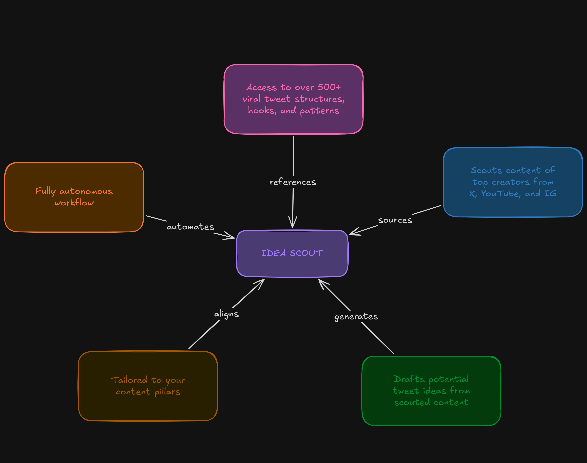

# Ultimate Creator Brain — Unified Idea Scout Pipeline (v4.1 Roadmap)

An agentic content scouting and **decision** system. It monitors target creators across YouTube, Instagram, and X (Twitter), filters noise with a guide-oriented LLM pass, then runs a comprehension-first pipeline:

**Comprehend → Brainstorm → Plan → Write → Validate → Evaluate → Curate → Select → Track → Learn**

Scout/draft generation produces source-grounded Short, Mid-length, Thread, and Article drafts in Notion (grouped by **Variation Set** when one source yields multiple formats). A separate editorial gate scores quality, recommends up to three daily picks, and closes the Idea → Pipeline → Tracker loop — while **selection and publishing stay human**.

---

## The Tech Stack

* **Background Orchestrator:** [Trigger.dev v3](https://trigger.dev/) (manual scout/draft workers + production-scheduled decision tasks).
* **Data Sources:** Notion API v5 (Custom-forked client with customized database reading endpoints).
* **Scraping Tools:** 
  * [Apify API](https://apify.com/) (Extracts YouTube video transcripts and Instagram Reels data).
  * [TwitterAPI.io](https://twitterapi.io/) (High-speed X search wrapper).
* **AI Engine:** [TokenRouter API](https://api.tokenrouter.com/v1) — MiniMax M3 for strategy, evaluation, and taste profiles; `x-ai/grok-4.3` for creative voice-matched drafts.
* **Environment:** TypeScript, Node.js, npm.

---

## Core Feature & Value Map

Here is the user-facing feature map for the **Idea Scout** agentic workspace. You can open and edit the interactive version using the link below:
* ⬜ [Interactive Excalidraw Board](https://excalidraw.com/#json=R_wmTfjZZwW4SBD8_gxaj,7rnQ8w-FECXdNaHO7PhnNA)



---

## Step-by-Step Workflow (With Simple Examples)

### Step 1: Read Creator Lists
The system queries your Notion Workspace to fetch active target accounts to monitor.
* **YouTube Creators:** Channel links (e.g. `youtube.com/@AlexHormozi`).
* **Instagram Creators:** Profile handles (e.g. `naval`).
* **X (Twitter) Creators:** Profile handles (e.g. `mrbeast`).

---

### Step 2: Multi-Source Scraping & Optimization
The scrapers gather recent content. To save API credits, several smart optimization strategies are applied:

* **X (Twitter):** Fetches recent tweets from each creator with a 5.5s throttle between requests.
  * *Views Filter:* Immediately drops tweets below **`TWITTER_MIN_VIEWS`** (default **3,000**) to avoid waste.
  * *X Article Support:* Detects long-form X Articles (via the `isArticle` flag or URLs containing `/article/`) and queries the TwitterAPI.io `/article` endpoint to retrieve the full article body, bypassing the standard tweet character limits.
* **YouTube:** Triggers Apify's `streamers/youtube-scraper` to pull the latest video metadata, subtitles, and transcripts (newest **5** per channel).
* **Instagram:** Triggers Apify's `apify/instagram-reel-scraper` with a larger metadata batch (~30), then keeps **`resultsLimit: 5`** per creator (~**3 newest + ~2 top-viewed** for credit control).
  * *Transcription:* Processes reels in **chunks of 3 concurrent actors** (with 2s cooldown between chunks) using `apple_yang/instagram-transcripts-scraper`.
* **Inter-Platform Cooldowns:** 5-second pauses between YouTube→Instagram and Instagram→Twitter phases allow Apify actors to release memory before the next phase starts.
* **Apify Token Rotation:** If the primary Apify API token hits rate limits or runs out of credits, the code automatically rotates through backup credentials (`BACKUP_APIFY_TOKEN`, `BACKUP_APIFY_TOKEN_2`, etc.) and retries.
* **Pre-Filtering Deduplication:** Before calling expensive transcript scraper actors, the system cross-references URLs against the Notion database to ensure we do not scrape a post we have already processed.

---

### Step 3: Single-Step LLM Filter (Relevance & Disambiguation)
To prevent your Notion databases from filling up with unrelated spam, the AI runs a single-step review:

* **Pillar Relevance Check:** The AI matches the post against active content pillars:
  * *Active Pillars:* Automation, AI Creative, AI Prompting & Tools, Vibe Coding, Creator Economy, Copywriting and Storytelling, Personal/Vulnerability, Building in Public.
  * *Frozen Pillars:* Web3 and Psychology remain readable for historical records, but they are ignored for new content processing and idea generation.
  * *Relevance threshold:* Must match an active pillar with a confidence score of $\ge 0.6$ or it is ignored.
  * *Expanded Context Limit:* The pipeline passes up to **100,000 characters** of the content/transcript to the LLM (expanded from 6,000 characters) to ensure full-length YouTube transcripts and X Articles are analyzed completely without early truncation.
  * *Scout Pass 1 cleaning:* YouTube/Instagram transcripts are deterministically cleaned (`prepareScoutContentBody`) — strip SFX, filler lines, consecutive dedupe — before gem extraction. Dense YT transcripts shrink ~0%.
* **Disambiguation Check:** Drops false-positives that match keywords by coincidence.
  * *Example:* A sports news post mentions "Kimi Antonelli" (an F1 racer) or "Amen Thompson" (an NBA player). The AI detects this is sports entertainment news rather than actionable tech or creator content, and automatically discards it.

---

### Step 4: Write to "Scouted Content" Database
For posts that pass the filters, the AI generates a 2-3 sentence **AI Summary** and 3-5 bulleted **Key Takeaways**. 

* **Notion Transcript Storage (fixes bare drafts):** A prior bug hard-truncated the `Transcript` property to 2,000 characters and skipped the page-body toggle — the Strategist only saw a snippet, producing shallow outlines. **Current behavior:**
  1. **`Transcript` property:** Chunked rich_text elements (2,000 chars each, up to 100 chunks via `splitIntoRichText()`) — not a single 2k substring.
  2. **Page body:** The **full, uncut transcript** is appended inside a collapsible toggle (`▶️ Full Transcript`) as batched paragraph blocks.
  3. **Read path:** `getScoutedContentByIds` extracts the toggle text via `extractRawTranscriptFromPageBody()` and passes it to the Strategist as authoritative source text.

#### Example Notion Scouted Entry:
* **Title:** "The Future of Vibe Coding with Claude Code"
* **Platform:** YouTube
* **Likes:** 10,200 | **Views:** 240,000
* **AI Summary:** "Explains how Claude Code allows non-developers to build full applications directly in terminal sessions."
* **Takeaways:**
  * Terminal-based AI agent speeds up development loops.
  * Natural language files are parsed directly into codebase changes.
* **Page Body:**
  ```markdown
  ▶️ Full Transcript
    [Full 15,000-character transcript text is safely stored here...]
  ```

---

### Step 5: The Source-First Two-Actor Idea Engine
The idea engine is **manual-only**: when `scout-content` is started from the Trigger.dev dashboard or API, it immediately dispatches **draft-ideas** with that run's scouted page IDs. **draft-ideas** can also be started directly to draft any **unlinked** scouted content from the past **14 days** (manual/orphaned). The **Value Strategist** studies sources serially using MiniMax M3 via TokenRouter; the **Writer** turns each `ExecutionPlan` into Short / Mid-length / Thread / Article using Grok 4.3 via TokenRouter.

#### Actor 1: The Value Strategist (`draft-ideas`, maxDuration **3600s**)
1. **Preserves rejected ideas** as taste-learning evidence — does **not** auto-archive Status = `Rejected`.
2. Loads context:
   - Targeted IDs from scout dispatch, **or** unlinked Scouted Content from the past **14 days**.
   - Top **30** Viral Post Library patterns rated ⭐⭐⭐⭐+.
   - Past **30 days** of Idea titles (soft dedup) and **14-day** pillar distribution (underserved balance).
   - **Active Taste Profile** (when ≥ 10 human ratings exist) for preference guidance.
3. **Prioritizes sources**: all YouTube/Instagram by raw source depth first, then caps X to ~30% of the YT/IG count; applies `maxSourcesPerRun` (**10**).
4. Skips sources thinner than **300** chars of raw depth.
5. **Resolves pillar** (`pillar-selection.ts`): single Niche tag → use it; multiple active tags → pick the underserved pillar (fewest recent Ideas); frozen Web3/Psychology → skip/Unknown.
6. Applies **transcript budget** (`transcript-cleaner.ts`):
   - Deterministic YT/IG clean; **head+tail** only if still over `strategistMaxTranscriptChars` (**30,000**).
   - MiniMax streaming (`strategistUseStreaming: true`) to avoid TokenRouter idle cutoff during `<think>`.
7. **Multi-phase comprehension** per source:
   - Comprehend → Brainstorm → Select (up to **2** formats when fit score ≥ 7) → Plan (`detailedOutline`, `talkingPoints`, `stepByStepProcess`, **Safe/Sharp/Bold hook variants**, viral structure).
8. **Variation Sets**: shared `Variation Set` label per source batch; titles get format suffixes (`— Thread`); multi-format siblings get preamble + footer links.
9. Writes Ideas Bank pages (status: 💭 Raw) with structured blocks (Hook/Output visible; strategist brief collapsed), then dispatches Writer async.

#### Actor 2: The Writer (`write-tweets`)
1. Receives the `ExecutionPlan` and the Notion Idea page ID, including talking points, step-by-step process, and hook variants when present.
2. Loads committed creator voice samples from `src/data/creator-voice-samples.json` (top 5 by voice mode) and optional Active Taste Profile.
3. Treats the source as the absolute authority and the viral template as packaging only.
4. If drafting an **Article**, loads 3 full, untruncated articles from `src/data/article-examples.json` as few-shot reference inputs.
5. Generates the draft using **Grok-4.3** (`x-ai/grok-4.3` via TokenRouter) at temperature 0.7.
6. Validates draft depth (`draft-validator.ts`):
   - **Article**: >= 1200 words (target 1500–3000) with >= 4 named `##` sections.
   - **Thread**: >= 8 posts (target 8–15) with progressive reasoning.
   - Retries once with an expansion hint if validation fails.
7. On depth-gate **failure**: Evaluation State → `Skipped`, status stays **💭 Raw**.
8. On success: `Draft Tweet` property (first 2k chars), full body in **`▶️ Draft — {format}`**, status → **📝 Drafted**, Evaluation State → `Pending`, then queues **`evaluate-draft`**.

#### Actor 3: The Editorial Evaluator (`evaluate-draft`)
1. Reads full draft, source context, strategist plan, and recent ideas (duplicate check).
2. Scores (1–10): Source Strength, Audience Fit, Novelty, Usefulness, Voice Fit, Hook Strength, Timeliness; **Effort Fit** is deterministic from format/length.
3. **Confidence Score** (fixed weights): usefulness 0.20; source / audience / novelty / voice / hook 0.15 each; timeliness 0.05.
4. Assigns shelf life (`24h` | `3d` | `7d` | `30d` | `Evergreen`) + optional `Expires At`; derives Priority from score (≥8.5 Hot, ≥7 Good, else Maybe).
5. Critical flags may include: `unsupported_claim`, `source_mismatch`, `generic_slop`, `weak_hook`, `voice_mismatch`, `duplicate_angle`, `incomplete_payoff`.
6. Routes: clean → stay **📝 Drafted**; flags or confidence below **6.5** → **👀 Needs Review**. Writes Hook A/B/C + Selected Hook when variants exist.
7. Historical drafts: `backfill-idea-evaluations` (batches of 10; skips Pending/Scored).

#### Decision and learning loop

1. **`curate-daily-ideas`** (07:00 Africa/Lagos, PRODUCTION) — up to 3 eligible drafts (confidence ≥ **7.5**, not expired, not recommended in last 7 days, distinct Variation Sets): **Best Overall**, **Quick Win**, **Bold Bet**. May return fewer than 3 rather than pad weak work.
2. **You** set Status to **✅ Selected** — automation never does this.
3. **`promote-selected-ideas`** (every 15 min) creates an idempotent Content Pipeline item and marks the idea **➡️ In Pipeline**.
4. **You** publish manually. **`sync-posted-content-to-tracker`** (hourly :05) moves a Pipeline item only when Status = **🚀 Posted**, `Move to Tracker` is checked, and `Posted URL` is present.
5. Rate ideas with **Human Rating**, **Taste Note**, **Rejection Reason**. After **10** ratings, **`refresh-taste-profile`** (Sunday 08:00 Africa/Lagos) can write an Active Taste Profile that guides future strategy/writing. Performance may inform guidance at 10 complete tracker posts; score-weight changes stay gated until 20.

#### Example of a Remix:
* **Scouted Input:** A transcript about using Claude Code to build static websites.
* **100 Viral Hooks Template:**
  * *Pattern:* "I built a [Product] in [Time] using [Tool]..."
* **ExecutionPlan Output:**
  * **Title:** "Claude Code Static Sites"
  * **Voice Mode:** Builder-Retrospective
  * **Format:** Thread
  * **Detailed Outline:** 
    1. Hook: Scroll-stopper showing speed.
    2. Setup: Installing Claude Code on the terminal.
    3. Workflow: Initializing the app with a single prompt.
    4. Execution: How Claude handles the build process.
    5. Takeaway: The shift to agentic vibe coding.
  * **Hook Filled Example:** "I built a full web app in 3 minutes using Claude Code. Here's how..."
  * **Talking Points:** terminal install, single-prompt init, agentic build loop, no boilerplate needed
  * **Step by Step Process:** 1. Install Claude Code → 2. Run init prompt → 3. Let agent build → 4. Deploy static output
  * **Do Not Invent:** no fake build time, fake revenue, or unsupported claims
* **Writer Output (via Grok-4.3):**
  ```text
  I built a full web app in 3 minutes using Claude Code.

  No templates. No boilerplate. Just one sentence in terminal.

  Here's the exact workflow 🧵

  [1/5] Install Claude Code on your terminal...
  ```

---

### Step 6: Write to "Ideas Bank" Database
The generated drafts are written directly to the **Ideas Bank** database.
* **Three-Phase Write**: Strategist creates the page (💭 Raw), Writer creates the draft (📝 Drafted), and Evaluator either confirms it or routes it to 👀 Needs Review.
* **Page layout**: optional Variation Set preamble → **Hook + Output** (visible) → collapsed strategist brief → **`▶️ Draft — {format}`** after write.
* **Variation Sets**: Multi-format outputs from one scouted source share a `Variation Set` property and cross-link in the page body.
* **Scored Drafts**: Voice DNA modes map to real creators (Builder-Retrospective → Dreyshq, Tool-Curator → Sharbel, Case-Study → Zaimiri), then a separate editorial gate judges quality.
  * *Plain-Language Rule:* Smart-builder voice — short sentences, niche-native terms when useful, no fake-smart abstractions.
  * *2,000 char limit bypass:* first 2k in `"Draft Tweet"` property; full text in the format-named draft toggle.
* **Deterministic Source Tracking**: `Inspired By (Scouted)` uses the source page ID from Notion.
* **Pillar Mapping**: `resolvePrimaryPillar` + `matchPillar` / `filterCategoryList` keep categories on the 8 active pillars.
* **Error Prevention**: Relation validation failures retry without relations so ideas are never lost.

#### Status legend (Ideas Bank)

| Status | Who sets it | Meaning |
| --- | --- | --- |
| `💭 Raw` | Strategist (create); Writer on depth-gate fail | Plan only, or draft failed structural validation (`Evaluation State: Skipped`) |
| `📝 Drafted` | Writer, then Evaluator may keep | Structurally valid draft; clean evaluation stays here |
| `👀 Needs Review` | Evaluator | Critical flags **or** Confidence Score below **6.5** |
| `✅ Selected` | **You only** | Authorizes Content Pipeline promotion |
| `➡️ In Pipeline` | `promote-selected-ideas` | Pipeline item exists; ready for human scheduling/posting |
| `Rejected` | **You** | Negative evidence for Taste Profile — **never auto-archived** |

**Priority** (`🔥 Hot` / `💡 Good` / `📝 Maybe`) is separate from Status and is derived from Confidence Score by the evaluator.

**Useful views:** Today’s Top 3 · Scored Drafts · Needs Review · Selected Ideas · Raw Writer Failures · Rejected Learnings.

---

### Operational Notes / Known Failure Modes
* **Bare drafts / thin outlines**: Usually means the Strategist saw a truncated transcript. Confirm the Scouted Content page has `▶️ Full Transcript` in the body and that `draft-ideas` logs show full `rawSourceText` depth. Run `npm run measure:transcripts` to validate cleaning reduction and head+tail needs against live Scouted Content.
* **Raw Ideas Need Investigation**: A page stuck in 💭 Raw usually means the Writer has not finished, failed, or failed the depth gate (`Evaluation State: Skipped`). Check Trigger.dev `write-tweets` logs.
* **Stuck Pending evaluation**: Writer queued `evaluate-draft` but scoring has not completed — check evaluator task logs; re-run `backfill-idea-evaluations` if needed.
* **Empty Today’s Top 3**: Normal when fewer than 3 drafts meet confidence ≥ 7.5 / not expired / not recently recommended. System will not pad with weak work.
* **Variation Sets**: Multi-format ideas share a `Variation Set` property; if siblings look disconnected, check that `appendVariationSiblingFooters` ran after multi-format creates.
* **Voice Sample Source of Truth**: Production Writer prompts use `src/data/creator-voice-samples.json`. `.tmp/creator-voice-samples.json` is only a regeneration/export artifact and is not deployed.
* **Frozen Pillars**: Web3/Psychology records remain in Notion for history, but new matching, drafting, and category writes should resolve those themes to `Unknown` or skip them.
* **Source cap**: Only `maxSourcesPerRun` (10) sources are drafted per run after platform weighting — deep YT/IG first.
* **Human gates**: Automation never sets `✅ Selected` and never publishes. Pipeline → Tracker requires Posted + Move to Tracker + Posted URL.
* **Roadmap schema**: `npm run migrate:roadmap` (or `:dry`) and `npm run verify:roadmap` after Notion property changes.

---

## Detailed System Configuration Reference

### 1. Notion Database Catalog
These are the exact database IDs used in the codebase.

#### Database IDs (Used for creating pages)
| Database Name | Database ID |
| :--- | :--- |
| **Viral Post Library** | `9c392141-a928-4813-a18e-676560fc4f62` |
| **Ideas Bank** | `38f85f8c-eccf-4679-a2d3-6c0e6d386e7d` |
| **Scouted Content** | `3674a5db-f371-80ad-8ec6-f3e99bdd4191` |
| **Creators (X)** | `18d75163-a3d6-455d-9d3d-2076f20d2fed` |
| **YouTube Creators** | `3674a5db-f371-80f9-8822-c0459d34168e` |
| **Instagram Creators** | `3674a5db-f371-809a-88a9-d122c712139b` |
| **Content Pipeline** | `8cc7a479-7eea-4092-a11b-81381d4524b0` |
| **My Content Tracker** | `69f828a6-5d4d-4ae1-bd62-b415abefe757` |
| **Taste Profiles** | `fb5e5bd1-9ff3-4a4c-a369-3f7f8322bc8a` |

#### Data Source IDs (Used for database queries)
| Database Name | Data Source ID |
| :--- | :--- |
| **Viral Post Library** | `93504640-6cf8-4676-9b4a-f74c8b706387` |
| **Ideas Bank** | `553eb2c3-82cb-4fb7-abff-6652cb694e4a` |
| **Scouted Content** | `3674a5db-f371-802c-b23e-000b7d73be04` |
| **Creators (X)** | `24e6bb9b-b226-4ff6-86b4-f6a72493029d` |
| **YouTube Creators** | `3674a5db-f371-80d3-bac9-000befffdd42` |
| **Instagram Creators** | `3674a5db-f371-80d2-bece-000b0dd38da2` |
| **Content Pipeline** | `4bfdc801-348f-4203-8966-9720d3e11088` |
| **My Content Tracker** | `75600b9e-4eba-4594-92ac-ce01fa85b0a8` |
| **Taste Profiles** | `39652859-413b-42aa-8d75-0ac42e24a7fc` |

---

### 2. Database Field Properties

#### Ideas Bank DB Schema
| Property Name | Property Type | Value Description |
| :--- | :--- | :--- |
| `Idea` | Title | Working title; often format-suffixed (e.g. `Claude Code Stack — Thread`) |
| `Source` | Select | Hardcoded to `"Idea Scout"` |
| `Category` | Multi-select | Maps to the matched content pillar(s) |
| `Hook Angle` | Rich text | Breakdown of the hook psychology / filled hook |
| `Why it works` | Rich text | Human psychology driver behind the concept |
| `Status` | Select | `💭 Raw` → `📝 Drafted` / `👀 Needs Review` → human `✅ Selected` → `➡️ In Pipeline`; human may set `Rejected` (kept for learning) |
| `Priority` | Select | Derived from Confidence Score (`🔥 Hot` ≥8.5, `💡 Good` ≥7, else `📝 Maybe`) |
| `Format Idea` | Select | `Short`, `Mid-length`, `Thread`, `Article`, `Video` |
| `Variation Set` | Rich text | Shared label grouping multi-format ideas from one scouted source |
| `Steal-able Pattern`| Rich text | Copied from the Viral Post Library pattern template |
| `Tweet Structure` | Rich text | Copied from the Viral Post Library structure template |
| `Draft Tweet` | Rich text | Draft preview (first 2,000 characters); full text in `▶️ Draft — {format}` toggle |
| `Inspired By (Scouted)` | Relation | Link back to the Scouted Content database entry |
| `Inspired By (Library)` | Relation | Optional viral library template |
| `Source Strength` … `Effort Fit` | Number | Component scores 1–10 (Effort Fit is deterministic) |
| `Confidence Score` | Number | Weighted editorial confidence |
| `Evaluation State` | Select | `Pending`, `Scored`, `Failed`, or `Skipped` |
| `Evaluation Version` / `Evaluated At` | Text / Date | Evaluator provenance |
| `Critical Flags` / `Improvement Notes` / `Recommendation Reason` | Text | Editorial evidence |
| `Shelf Life` / `Expires At` | Select / Date | Timeliness for daily curation |
| `Recommendation Date`, `Daily Rank`, `Recommendation Role` | Date / Number / Select | Today’s Top 3 (Best Overall, Quick Win, Bold Bet) |
| `Human Rating`, `Taste Note`, `Rejection Reason` | Select / Text / Select | Explicit feedback for Taste Profile learning |
| `Hook A`, `Hook B`, `Hook C`, `Selected Hook`, `Hook Psychology` | Text / multi-select | Safe, Sharp, Bold openers + psychology labels |
| `Pipeline Item` | Relation | Idempotent handoff into Content Pipeline |

#### Scouted Content DB Schema
| Property Name | Property Type | Value Description |
| :--- | :--- | :--- |
| `Title` | Title | Post title (capped at 200 characters) |
| `Platform` | Select | Platform source (`X`, `YouTube`, `Instagram`) |
| `URL` | URL | Link to the original video or post |
| `Likes` | Number | Number of likes |
| `Views` | Number | Number of views |
| `Comments` | Number | Number of comments |
| `Published Date` | Date | Date when the post was uploaded |
| `Scouted Date` | Date | Date when our system scouted it |
| `AI Summary` | Rich text | 2-3 sentence content overview |
| `Key Takeaways` | Rich text | 3-5 bulleted learnings |
| `Transcript` | Rich text | Chunked rich_text preview (2k per element); full transcript in page-body `▶️ Full Transcript` toggle |
| `YouTube Creators` | Relation | Relation link back to YT Creators database |
| `Instagram Creators` | Relation | Relation link back to IG Creators database |
| `👤 Twitter Creators` | Relation | Relation link back to X Creators database |

---

### 3. File Directory Structure

```text
src/
├── data/
│   ├── article-examples.json        — Curated untruncated X Article references for few-shot learning.
│   ├── creator-voice-samples.json   — Committed, reviewed few-shot examples for Writer voice modes.
│   └── viral-hook-templates.json    — 100 parsed hook templates.
│
├── lib/
│   ├── apify.ts                     — YouTube & Instagram scrapers + Apify token rotation.
│   ├── content-intelligence.ts      — Schemas for multi-stage strategist pipeline.
│   ├── draft-validator.ts           — Writer depth gates (words, sections, posts).
│   ├── hook-matcher.ts              — Enriched 100 hooks (psychology, Safe/Sharp/Bold, variants).
│   ├── idea-evaluation.ts           — Confidence scores, shelf life, critical flags, thresholds.
│   ├── idea-curation.ts             — Deterministic daily Top 3 selection.
│   ├── idea-roadmap-notion.ts       — Evaluation/curation/promote/sync/taste Notion I/O.
│   ├── idea-page-blocks.ts          — Ideas Bank page layout (Hook/Output + strategist brief).
│   ├── idea-scout-config.ts         — Caps/budgets (30k transcript, maxSourcesPerRun: 10, streaming).
│   ├── idea-variations.ts           — Variation Set labels, format title suffixes, preambles.
│   ├── transcript-cleaner.ts        — YT/IG clean + head+tail budget; scout Pass 1 body prep.
│   ├── notion-markdown-blocks.ts    — Markdown → native Notion blocks.
│   ├── notion.ts                    — DB reads/writes, transcripts, ideas, variation footers.
│   ├── twitter.ts                   — TwitterAPI.io client + views filter.
│   ├── llm.ts                       — TokenRouter (M3/Grok) + legacy OpenRouter helpers.
│   ├── voice-dna.ts                 — ExecutionPlan, voice modes, buildWriterPrompt().
│   ├── pillar-selection.ts          — Underserved multi-tag pillar routing.
│   ├── pillar-utils.ts              — Alias map, fuzzy match, filterCategoryList.
│   ├── scout-analysis.ts            — Scout Pass 1 analysis helpers.
│   └── constants.ts                 — Notion IDs, pillars, Twitter thresholds.
│
└── trigger/
    ├── idea-scout/
    │   ├── scout-content.ts         — Mon/Thu/Sun orchestrator + scrapers + draft dispatch.
    │   ├── process-content.ts       — Relevance filter + summary → Scouted Content.
    │   ├── comprehend-source.ts     — Multi-phase strategist (Comprehend → Plan).
    │   ├── draft-ideas.ts           — Prioritize sources, Variation Sets, dispatch Writer.
    │   ├── write-tweets.ts          — Grok writer + structural validation → queues evaluate-draft.
    │   ├── evaluate-draft.ts        — Editorial quality scoring and routing.
    │   ├── backfill-evaluations.ts  — Batch historical draft scoring.
    │   ├── curate-daily-ideas.ts    — Today’s Top 3 recommendations.
    │   ├── promote-selected-ideas.ts — ✅ Selected → Content Pipeline.
    │   ├── sync-posted-content.ts   — 🚀 Posted Pipeline → My Content Tracker.
    │   └── refresh-taste-profile.ts — Weekly human-feedback Taste Profile.
    │
    └── viral-library/
        └── research-tweets.ts       — Manual Viral Post Library research (from n8n port).
```

---

### 4. Background Workers Configuration
The system uses the following task registrations in Trigger.dev:

| Task ID | Trigger Type | Schedule / Trigger | Max Duration | Concurrency | Model |
| :--- | :--- | :--- | :--- | :--- | :--- |
| `scout-content` | `task` | On-demand (Manual Run) | 14400 seconds (4 hours) | 1 | — |
| `process-content`| `task` | Batched from orchestrator | 300 seconds (5 minutes) | 5 (queue limit) | `MiniMax-M3` (TokenRouter) |
| `draft-ideas` | `task` | Triggered by a manual `scout-content` run or started directly on-demand | **3600 seconds (1 hour)** | 1 | `MiniMax-M3` (TokenRouter, streaming) |
| `write-tweets` | `task` | Triggered by `draft-ideas` | 600 seconds (10 minutes) | — | `x-ai/grok-4.3` (TokenRouter, temp 0.7) |
| `evaluate-draft` | `task` | After valid writer output or backfill | 600 seconds | — | `MiniMax-M3` |
| `backfill-idea-evaluations` | `task` | Manual / script | 600 seconds | — | Dispatches `evaluate-draft` |
| `curate-daily-ideas` | `schedules.task` | Daily 07:00 Africa/Lagos (PRODUCTION) | 300 seconds | — | Deterministic |
| `promote-selected-ideas` | `schedules.task` | Every 15 min Africa/Lagos (PRODUCTION) | 600 seconds | — | Deterministic |
| `sync-posted-content-to-tracker` | `schedules.task` | Hourly :05 Africa/Lagos (PRODUCTION) | 600 seconds | — | Deterministic |
| `refresh-taste-profile` | `schedules.task` | Sunday 08:00 Africa/Lagos (PRODUCTION) | 600 seconds | — | `MiniMax-M3` |
| `research-tweets` | `task` | On-demand (Manual Run) | 14400 seconds (4 hours) | 1 | `MiniMax-M3` (TokenRouter) |

### 4b. Roadmap scripts

```bash
npm run migrate:roadmap        # add/ensure Notion roadmap properties
npm run migrate:roadmap:dry    # dry-run migration
npm run verify:roadmap         # live schema checks
npm run enrich:hooks           # enrich viral-hook-templates.json metadata
npm test                       # includes evaluation, curation, hook intelligence tests
```

---

### 5. Setup & Environment Variables
Create a `.env` file in the root directory:

```env
# Notion API
NOTION_API_KEY=secret_notion_key_goes_here

# TokenRouter (LLM Client for Idea Scout)
TOKENROUTER_API_KEY=tr-your-key-here

# OpenRouter (Optional: Used for legacy scripts or on-demand research only)
OPENROUTER_API_KEY=sk-or-your-key
OPENROUTER_MODEL=qwen/qwen3.6-plus

# X (Twitter) Scraper wrapper (either key works)
TWITTER_API_KEY=your-twitterapi-io-key
BACKUP_TWITTER_API_KEY=backup-twitterapi-io-key
TWITTER_MIN_VIEWS=3000

# Apify Scraper Keys (Rotates automatically to share credit loads)
APIFY_TOKEN=primary-apify-token
BACKUP_APIFY_TOKEN=backup-token-1
BACKUP_APIFY_TOKEN_2=backup-token-2
BACKUP_APIFY_TOKEN_3=backup-token-3
BACKUP_APIFY_TOKEN_4=backup-token-4

# Trigger.dev Credentials
TRIGGER_SECRET_KEY=tg_secret_key
TRIGGER_ENV=dev
```

---

### 6. Deployment Checklist

1. **Upload Secrets:** In your Trigger.dev Dashboard, add ALL environment variables to the production environment:
   - `NOTION_API_KEY`
   - `TOKENROUTER_API_KEY` ⚠️ **Critical** — missing this causes strategist and writer failures.
   - `APIFY_TOKEN` + `BACKUP_APIFY_TOKEN` through `BACKUP_APIFY_TOKEN_4`
   - `TWITTER_API_KEY` and/or `BACKUP_TWITTER_API_KEY`
   - `TWITTER_MIN_VIEWS` (default: `3000`)
2. **Run Deploy Command:** Run this in your terminal to sync your workers to production:
   ```bash
   npx trigger.dev@latest deploy
   ```
3. **Verify runs:** Run a test execution from the Trigger.dev dashboard to confirm everything is linked correctly.
4. **Validate transcript cap:** `npm run measure:transcripts` — measures real Scouted Content cleaning reduction and head+tail needs at the 30k strategist cap.
5. **Roadmap schema:** `npm run migrate:roadmap` then `npm run verify:roadmap` if Ideas Bank is missing evaluation/curation properties.
6. **Backfill scores (optional):** trigger `backfill-idea-evaluations` for historical `📝 Drafted` pages.
