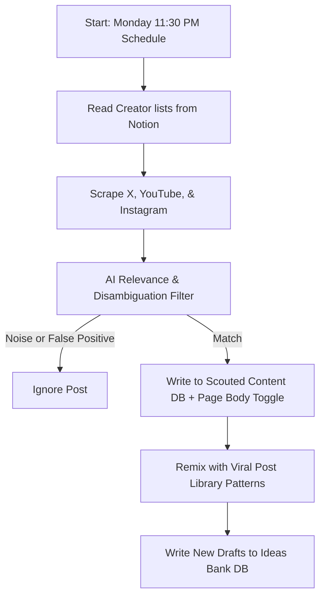

# Ultimate Creator Brain — Unified Idea Scout Pipeline

An automated agentic content scouting and idea remixing engine. This system monitors target creators across YouTube, Instagram, and X (Twitter), filters out noise using a two-tier LLM system, and remixes relevant concepts with high-performing templates to generate fresh tweet drafts directly inside Notion.

---

## The Tech Stack

* **Background Orchestrator:** [Trigger.dev v3](https://trigger.dev/) (Runs background cron schedules and concurrent worker tasks).
* **Data Sources:** Notion API v5 (Custom-forked client with customized database reading endpoints).
* **Scraping Tools:** 
  * [Apify API](https://apify.com/) (Extracts YouTube video transcripts and Instagram Reels data).
  * [TwitterAPI.io](https://twitterapi.io/) (High-speed X search wrapper).
* **AI Engine:** [OpenRouter API](https://openrouter.ai/) (Uses `qwen/qwen3.6-plus` or other configured OpenRouter models).
* **Environment:** TypeScript, Node.js, npm.

---

## High-Level Pipeline Flow



---

## Step-by-Step Workflow (With Simple Examples)

### Step 1: Read Creator Lists
The system queries your Notion Workspace to fetch active target accounts to monitor.
* **YouTube Creators:** Channel links (e.g. `youtube.com/@AlexHormozi`).
* **Instagram Creators:** Profile handles (e.g. `naval`).
* **X (Twitter) Creators:** Profile handles (e.g. `mrbeast`).

---

### Step 2: Multi-Source Scraping & Optimization
The scrapers gather recent content. To save API credits, several smart optimization strategies are applied:

* **X (Twitter):** Fetches recent tweets from each creator.
  * *Views Filter:* Immediately drops tweets that have **fewer than 1,000 views** to avoid waste.
* **YouTube:** Triggers Apify's `fast-youtube-transcript-scraper` to pull the latest video metadata and its **entire audio transcript** (spoken words).
* **Instagram:** Triggers Apify's `apify/instagram-reel-scraper` on the newest 30 reels.
  * *Virality Strategy:* Selects the **5 newest reels** (freshness) plus the **5 highest-viewed reels** (virality) from the rest, then runs Apify's `apple_yang/instagram-transcripts-scraper` on these 10 items.
* **Apify Token Rotation:** If the primary Apify API token hits rate limits or runs out of credits, the code automatically rotates through backup credentials (`BACKUP_APIFY_TOKEN`, `BACKUP_APIFY_TOKEN_2`, etc.) and retries.
* **Pre-Filtering Deduplication:** Before calling expensive transcript scraper actors, the system cross-references URLs against the Notion database to ensure we do not scrape a post we have already processed.

---

### Step 3: Single-Step LLM Filter (Relevance & Disambiguation)
To prevent your Notion databases from filling up with unrelated spam, the AI runs a single-step review:

* **Pillar Relevance Check:** The AI matches the post against active content pillars:
  * *Active Pillars:* Automation, AI Creative, AI Prompting & Tools, Vibe Coding, Web3, Creator Economy, Copywriting & Storytelling, Personal/Vulnerability, Building in Public.
  * *Relevance threshold:* Must match an active pillar with a confidence score of $\ge 0.6$ or it is ignored.
* **Disambiguation Check:** Drops false-positives that match keywords by coincidence.
  * *Example:* A sports news post mentions "Kimi Antonelli" (an F1 racer) or "Amen Thompson" (an NBA player). The AI detects this is sports entertainment news rather than actionable tech or creator content, and automatically discards it.

---

### Step 4: Write to "Scouted Content" Database
For posts that pass the filters, the AI generates a 2-3 sentence **AI Summary** and 3-5 bulleted **Key Takeaways**. 

* **Bypassing Notion's 2,000 Character Limit:** Notion cells cut off text longer than 2,000 characters. To prevent transcript loss:
  1. The system truncates the transcript field to 2,000 characters for the database column.
  2. It pastes the **entire, uncut transcript** inside a collapsible **Toggle Block** (`▶️ Full Transcript`) directly in the page body.

#### Example Notion Scouted Entry:
* **Title:** "The Future of Vibe Coding with Claude Code"
* **Platform:** YouTube
* **Likes:** 10,200 | **Views:** 240,000
* **AI Summary:** "Explains how Claude Code allows non-developers to build full applications directly in terminal sessions."
* **Takeaways:**
  * Terminal-based AI agent speeds up development loops.
  * Natural language files are parsed directly into codebase changes.
* **Page Body:**
  ```markdown
  ▶️ Full Transcript
    [Full 15,000-character transcript text is safely stored here...]
  ```

---

### Step 5: The Idea Remix & Drafting Phase
The system automatically translates scouted concepts into fresh drafts using proven hooks:

1. It reads your **Viral Post Library** database for patterns rated ⭐⭐⭐⭐ or higher.
2. It fetches the fresh **Scouted Content** entries.
3. It asks the AI to combine the scouted content topic with the viral pattern template structure.

#### Example of a Remix:
* **Scouted Input:** A transcript about using Claude Code to build static websites.
* **Viral Post Template:**
  * *Pattern:* "How to do [Action] in [Time] (without [Pain point])"
  * *Structure:* "Step 1: ... \nStep 2: ... \nStep 3: ..."
* **Output Idea Draft:**
  * **Idea:** "How to build a web app in 3 minutes using Claude Code (without writing code)"
  * **Hook Angle:** Direct benefit targeting low-code entrepreneurs.
  * **Why it works:** Hits a major pain point (no coding skills) and leverages speed (3 minutes).
  * **Draft Output:**
    ```text
    How to build a web app in 3 minutes using Claude Code (without writing code):

    Step 1: Install Claude Code on your terminal.
    Step 2: Type 'create a React landing page for a SaaS'.
    Step 3: Watch it write, debug, and test itself in real-time.

    Here is a full breakdown of the workflow...
    ```

---

### Step 6: Write to "Ideas Bank" Database
The generated tweet drafts are written directly to the **Ideas Bank** database.
* **Source Tracking:** The draft links back to the original scouted entry so you can easily reference the source.
* **Error Prevention:** If the relation schema has changed or is missing, the script catches the error and saves the idea anyway, preventing data loss.

---

## Detailed System Configuration Reference

### 1. Notion Database Catalog
These are the exact database IDs used in the codebase.

#### Database IDs (Used for creating pages)
| Database Name | Database ID |
| :--- | :--- |
| **Viral Post Library** | `9c392141-a928-4813-a18e-676560fc4f62` |
| **Ideas Bank** | `38f85f8c-eccf-4679-a2d3-6c0e6d386e7d` |
| **Scouted Content** | `3674a5db-f371-80ad-8ec6-f3e99bdd4191` |
| **Creators (X)** | `18d75163-a3d6-455d-9d3d-2076f20d2fed` |
| **YouTube Creators** | `3674a5db-f371-80f9-8822-c0459d34168e` |
| **Instagram Creators** | `3674a5db-f371-809a-88a9-d122c712139b` |
| **Content Pipeline** | `8cc7a479-7eea-4092-a11b-81381d4524b0` |

#### Data Source IDs (Used for database queries)
| Database Name | Data Source ID |
| :--- | :--- |
| **Viral Post Library** | `93504640-6cf8-4676-9b4a-f74c8b706387` |
| **Ideas Bank** | `553eb2c3-82cb-4fb7-abff-6652cb694e4a` |
| **Scouted Content** | `3674a5db-f371-802c-b23e-000b7d73be04` |
| **Creators (X)** | `24e6bb9b-b226-4ff6-86b4-f6a72493029d` |
| **YouTube Creators** | `3674a5db-f371-80d3-bac9-000befffdd42` |
| **Instagram Creators** | `3674a5db-f371-80d2-bece-000b0dd38da2` |
| **Content Pipeline** | `4bfdc801-348f-4203-8966-9720d3e11088` |

---

### 2. Database Field Properties

#### Ideas Bank DB Schema
| Property Name | Property Type | Value Description |
| :--- | :--- | :--- |
| `Idea` | Title | Compelling title summarizing the post concept |
| `Source` | Select | Hardcoded to `"Idea Scout"` |
| `Category` | Multi-select | Maps to the matched content pillar(s) |
| `Hook Angle` | Rich text | Breakdown of the hook psychology |
| `Why it works` | Rich text | Human psychology driver behind the concept |
| `Status` | Select | Defaults to `"💭 Raw"` |
| `Priority` | Select | AI priority selection (`🔥 Hot`, `💡 Good`, `📝 Maybe`) |
| `Format Idea` | Select | Suggests structure (`Short`, `Thread`, `Video`) |
| `Steal-able Pattern`| Rich text | Copied from the Viral Post Library pattern template |
| `Tweet Structure` | Rich text | Copied from the Viral Post Library structure template |
| `Inspired By (Scouted)` | Relation | Link back to the Scouted Content database entry |

#### Scouted Content DB Schema
| Property Name | Property Type | Value Description |
| :--- | :--- | :--- |
| `Title` | Title | Post title (capped at 200 characters) |
| `Platform` | Select | Platform source (`X`, `YouTube`, `Instagram`) |
| `URL` | URL | Link to the original video or post |
| `Likes` | Number | Number of likes |
| `Views` | Number | Number of views |
| `Comments` | Number | Number of comments |
| `Published Date` | Date | Date when the post was uploaded |
| `Scouted Date` | Date | Date when our system scouted it |
| `AI Summary` | Rich text | 2-3 sentence content overview |
| `Key Takeaways` | Rich text | 3-5 bulleted learnings |
| `Transcript` | Rich text | Truncated copy of the transcript (max 2,000 characters) |
| `YouTube Creators` | Relation | Relation link back to YT Creators database |
| `Instagram Creators` | Relation | Relation link back to IG Creators database |
| `👤 Twitter Creators` | Relation | Relation link back to X Creators database |

---

### 3. File Directory Structure

```text
src/
├── lib/
│   ├── apify.ts      — Controls YouTube & Instagram scrapers, handles token rotation.
│   ├── notion.ts     — Handles all database reads/writes and page creations.
│   ├── twitter.ts    — Controls TwitterAPI.io requests and views filters.
│   ├── llm.ts        — Manages connection to OpenRouter (Qwen).
│   └── constants.ts  — Stores Notion database IDs, source IDs, and content pillars list.
│
└── trigger/
    └── idea-scout/
        ├── scout-content.ts   — Orchestrator. Fetches creators and starts scrapers.
        ├── process-content.ts — Filters content relevance and writes to Scouted Content.
        └── draft-ideas.ts     — Remixes scouted posts with templates and writes to Ideas Bank.
```

---

### 4. Background Workers Configuration
The system uses the following task registrations in Trigger.dev:

| Task ID | Trigger Type | Schedule / Trigger | Max Duration |
| :--- | :--- | :--- | :--- |
| `scout-content` | `schedules.task` | Monday 11:30 PM (`30 23 * * 1`) | 3600 seconds |
| `process-content`| `task` | Batched from orchestrator | 120 seconds |
| `draft-ideas` | `task` | Triggered post-processing | 180 seconds |

---

### 5. Setup & Environment Variables
Create a `.env` file in the root directory:

```env
# Notion API
NOTION_API_KEY=secret_notion_key_goes_here

# OpenRouter (LLM)
OPENROUTER_API_KEY=sk-or-your-key
OPENROUTER_MODEL=qwen/qwen3.6-plus

# X (Twitter) Scraper wrapper
TWITTER_API_KEY=your-twitterapi-io-key
TWITTER_MIN_VIEWS=1000

# Apify Scraper Keys (Rotates automatically to share credit loads)
APIFY_TOKEN=primary-apify-token
BACKUP_APIFY_TOKEN=backup-token-1
BACKUP_APIFY_TOKEN_2=backup-token-2
BACKUP_APIFY_TOKEN_3=backup-token-3
BACKUP_APIFY_TOKEN_4=backup-token-4

# Trigger.dev Credentials
TRIGGER_SECRET_KEY=tg_secret_key
TRIGGER_ENV=dev
```

---

### 6. Deployment Checklist

1. **Upload Secrets:** In your Trigger.dev Dashboard, add your environment variables (`NOTION_API_KEY`, `APIFY_TOKEN`, etc.) to the project settings.
2. **Run Deploy Command:** Run this in your terminal to sync your workers to production:
   ```bash
   npx trigger.dev@latest deploy
   ```
3. **Verify runs:** Run a test execution from the Trigger.dev dashboard to confirm everything is linked correctly.
