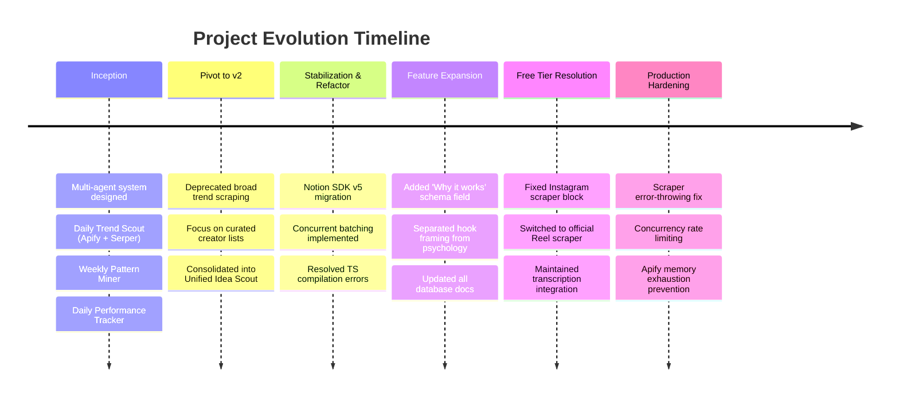

# Agentic Workflows — Chronological Project Log & Reference Manual

> **Last Updated:** May 26, 2026  
> **Project:** Ultimate Creator Brain — Unified Idea Scout Pipeline  
> **Platform:** Trigger.dev v3 (TypeScript), Notion API v5, OpenRouter (Qwen 3.6 Plus)

---

# SECTION 1: Chronological Project Logs & Changelog

This section documents the history of the codebase, key architectural shifts, additions, deletions, and implementation milestones.



---

### LOG ENTRY 1: Project Inception & Phase 1 Design
*Date: Mid-May 2026*

* **Goal:** Design an automation system to turn the Notion workspace into a content engine.
* **Initial Scope:**
  * **Daily Trend Scout:** A task running daily at 7 AM to scrape global trends via Apify (`karamelo/twitter-trends-scraper`), search hacker news, scrape Google News and Reddit (via Serper API), filters by pillar, and generate ideas.
  * **Weekly Pattern Miner:** A task running Monday at 9 AM to query the Viral Post Library for ⭐⭐⭐⭐+ rated posts and generate evergreen ideas in the Ideas Bank.
  * **Daily Performance Tracker:** A task running at 10 PM to pull user's recent tweets via TwitterAPI.io, calculate custom engagement scores, and flag winners.
* **Key Codebase Additions:**
  * Created `src/trigger/trend-scout/` (`fetch-trends.ts`, `filter-and-generate.ts`).
  * Created `src/trigger/pattern-miner/` (`mine-library.ts`, `generate-evergreen.ts`).
  * Created libraries: `src/lib/hackernews.ts`, `src/lib/web-search.ts` (Serper), `src/lib/creators.ts`.
  * Configured basic TypeScript and Trigger.dev boilerplate.

---

### LOG ENTRY 2: The Core Pivot to Unified Idea Scout (Transition to v2)
*Date: May 22, 2026*

* **Reasoning for Pivot:** Broad, algorithmic trends (news/Reddit) produced too much noise and generic ideas. The user wanted to eliminate algorithmic noise, reduce API credit costs, and focus on high-signal content from curated lists of target creators.
* **Architectural Simplification:**
  * Deprecated the daily **Trend Scout** and weekly **Pattern Miner** tasks.
  * Removed legacy files: `src/trigger/trend-scout/`, `src/trigger/pattern-miner/`, `src/lib/hackernews.ts`, `src/lib/web-search.ts`, and `src/lib/creators.ts`.
  * Introduced the **Unified Idea Scout** pipeline: Runs once weekly (Monday night), scraping a natural rotation of target creators on YouTube (descriptions/transcripts), Instagram Reels (transcripts), and X (tweets).
  * Merged the pattern mining logic directly into the synthesis step. The drafting task explicitly guides the LLM to adapt the `STEAL-ABLE TEMPLATE` and reuse the `TWEET STRUCTURE` verbatim, preserving proven engagement patterns.
* **Key Codebase Additions:**
  * Created `src/trigger/idea-scout/` folder containing the new unified task files:
    * `scout-content.ts` (Orchestrator: Monday 11:30 PM cron, gathers creators, dispatches scrapers, runs batches).
    * `process-content.ts` (Processor: runs relevance check, summaries, writes to Scouted Content DB).
    * `draft-ideas.ts` (Synthesis: The LLM synthesizes these with this week's scouted content to draft 5-8 highly targeted tweet concepts in the Ideas Bank DB).

---

### LOG ENTRY 3: Notion SDK v5 Updates, Batching, & TypeScript Stabilization
*Date: May 22–23, 2026*

* **Notion API v5 Migration:** Standardized all database read queries to use `dataSources.query` with `data_source_id` to fully align with the database client fork. Kept `pages.create` using `database_id` under `parent`.
* **Timeout Prevention & Batching:** Refactored the loop in `scout-content.ts` to run `process-content` tasks in parallel using Trigger.dev's `processContent.batchTriggerAndWait()`. This prevents timeouts during heavy scraping sessions and processes all creators concurrently.
* **Robustness & Edge Cases:**
  * Handled creator handles containing leading `@` symbols by stripping them before querying TwitterAPI.io.
  * Implemented a fallback in `createIdea` (`notion.ts`): If writing a relation attribute fails validation (e.g. Notion DB misalignment), the system catches the error and retries the write operation without the relation attributes to ensure ideas are never lost.
  * Resolved type compiler errors: Typed callback arguments, cast query reductions, and resolved compiler warning details. Run `npx tsc --noEmit` verified successfully (Exit code: 0).

---

### LOG ENTRY 4: "Why it works" Schema Expansion & Documentation Alignment
*Date: May 23, 2026 (Current Session)*

* **Goal:** Add a dedicated `Why it works` text property to the Ideas Bank database to capture the psychological and strategic reasoning behind each remixed concept, separating it from the structural `Hook Angle` framing.
* **Code Modifications:**
  * Modified `src/lib/notion.ts`: Added `whyItWorks` to `CreateIdeaOptions` and mapped it to the `Why it works` Notion rich text page property.
  * Modified `src/trigger/idea-scout/draft-ideas.ts`: Updated LLM instructions in the JSON schema prompt to separate the psychological analysis into a standalone `whyItWorks` field and pass it to the writer block.
* **Notion Manuals Alignment:**
  * Modified `Notion Knowledge/notion_database_map.md` to append the `Why it works` property.
  * Modified `Notion Knowledge/notion manual (UPDATED).MD` to document the new field under Section 4.2.

---

### LOG ENTRY 5: Instagram Scraper Free Tier Resolution
*Date: May 23, 2026*

* **Goal:** Resolve a hard-fail error where the `apidojo/instagram-scraper-api` actor blocked execution on the Apify Free plan.
* **Code Modifications:**
  * Modified `src/lib/apify.ts` to replace `apidojo/instagram-scraper-api` with the official, free-tier compatible `apify/instagram-reel-scraper` for the initial metadata fetch.
  * Updated the dataset mapping in `scrapeInstagramReels` to properly map `shortCode`, `likesCount`, `videoPlayCount`, and other specific fields.
  * Preserved the `crawlerbros/instagram-transcript-scraper` integration to pull transcripts natively.
  * Fixed a bug in `scripts/test-scrapers.ts` that attempted to log an undefined `playCount` property instead of `videoPlayCount` or `videoViewCount`.

---

### LOG ENTRY 6: Instagram Strategy Upgrades, Disambiguation Filter, and Twitter View-Only Refinements
*Date: May 24, 2026*

* **Goal:** Upgrade Instagram scraping strategy, add relevance disambiguation (relevance check against false positives), implement Apify token rotation, and refine Twitter programmatic engagement filters to exclude bookmark constraints.
* **Code Modifications:**
  * **Instagram Upgrades (`src/lib/apify.ts`)**: Updated `scrapeInstagramReels` to pull the newest 30 reels per creator, immediately selecting the 5 newest reels (freshness) plus the 5 highest-viewed reels (virality) from the remaining batch, merging them into 10 items. Replaced the legacy transcript scraper with `apple_yang/instagram-transcripts-scraper` mapping transcripts concurrently by `videoUrl`.
  * **Apify Token Rotation (`src/lib/apify.ts` & `src/lib/constants.ts`)**: Built a robust rotation loop across `APIFY_TOKEN` and backup variables `BACKUP_APIFY_TOKEN` (1 through 4) to ensure failover/credit sharing on rate limits or account exhaustion.
  * **Disambiguation / Relevance Filter (`src/trigger/idea-scout/process-content.ts`)**: Implemented a single-step LLM filter. Checks pillar relevance (confidence score $\ge 0.6$) and verifies disambiguation to discard keyword false positives (e.g. Formula 1 driver Kimi Antonelli, NBA athlete Amen Thompson) that are unrelated to tech or content creation.
  * **Twitter Programmatic Filter (`src/trigger/idea-scout/scout-content.ts`)**: Refined the filter to check only `views >= MIN_VIEWS` (default 1000). Completely removed bookmark filters (`MIN_BOOKMARKS`) to keep viral/popular tweets that have 0 bookmarks.
  * **Test Suites**: Created `scripts/test-disambiguation.ts` for validating relevance, updated `test-twitter.ts` to test programmatic view counts.

---

### LOG ENTRY 7: Production Hardening — Error Propagation & Concurrency Rate Limiting
*Date: May 25–26, 2026*

* **Goal:** Fix three production blockers: (1) Missing `OPENROUTER_API_KEY` in Trigger.dev prod causing silent LLM failures, (2) Apify free-tier memory exhaustion from too many concurrent actors, (3) Scrapers silently updating `Last Checked` on failed creators.
* **Code Modifications:**
  * **Scraper Error Propagation (`src/lib/apify.ts`, `src/lib/twitter.ts`):** Changed scrapers to `throw` on top-level failures instead of returning empty arrays. This ensures the per-creator `try/catch` in `scout-content.ts` catches the error and excludes the failed creator from `processedCreatorIds`, preventing false `Last Checked` updates.
  * **Instagram Transcript Concurrency (`src/lib/apify.ts`):** Replaced unbounded `Promise.all()` with chunked processing (max 3 concurrent transcript actors + 2s cooldown between chunks). Prevents Apify 8192MB free-tier memory exhaustion.
  * **Process-Content Queue Limit (`src/trigger/idea-scout/process-content.ts`):** Added `queue.concurrencyLimit: 5` to prevent 300+ parallel tasks from flooding Notion (3 req/s limit) and OpenRouter simultaneously.
  * **Notion Batch Read Chunking (`src/lib/notion.ts`):** `getScoutedContentByIds()` now processes in batches of 5 with 350ms delay to stay under Notion's rate limit.
  * **Inter-Platform Cooldowns (`src/trigger/idea-scout/scout-content.ts`):** Added 5-second pauses between YouTube→Instagram and Instagram→Twitter phases to allow Apify actors to release memory.
  * **Schedule Change:** Moved cron from `30 4 * * 2` (Tuesday 4:30 AM UTC) to `0 14 * * 2` (Tuesday 2:00 PM UTC / 3:00 PM WAT).
* **Environment Fix:** Added `OPENROUTER_API_KEY` and `OPENROUTER_MODEL` to Trigger.dev production environment variables.

---

# SECTION 2: System Reference & Current Architecture

### 1. The Unified Idea Scout Flow

The Unified Idea Scout pipeline runs weekly on Tuesday afternoons at 2:00 PM UTC (3:00 PM WAT). It runs in three sequential phases with concurrency controls:

```
Trigger.dev Tuesday Cron
│
└── scout-content (runs 2:00 PM UTC Tuesday, 3600s max)
    ├── Step 1: Fetch active creators from YouTube, Instagram, and X databases
    ├── Step 2: Trigger scrapers (with 5s cooldowns between platform phases)
    │           ├── YT: Apify actor, sequential per creator
    │           ├── ⏸️ 5s cooldown
    │           ├── IG: Apify actor, transcripts chunked to 3 concurrent + 2s delay
    │           ├── ⏸️ 5s cooldown
    │           └── X: TwitterAPI.io with 5.5s throttle per request
    ├── Step 3: Run process-content via batchTriggerAndWait (queue concurrencyLimit: 5)
    │           LLM relevance filter → AI summary → Scouted Content DB with creator relations
    ├── Step 4: Update Last Checked ONLY for successfully processed creators
    └── Step 5: Trigger draft-ideas to synthesize and write fresh drafts to Ideas Bank
```

---

### 2. Notion Database Inventory

#### Database IDs (used for `pages.create`)
| Database           | ID                                     |
| ------------------ | -------------------------------------- |
| Viral Post Library | `9c392141-a928-4813-a18e-676560fc4f62` |
| Ideas Bank         | `38f85f8c-eccf-4679-a2d3-6c0e6d386e7d` |
| Scouted Content    | `3674a5db-f371-80ad-8ec6-f3e99bdd4191` |
| Creators (X)       | `18d75163-a3d6-455d-9d3d-2076f20d2fed` |
| YouTube Creators   | `3674a5db-f371-80f9-8822-c0459d34168e` |
| Instagram Creators | `3674a5db-f371-809a-88a9-d122c712139b` |
| Content Pipeline   | `8cc7a479-7eea-4092-a11b-81381d4524b0` |
| My Content Tracker | `69f828a6-5d4d-4ae1-bd62-b415abefe757` |

#### Data Source IDs (used for `dataSources.query` in API v5)
| Database           | Data Source ID                         |
| ------------------ | -------------------------------------- |
| Viral Post Library | `93504640-6cf8-4676-9b4a-f74c8b706387` |
| Ideas Bank         | `553eb2c3-82cb-4fb7-abff-6652cb694e4a` |
| Scouted Content    | `3674a5db-f371-802c-b23e-000b7d73be04` |
| Creators (X)       | `24e6bb9b-b226-4ff6-86b4-f6a72493029d` |
| YouTube Creators   | `3674a5db-f371-80d3-bac9-000befffdd42` |
| Instagram Creators | `3674a5db-f371-80d2-bece-000b0dd38da2` |
| Content Pipeline   | `4bfdc801-348f-4203-8966-9720d3e11088` |
| My Content Tracker | `75600b9e-4eba-4594-92ac-ce01fa85b0a8` |

---

### 3. Database Schema Mappings

#### Ideas Bank (Write Properties)
| Property                | Type         | Description                                                    |
| ----------------------- | ------------ | -------------------------------------------------------------- |
| `Idea`                  | Title        | A compelling headline summarizing the post concept              |
| `Source`                | Select       | Hardcoded to `"Idea Scout"`                                    |
| `Category`              | Multi-select | Maps to the matched Content Pillar(s)                          |
| `Hook Angle`            | Rich text    | Summary of the psychological hook framing                      |
| `Why it works`          | Rich text    | LLM-analyzed psychological/strategic rationale for why it works |
| `Status`                | Select       | Defaults to `"💭 Raw"`                                         |
| `Priority`              | Select       | LLM-evaluated priority (`🔥 Hot`, `💡 Good`, `📝 Maybe`)       |
| `Format Idea`           | Select       | LLM-suggested structure (`Short`, `Thread`, `Video`, etc.)     |
| `Steal-able Pattern`    | Rich text    | Copied verbatim from the matched Viral Post Library pattern    |
| `Tweet Structure`       | Rich text    | Copied verbatim from the matched Viral Post Library structure  |
| `Inspired By (Scouted)` | Relation     | Direct link to the source entry in the Scouted Content DB     |

#### Scouted Content (Write Properties)
| Property             | Type      | Description                                                     |
| -------------------- | --------- | --------------------------------------------------------------- |
| `Title`              | Title     | Scraped item title (capped at 200 chars for Notion compatibility) |
| `Platform`           | Select    | Source platform (`X`, `YouTube`, `Instagram`)                    |
| `URL`                | URL       | Permanent link to the original video or post                     |
| `Likes`              | Number    | Likes count on target content                                   |
| `Views`              | Number    | Views count on target content                                   |
| `Comments`           | Number    | Comments count on target content                                 |
| `Published Date`     | Date      | Publish date on original platform                               |
| `Scouted Date`       | Date      | Date the pipeline processed and stored the content               |
| `AI Summary`         | Rich text | 2-3 sentence core message summary generated by the LLM           |
| `Key Takeaways`      | Rich text | 3-5 bulleted actionable items extracted from the transcript     |
| `Transcript`         | Rich text | Substring of transcript or tweet body (max 2000 chars)          |
| `YouTube Creators`   | Relation  | Links back to YT Creators DB (if YouTube content)               |
| `Instagram Creators` | Relation  | Links back to IG Creators DB (if Instagram content)             |
| `👤 Twitter Creators` | Relation  | Links back to X Creators DB (if Twitter content)                |

---

### 4. Active Content Pillars

| Content Pillar | Description / Scope |
| -------------- | ------------------- |
| **Automation** | n8n workflows, Make.com, AI agents, execution pipelines |
| **AI Creative** | AI video/image gen, UGC, ad creatives, faceless content |
| **AI Prompting & Tools** | Prompt engineering, Claude/ChatGPT tips, config hacks, hidden options |
| **Vibe Coding** | Cursor, Claude Code, Windsurf, coding products with LLMs |
| **Web3** | Crypto culture, NFTs, Web3 x AI utility |
| **Creator Economy** | X growth, audience monetization, digital products |
| **Copywriting & Storytelling** | Hooks, narrative structure, copywriting hacks (exact DB name match) |
| **Personal/Vulnerability** | Personal stories, lessons, behind-the-scenes founder context |
| **Building in Public** | Shipping updates, revenue transparency, founder journey |

> [!NOTE]
> The **Psychology** pillar has been frozen. Existing ideas in the databases are preserved, but the Idea Scout pipeline is instructed to ignore it for fresh filtering and idea generation.

---

### 5. File Structure Reference

```
src/
├── lib/
│   ├── apify.ts            — Apify Actor triggers for YouTube transcripts and Instagram Reels
│   ├── constants.ts        — Database IDs, Data Source IDs, Content Pillars list
│   ├── llm.ts              — The LLM System Prompt (OpenRouter)
│   ├── notion.ts           — Query creators, fetch patterns, read past ideas, create scouted entries/ideas
│   └── twitter.ts          — Advanced TwitterAPI.io search for monitoring focus creators
│
└── trigger/
    └── idea-scout/
        ├── scout-content.ts   — Tuesday 2:00 PM UTC cron orchestrator (gathers creators, scrapes, batch triggers processes)
        ├── process-content.ts — Concurrent task (max 5 parallel): filters relevance, generates summary, stores in Scouted Content
        └── draft-ideas.ts     — Idea drafting: pulls fresh scouted items, remixes with VPL patterns, writes to Ideas Bank
```

---

### 6. Trigger.dev Task Registry

| Task ID | Type | Trigger / Schedule | Max Duration | Concurrency | Status |
| ------- | ---- | ------------------ | ------------ | ----------- | ------ |
| `scout-content` | `schedules.task` | `0 14 * * 2` (Tuesday 2:00 PM UTC) | 3600s | 1 | Active |
| `process-content` | `task` | On-demand (Concurrent Batch) | 120s | 5 (queue limit) | Active |
| `draft-ideas` | `task` | On-demand (Post-Processing) | 180s | 1 | Active |

---

# SECTION 3: Environment Setup & Production Checklist

### 1. Environment Variables Required (.env)

```env
# Notion API Configuration
NOTION_API_KEY=

# OpenRouter / LLM Client Configuration
OPENROUTER_API_KEY=
OPENROUTER_MODEL=qwen/qwen3.6-plus

# Twitter API (TwitterAPI.io wrapper client)
TWITTER_API_KEY=
BACKUP_TWITTER_API_KEY=

# Twitter Programmatic Filter Configuration
TWITTER_MIN_VIEWS=1000

# Apify Scraper Token & Failover Rotation
APIFY_TOKEN=
BACKUP_APIFY_TOKEN=
BACKUP_APIFY_TOKEN_2=
BACKUP_APIFY_TOKEN_3=
BACKUP_APIFY_TOKEN_4=

# Trigger.dev Credentials
TRIGGER_SECRET_KEY=
TRIGGER_ENV=dev|prod
```

### 2. Checklist Before Production Deployment

- [ ] **Register Secrets in Production:** Upload ALL environment variables to the Trigger.dev cloud dashboard for the production environment, including:
  - `NOTION_API_KEY`
  - `OPENROUTER_API_KEY` ⚠️ (missing this causes silent LLM failures — content gets filtered with no error)
  - `OPENROUTER_MODEL`
  - `APIFY_TOKEN` + backup tokens
  - `BACKUP_TWITTER_API_KEY`
  - `TWITTER_MIN_VIEWS`
- [ ] **Deploy Project:** Run the deployment command:
  ```bash
  npx trigger.dev@latest deploy
  ```
- [ ] **Verify Production Run:** Trigger a dry run of the orchestrator task from the Trigger.dev dashboard to verify database mapping and scraper responses under production credentials.
