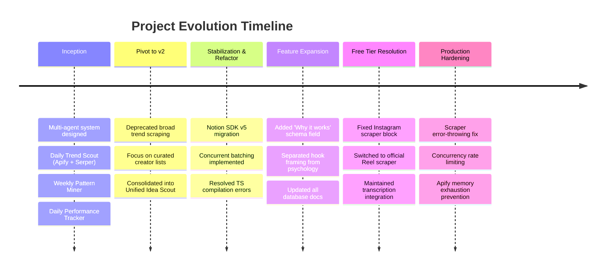

# Agentic Workflows — Chronological Project Log & Reference Manual

> **Last Updated:** July 13, 2026 (LOG 34 cleanup)  
> **Project:** Ultimate Creator Brain — Unified Idea Scout Pipeline (v4.1 Roadmap / Decision OS)  
> **Platform:** Trigger.dev v3 (TypeScript), Notion API v5, TokenRouter (MiniMax-M3 strategist/evaluator + `x-ai/grok-4.3` writer), Apify, TwitterAPI.io

---

# SECTION 1: Chronological Project Logs & Changelog

This section documents the history of the codebase, key architectural shifts, additions, deletions, and implementation milestones.



---

### LOG ENTRY 1: Project Inception & Phase 1 Design
*Date: Mid-May 2026*

* **Goal:** Design an automation system to turn the Notion workspace into a content engine.
* **Initial Scope:**
  * **Daily Trend Scout:** A task running daily at 7 AM to scrape global trends via Apify (`karamelo/twitter-trends-scraper`), search hacker news, scrape Google News and Reddit (via Serper API), filters by pillar, and generate ideas.
  * **Weekly Pattern Miner:** A task running Monday at 9 AM to query the Viral Post Library for ⭐⭐⭐⭐+ rated posts and generate evergreen ideas in the Ideas Bank.
  * **Daily Performance Tracker:** A task running at 10 PM to pull user's recent tweets via TwitterAPI.io, calculate custom engagement scores, and flag winners.
* **Key Codebase Additions:**
  * Created `src/trigger/trend-scout/` (`fetch-trends.ts`, `filter-and-generate.ts`).
  * Created `src/trigger/pattern-miner/` (`mine-library.ts`, `generate-evergreen.ts`).
  * Created libraries: `src/lib/hackernews.ts`, `src/lib/web-search.ts` (Serper), `src/lib/creators.ts`.
  * Configured basic TypeScript and Trigger.dev boilerplate.

---

### LOG ENTRY 2: The Core Pivot to Unified Idea Scout (Transition to v2)
*Date: May 22, 2026*

* **Reasoning for Pivot:** Broad, algorithmic trends (news/Reddit) produced too much noise and generic ideas. The user wanted to eliminate algorithmic noise, reduce API credit costs, and focus on high-signal content from curated lists of target creators.
* **Architectural Simplification:**
  * Deprecated the daily **Trend Scout** and weekly **Pattern Miner** tasks.
  * Removed legacy files: `src/trigger/trend-scout/`, `src/trigger/pattern-miner/`, `src/lib/hackernews.ts`, `src/lib/web-search.ts`, and `src/lib/creators.ts`.
  * Introduced the **Unified Idea Scout** pipeline: Runs once weekly (Monday night), scraping a natural rotation of target creators on YouTube (descriptions/transcripts), Instagram Reels (transcripts), and X (tweets).
  * Merged the pattern mining logic directly into the synthesis step. The drafting task explicitly guides the LLM to adapt the `STEAL-ABLE TEMPLATE` and reuse the `TWEET STRUCTURE` verbatim, preserving proven engagement patterns.
* **Key Codebase Additions:**
  * Created `src/trigger/idea-scout/` folder containing the new unified task files:
    * `scout-content.ts` (Orchestrator: Monday 11:30 PM cron, gathers creators, dispatches scrapers, runs batches).
    * `process-content.ts` (Processor: runs relevance check, summaries, writes to Scouted Content DB).
    * `draft-ideas.ts` (Synthesis: The LLM synthesizes these with this week's scouted content to draft 10 highly targeted tweet concepts in the Ideas Bank DB).

---

### LOG ENTRY 3: Notion SDK v5 Updates, Batching, & TypeScript Stabilization
*Date: May 22–23, 2026*

* **Notion API v5 Migration:** Standardized all database read queries to use `dataSources.query` with `data_source_id` to fully align with the database client fork. Kept `pages.create` using `database_id` under `parent`.
* **Timeout Prevention & Batching:** Refactored the loop in `scout-content.ts` to run `process-content` tasks in parallel using Trigger.dev's `processContent.batchTriggerAndWait()`. This prevents timeouts during heavy scraping sessions and processes all creators concurrently.
* **Robustness & Edge Cases:**
  * Handled creator handles containing leading `@` symbols by stripping them before querying TwitterAPI.io.
  * Implemented a fallback in `createIdea` (`notion.ts`): If writing a relation attribute fails validation (e.g. Notion DB misalignment), the system catches the error and retries the write operation without the relation attributes to ensure ideas are never lost.
  * Resolved type compiler errors: Typed callback arguments, cast query reductions, and resolved compiler warning details. Run `npx tsc --noEmit` verified successfully (Exit code: 0).

---

### LOG ENTRY 4: "Why it works" Schema Expansion & Documentation Alignment
*Date: May 23, 2026 (Current Session)*

* **Goal:** Add a dedicated `Why it works` text property to the Ideas Bank database to capture the psychological and strategic reasoning behind each remixed concept, separating it from the structural `Hook Angle` framing.
* **Code Modifications:**
  * Modified `src/lib/notion.ts`: Added `whyItWorks` to `CreateIdeaOptions` and mapped it to the `Why it works` Notion rich text page property.
  * Modified `src/trigger/idea-scout/draft-ideas.ts`: Updated LLM instructions in the JSON schema prompt to separate the psychological analysis into a standalone `whyItWorks` field and pass it to the writer block.
* **Notion Manuals Alignment:**
  * Modified `Notion Knowledge/notion_database_map.md` to append the `Why it works` property.
  * Modified `Notion Knowledge/notion manual (UPDATED).MD` to document the new field under Section 4.2.

---

### LOG ENTRY 5: Instagram Scraper Free Tier Resolution
*Date: May 23, 2026*

* **Goal:** Resolve a hard-fail error where the `apidojo/instagram-scraper-api` actor blocked execution on the Apify Free plan.
* **Code Modifications:**
  * Modified `src/lib/apify.ts` to replace `apidojo/instagram-scraper-api` with the official, free-tier compatible `apify/instagram-reel-scraper` for the initial metadata fetch.
  * Updated the dataset mapping in `scrapeInstagramReels` to properly map `shortCode`, `likesCount`, `videoPlayCount`, and other specific fields.
  * Preserved the `crawlerbros/instagram-transcript-scraper` integration to pull transcripts natively.
  * Fixed a bug in `scripts/test-scrapers.ts` that attempted to log an undefined `playCount` property instead of `videoPlayCount` or `videoViewCount`.

---

### LOG ENTRY 6: Instagram Strategy Upgrades, Disambiguation Filter, and Twitter View-Only Refinements
*Date: May 24, 2026*

* **Goal:** Upgrade Instagram scraping strategy, add relevance disambiguation (relevance check against false positives), implement Apify token rotation, and refine Twitter programmatic engagement filters to exclude bookmark constraints.
* **Code Modifications:**
  * **Instagram Upgrades (`src/lib/apify.ts`)**: Updated `scrapeInstagramReels` to pull the newest 30 reels per creator, immediately selecting the 5 newest reels (freshness) plus the 5 highest-viewed reels (virality) from the remaining batch, merging them into 10 items. Replaced the legacy transcript scraper with `apple_yang/instagram-transcripts-scraper` mapping transcripts concurrently by `videoUrl`.
  * **Apify Token Rotation (`src/lib/apify.ts` & `src/lib/constants.ts`)**: Built a robust rotation loop across `APIFY_TOKEN` and backup variables `BACKUP_APIFY_TOKEN` (1 through 4) to ensure failover/credit sharing on rate limits or account exhaustion.
  * **Disambiguation / Relevance Filter (`src/trigger/idea-scout/process-content.ts`)**: Implemented a single-step LLM filter. Checks pillar relevance (confidence score $\ge 0.6$) and verifies disambiguation to discard keyword false positives (e.g. Formula 1 driver Kimi Antonelli, NBA athlete Amen Thompson) that are unrelated to tech or content creation.
  * **Twitter Programmatic Filter (`src/trigger/idea-scout/scout-content.ts`)**: Refined the filter to check only `views >= MIN_VIEWS` (default 1000). Completely removed bookmark filters (`MIN_BOOKMARKS`) to keep viral/popular tweets that have 0 bookmarks.
  * **Test Suites**: Created `scripts/test-disambiguation.ts` for validating relevance, updated `test-twitter.ts` to test programmatic view counts.

---

### LOG ENTRY 7: Production Hardening — Error Propagation & Concurrency Rate Limiting
*Date: May 25–26, 2026*

* **Goal:** Fix three production blockers: (1) Missing `OPENROUTER_API_KEY` in Trigger.dev prod causing silent LLM failures, (2) Apify free-tier memory exhaustion from too many concurrent actors, (3) Scrapers silently updating `Last Checked` on failed creators.
* **Code Modifications:**
  * **Scraper Error Propagation (`src/lib/apify.ts`, `src/lib/twitter.ts`):** Changed scrapers to `throw` on top-level failures instead of returning empty arrays. This ensures the per-creator `try/catch` in `scout-content.ts` catches the error and excludes the failed creator from `processedCreatorIds`, preventing false `Last Checked` updates.
  * **Instagram Transcript Concurrency (`src/lib/apify.ts`):** Replaced unbounded `Promise.all()` with chunked processing (max 3 concurrent transcript actors + 2s cooldown between chunks). Prevents Apify 8192MB free-tier memory exhaustion.
  * **Process-Content Queue Limit (`src/trigger/idea-scout/process-content.ts`):** Added `queue.concurrencyLimit: 5` to prevent 300+ parallel tasks from flooding Notion (3 req/s limit) and OpenRouter simultaneously.
  * **Notion Batch Read Chunking (`src/lib/notion.ts`):** `getScoutedContentByIds()` now processes in batches of 5 with 350ms delay to stay under Notion's rate limit.
  * **Inter-Platform Cooldowns (`src/trigger/idea-scout/scout-content.ts`):** Added 5-second pauses between YouTube→Instagram and Instagram→Twitter phases to allow Apify actors to release memory.
  * **Schedule Change:** Moved cron from `0 14 * * 2` (Tuesday 2:00 PM UTC) to `0 2 * * 3` (Wednesday 2:00 AM UTC / 3:00 AM WAT).
* **Environment Fix:** Added `OPENROUTER_API_KEY` and `OPENROUTER_MODEL` to Trigger.dev production environment variables.

---

### LOG ENTRY 8: Max Duration Timeout Fix for Apify Scraping
*Date: May 26, 2026*

* **Goal:** Prevent the `scout-content` orchestrator from timing out in production during heavy Apify scraping and concurrent batch processing.
* **Code Modifications:**
  * Increased `maxDuration` from 3600s (1 hour) to 14400s (4 hours) in `src/trigger/idea-scout/scout-content.ts` and globally in `trigger.config.ts`.

---

### LOG ENTRY 9: Task Decoupling, Independent Scheduling, and API Robustness
*Date: May 27, 2026*

* **Goal:** Decouple `draft-ideas` from the `scout-content` orchestrator to prevent parent run hangs on child timeouts, set up client-side API timeouts to fail gracefully, and schedule the drafting task 3 times a week with automated source deduplication.
* **Code Modifications:**
  * **API Client Timeout (`src/lib/llm.ts`):** Added a 60-second client-side timeout (`timeout: 60000`) to the OpenAI/OpenRouter client to prevent infinite hangs on slow API calls.
  * **Platform Timeout Safety (`src/trigger/idea-scout/process-content.ts`):** Increased `process-content` `maxDuration` from 120s to 300s to ensure ample execution time for AI filters.
  * **Task Decoupling (`src/trigger/idea-scout/scout-content.ts`):** Removed Step 5 (triggering/waiting for `draftIdeas`) so the scraping orchestrator runs independently and finishes cleanly.
  * **Independent Scheduling (`src/trigger/idea-scout/draft-ideas.ts`):** Changed `draftIdeas` to a scheduled task (`schedules.task`) triggered Mon, Wed, Fri at 8:00 AM UTC (`0 8 * * 1,3,5`). Extracted `scoutedContentIds` from the payload to support both cron runs and manual/dashboard triggers.
  * **Source Deduplication (`src/lib/notion.ts`):** Modified `getRecentScoutedContent` to include a filter checking that `"Linked Ideas"` relation is empty (`relation: { is_empty: true }`). This ensures that the independent scheduled runs of `draft-ideas` only process newly scouted items that have not been remixed yet.
  * **Draft Ideas Count (`src/trigger/idea-scout/draft-ideas.ts`):** Raised the number of generated tweet drafts from 5-8 to 10.

---

### LOG ENTRY 10: Automated Cleanup of Rejected Ideas
*Date: May 28, 2026*

* **Goal:** Automatically delete ideas marked as "Rejected" from the Ideas Bank to sever their bi-directional relation with scouted content, freeing up the source material for the AI to reuse in future drafting runs.
* **Code Modifications:**
  * Added `cleanRejectedIdeas` to `src/lib/notion.ts`: Queries `NOTION_DATA_SOURCE_IDS.IDEAS_BANK` for ideas where `Status` equals `"Rejected"` and sets their `archived` property to `true`.
  * Updated `src/trigger/idea-scout/draft-ideas.ts`: Integrated `cleanRejectedIdeas` at the very beginning of the `run` method so it cleans up rejected ideas *before* querying scouted content.

---

### LOG ENTRY 11: Deep Documentation Alignment & Dual-Model Setup
*Date: May 28, 2026*

* **Goal:** Eradicate outdated documentation claims that cause AI agent hallucinations, clarify transcript saving behavior, and optimize processing cost via a dual-model LLM architecture.
* **Code Modifications:**
  * Modified `src/lib/llm.ts`: Added optional `modelOverride` to `generateText` and `generateJSON` functions.
  * Modified `src/trigger/idea-scout/process-content.ts`: Injected `xiaomi/mimo-v2.5-pro` into the filtering and summarization LLM calls to reduce token costs for heavy extraction workloads. `draft-ideas.ts` remains on `qwen/qwen3.6-plus` for creative synthesis.
* **Documentation Actions:**
  * **Deleted** `doc.md` (a legacy snapshot from May 25th that asserted inaccurate bugs).
  * **Rewrote** `README.md` to formally document the single-step LLM filter, document the dual-model LLM architecture, and clarify that Notion's 2,000 char per-element limit is bypassed via chunked rich_text properties plus the full transcript in the page-body toggle (see LOG ENTRY 25 for the bare-draft root-cause fix).

---

### LOG ENTRY 12: Niche-Based Chunked Drafting & Notion Schema Standardization
*Date: May 28, 2026 (Current Session)*

* **Goal:** Eradicate "idea poisoning" (mixing irrelevant categories) and parent run timeouts by grouping scouted content by AI-matched niches, standardizing on a single Multi-Select property in Notion, and executing chunked synthesis loops.
* **Code Modifications:**
  * **Schema Standardization (`src/lib/notion.ts`):** Unified database operations (reads and writes) on the `"Niche"` multi-select property in the `Scouted Content` database (replacing the legacy `"Pillars"` schema concept).
  * **Core Chunked Drafting Rewrite (`src/trigger/idea-scout/draft-ideas.ts`):** Modified the synthesis runner to group scouted posts by their `"Niche"` values. It loops through each niche group sequentially, matches relevant viral templates, calculates dynamic target counts (`length * 0.75`), prompts OpenRouter, writes the drafts, and pauses for 1s between chunks.
  * **Decoupled Business Logic (`src/trigger/idea-scout/draft-ideas.ts`):** Extracted `runDraftIdeas` so it can be verified locally.
  * **One-Time Tagging Migration (`scripts/tag-existing-content.ts`):** Created a recursive paginated migration script that fetched **308 total historical posts** missing niche tags, categorized them using `google/gemini-3.1-flash-lite`, and updated them safely in Notion without deleting data. An audit script (`count-empty-niches.ts`) verified that 100% of posts were fully tagged (0 remaining untagged).
  * **Local Test Suite (`scripts/test-draft-locally.ts`):** Created a script to locally trigger the synthesis logic and verify Notion page creations.
### LOG ENTRY 13: Parallel LLM Synthesis, Throttled Notion Writes, and Title Cleaning Helper
*Date: May 29, 2026*

* **Goal:** Resolve Trigger.dev task execution timeouts in the `draft-ideas` pipeline caused by sequential LLM calls, and fix the empty `Inspired By (Scouted)` relations bug in the Notion Ideas Bank.
* **Code Modifications:**
  * **Parallel LLM Synthesis with Concurrency Limit (`src/trigger/idea-scout/draft-ideas.ts`):** Parallelized LLM calls across all niche groups to run concurrently instead of sequentially. Implemented a concurrency limiter (`CONCURRENCY_LIMIT = 3`) to process 3 niche groups at a time to prevent API key/network congestion or rate limits from causing timeout failures.
  * **Throttled Sequential Notion Writes (`src/trigger/idea-scout/draft-ideas.ts`):** Decoupled the database writes from LLM synthesis. All synthesized ideas are gathered, flattened, and then sequentially inserted into the Notion database with a `350ms` delay between writes to respect Notion's 3 requests/second rate limits.
  * **Title Cleaning and Matching (`src/trigger/idea-scout/draft-ideas.ts`):** Added a `cleanTitle` helper to strip platform prefixes (like `[youtube]`, `instagram post:`) and normalize whitespace before matching LLM output titles against scouted content titles. Enabled flexible title matching (prefix match up to 30 characters, min 15, or substring inclusion) to guarantee correct population of the `Inspired By (Scouted)` relation.
  * **Increased client timeout (`src/lib/llm.ts`):** Raised client-side OpenAI timeout from 60 seconds to 120 seconds to prevent large parallel synthesis requests from throwing connection timeouts.
  * **Local validation:** Created and ran a local test script `scripts/check-ideas.ts` verifying that generated ideas were correctly tagged with their content pillars and correctly linked to their scouted source and library templates.

---

### LOG ENTRY 14: Direct REST Twitter Scraper Migration, X Articles Fetching Fix, Deterministic Relation Linking, and Trigger.dev Batch Chunking
*Date: May 30, 2026 (Current Session)*

* **Goal:** Replace blocked Apify X/Twitter scraper, fix empty X Article full-body fetches, raise Notion relation matching rate to 100%, and prevent the Trigger.dev orchestrator from hanging in "waiting".
* **Code Modifications:**
  * **X Scraper REST Migration (`src/lib/twitter.ts` & `src/trigger/idea-scout/scout-content.ts`):** Replaced Apify's blocked `twitter-scraper-lite` actor with a direct client call to the `/tweet/advanced_search` endpoint of `twitterapi.io`. Implemented a sequential creator loop with a `5.5-second` delay to stay within the 1 QPS free-tier rate limit, preventing `429` rate-limit blocks.
  * **X Articles Parameter Correction (`src/lib/twitter.ts`):** Identified and fixed a parameter mismatch in the `getArticle` helper where it was passing `tweetId` instead of the expected `articleId` (`params: { articleId: tweetId }`). This allows X Articles to successfully fetch the full article markdown body.
  * **Deterministic Relation Linking (`src/trigger/idea-scout/draft-ideas.ts`):** Injected Notion Page IDs directly into the LLM synthesis context (e.g. `[ID: pageId]`) and updated the prompt schema to return `"inspiredByScoutedIds"`. The matching loop now extracts these IDs using a UUID regex `/[0-9a-f]{8}-[0-9a-f]{4}-[0-9a-f]{4}-[0-9a-f]{4}-[0-9a-f]{12}/i`, achieving a 100% relation mapping success rate. Added `cleanTitle` matching as a robust safety fallback.
  * **Trigger.dev Batch Chunking (`src/trigger/idea-scout/scout-content.ts`):** Chunked the large 80+ item `batchTriggerAndWait` dispatch into groups of 15 items with a 2-second cooldown to prevent the Trigger.dev orchestrator run from hanging in the `"waiting"` state.
  * **LLM JSON Syntax Repair (`src/lib/llm.ts`):** Added a regex-based `repairJson(str)` helper that automatically heals minor LLM formatting flukes (e.g., missing commas between object properties on newlines or trailing commas in arrays/objects).
  * **Local validation:** Created and ran a mock relation writing test script `scripts/test-relation-writing.ts` that successfully wrote a mock idea to Notion and mapped it directly to its scouted content item using its UUID page ID.

---

### LOG ENTRY 15: Ported Twitter Content Research Workflow to Trigger.dev
*Date: May 31, 2026 (Current Session)*

* **Goal:** Port the user's idle n8n workflow for scraping focus creators' viral tweets into a native manual task in the current workspace.
* **Code Modifications:**
  * **Notion Helper Additions (`src/lib/notion.ts`):** Added `getExistingViralPostUrls(days: number)` to fetch cleanup/dedupe lists (with full pagination via `next_cursor` loops). Added `createViralPost(input: ViralPostInput)` to write structured analyzed items to the `📚 Viral Post Library` database.
  * **Manual Trigger.dev Task (`src/trigger/viral-library/research-tweets.ts`):** Created the task `research-tweets` to sequentially pull tweets for all focus creators from the last 30 days, filter by `views >= 3000` and `bookmarks >= 10`, deduplicate against existing library items, score virality, select the top 150 tweets, analyze them using OpenRouter (`xiaomi/mimo-v2.5-pro` by default), and write them to the Notion primary library database. Included sequential execution delays (5.5s for X REST API search, 500ms for Notion database writes) and full-text X Article fetching.
  * **Local Test Suite (`scripts/test-viral-research-locally.ts`):** Created a script to test scraping and AI strategist prompts on a single handle without making any database writes.
  * **Local validation:** Ran `npx tsc --noEmit` which verified type safety with 0 compile errors, and verified the local test script against creator `@levelsio` which fetched raw tweets and generated structured JSON strategic analyses perfectly.

---

### LOG ENTRY 16: Content Pillar Hardening, Sorting, and Web3 Deprecation
*Date: June 1, 2026 (Current Session)*

* **Goal:** Harden content pillar classification to fix fuzzy-matching bugs (AI Tools -> Automation), sort keyword aliases by length descending to prevent substring collisions, deprecate the Web3 pillar, and wire test scripts.
* **Code Modifications:**
  * **Pillar Utilities (`src/lib/pillar-utils.ts`):** Created a comprehensive static alias map (`PILLAR_ALIASES`) for canonical pillars. Pre-sorted alias entries by key length descending (`SORTED_PILLAR_ALIASES`) before running the substring matching loop to fix order-dependence. Updated fallback from `"Automation"` to `"Unknown"`.
  * **Notion Integration (`src/lib/notion.ts`):** Modified `getTwitterCreators()` to programmatically exclude X creators whose niche contains `"Web3"` (case-insensitive) from active monitoring.
  * **Constants Setup (`src/lib/constants.ts`):** Moved `"Web3"` from `CONTENT_PILLARS` to `FROZEN_PILLARS`. Removed legacy `"Psychology"` description from `PILLAR_DESCRIPTIONS` to prevent configuration drift.
  * **Prompts & Logic (`process-content.ts` & `draft-ideas.ts`):** Adjusted active pillars count from 9 to 8 and removed Web3 from topics lists and prompts.
  * **Script & Test Wiring (`package.json`):** Linked `"test:pillars"` script to `scripts/test-pillar-matching.ts` and wired it into `"test"` script.
  * **Documentation Updates (`directives/idea-scout.md`, `README.md`, `RECAP.md`, and Notion manual):** Updated active pillars count to 8, designated Web3 as frozen, and set default views threshold to 3000.
* **Local validation:** Executed `npm test` verifying that compilation was clean (no tsc errors) and both URL normalization and content pillar matching tests (including sorted edge-cases like `"growth and vibe coding"`) passed with 100% success.

---

### LOG ENTRY 17: Notion Category Write Filtering & Web3 Alias Deletion
*Date: June 1, 2026 (Current Session)*

* **Goal:** Clean up the Web3 aliases, implement Category mitigation (B) to filter out unrecognized/fallback tags before writing to Notion (including `createViralPost`), and align the test suite assertions.
* **Code Modifications:**
  * **Pillar Utilities (`src/lib/pillar-utils.ts`):** Removed Web3 keyword mappings (`"web3"`, `"crypto"`, `"solana"`, `"base"`, `"defi"`) from `PILLAR_ALIASES` so they resolve to `"Unknown"`. Added a testable helper function `filterCategoryList()` that dynamically filters out any pillars in `FROZEN_PILLARS` (from `constants.ts`) and `"Unknown"`.
  * **Constants Setup (`src/lib/constants.ts`):** Removed `"Web3"` from the `PILLAR_DESCRIPTIONS` mapping to maintain consistency with the frozen pillars.
  * **Notion Integration (`src/lib/notion.ts`):** Updated `createIdea()`, `createScoutedContent()`, and `createViralPost()` to use the new `filterCategoryList()` helper. This strips out `"Unknown"`, `"Web3"`, and `"Psychology"` from properties payloads, leaving category fields cleanly empty in the Notion database.
  * **Testing (`scripts/test-pillar-matching.ts`):** Updated assertions to expect `"Unknown"` for Web3 and its keywords (e.g., solana, crypto). Added a new suite of category mitigation tests to verify that `filterCategoryList()` correctly filters fallback/frozen pillars while leaving valid active ones intact.
* **Local validation:** Executed `npm test` verifying that compilation is clean and all 23 matching, 4 category mitigation, and 9 URL normalization tests (36 total) pass successfully.

---

### LOG ENTRY 18: Curator-Analyst Voice Integration & Intentional Voice Ratio Framing
*Date: June 1, 2026 (Current Session)*

* **Goal:** Integrate a secondary high-leverage Curator-Analyst (third-person reverse-engineering deconstruction) voice alongside the default "Smart Friend" peer retrospective, avoid accidental LLM defaults, and track voice selection in Notion.
* **Code Modifications:**
  - **LLM System Prompt (`src/lib/llm.ts`):** Added a comprehensive system prompt section for the `"CURATOR-ANALYST"` voice detailing its key characteristics (third-person spotlight, metric-heavy proof, reverse-engineering deconstruction, actionable replicability, and lowercase "i" rules). Set an intentional bias: Smart Friend remains the default, with Curator-Analyst having a floor of at least 2 out of 5 ideas generated when scouted content spotlights external builders or tools.
  - **Synthesis Task Prompt (`src/trigger/idea-scout/draft-ideas.ts`):** Mirrored the identical dual-voice block and ratio guidelines into `SYNTHESIS_SYSTEM_PROMPT`.
  - **JSON Schema Output (`src/trigger/idea-scout/draft-ideas.ts`):** Injected the `"voiceMode"` property into the output JSON schema so the model explicitly declares which voice mode it picked for each generated idea (`"Smart Friend"` vs. `"Curator-Analyst"`).
  - **Notion Idea Writing (`src/trigger/idea-scout/draft-ideas.ts`):** Extended `rawData` assembly to include and prefix the selected voice mode (`🎙️ Voice: ${idea.voiceMode || "Smart Friend"}`), publishing the record to the Notion Ideas Bank for easy monitoring.
* **Local validation:** Ran `npx tsc --noEmit` and verified compile type safety with zero errors.

---

### LOG ENTRY 19: Voice DNA Extraction & Blended Tweet Drafting Integration
*Date: June 5, 2026 (Current Session)*

* **Goal:** Extract personal writing voice patterns from personal tweet archive (63MB) and blend them with reference creators (@sharbel + @zaimiri) at a 55/45 ratio to auto-generate ready-to-post tweet drafts in the Notion Ideas Bank, storing the full draft inside a collapsible toggle.
* **Code Modifications:**
  - **Voice DNA Extraction (`scripts/parse-my-tweets.ts`, `scripts/scrape-creator-voice.ts`, `scripts/generate-voice-dna.ts`):** Created parser to filter top 200 personal engagement tweets, scraper to fetch top 50 posts from reference creators (with 5.5s throttle to respect free-tier QPS limits), and generator to produce the blended Voice DNA prompt saved to `src/lib/voice-dna.ts`.
  - **Pipeline Integration (`src/lib/llm.ts`, `src/trigger/idea-scout/draft-ideas.ts`):** Injected the Voice DNA profile into the LLM system prompts. Instructed the LLM to output a ready-to-post `draftTweet` field matching the Voice DNA structure and tone.
  - **Notion Integration (`src/lib/notion.ts`):** Modified `createIdea()` to accept `draftTweet` option, storing the first 2000 characters in the `"Draft Tweet"` page property, and the full un-truncated text inside a collapsible `"▶️ Full Draft Tweet"` toggle block in the page body.
  - **Package Scripts (`package.json`):** Added `"build:voice"` script to execute the entire voice extraction and generation pipeline in sequence.
* **Local validation:** Successfully scraped @sharbel (57 tweets) and @zaimiri (47 tweets), generated the `voice-dna.ts` profile (9.5k chars of deep writing guidelines), and verified that `npx tsc --noEmit` compiles cleanly with 0 errors.

---

### LOG ENTRY 20: Pivot Voice DNA to General Tech/AI/Automation
*Date: June 6, 2026 (Current Session)*

* **Goal:** Pivot the extracted Voice DNA and generated tweet drafts away from Web3 gaming, aligning with the active Content Pillars (Automation, AI tools, Vibe Coding, etc.).
* **Code Modifications:**
  - **Generator Prompt (`scripts/generate-voice-dna.ts`):** Updated prompt archetype from "Web3 Trench-Builder" to "Tech/AI Trench-Builder". Swapped the hardcoded Web3 gaming examples with General Tech, AI Tools, and Automation references. Prohibited cheesy threadboi opening shapes (`Introduction Frame` like "This is Cursor" and `Community Pulse` like "It's that time of the week again"), replacing them with natural, builder-native hooks (Personal Statement, Direct Value/Conditional, Ecosystem/Metric, and Provocation).
  - **Steering Guardrail (`scripts/generate-voice-dna.ts`):** Injected a new `[PIVOT AWAY FROM WEB3 GAMING]` instruction block to guide the LLM to abstract any residual gaming or crypto-specific elements in the source tweets into general tech/workflow counterparts.
  - **Test Suite (`scripts/test-blended-voice.ts`):** Re-implemented the local voice-blending test script inside `scripts/test-blended-voice.ts` using General Tech/AI/Automation concepts to confirm the quality of the generated drafts.
* **Local validation:** Regenerated the Voice DNA prompt successfully (Exit code: 0). The new `src/lib/voice-dna.ts` explicitly includes `"Absolutely no Web3 gaming or crypto hype"` and maps all references to AI/Automation. Prohibited cheesy templates and generated organic developer hooks. Ran the local test script and confirmed that generated drafts (e.g. n8n webhook and API wrapper lessons) follow the visual rhythm rules perfectly with zero Web3 gaming/crypto references and use the new natural hook shapes. Verified type safety with `npx tsc --noEmit`.

---

### LOG ENTRY 21: Integration of Signature Style Frameworks
*Date: June 6, 2026 (Current Session)*

* **Goal:** Integrate dynamic layout/framework selection (SaaS-Killer, Macro Case-Study, Reputation Warning, Concept Explainer, General Blended) into the drafting pipeline, allowing the system to pick optimal layout styles based on raw scouted content.
* **Code Modifications:**
  - **Pipeline Synthesis Prompt (`src/trigger/idea-scout/draft-ideas.ts`):** Added a new system prompt section detailing the 5 style frameworks and instructions on matching them to raw scouted input topics.
  - **Output Schema (`src/trigger/idea-scout/draft-ideas.ts`):** Added `appliedFramework` to the JSON schema output.
  - **Notion Metadata Write (`src/trigger/idea-scout/draft-ideas.ts`):** Updated the rawData string to include the `📐 Framework` field and write it into the body of the generated Idea page block.
  - **Project Git Rules (`.gitignore`):** Ignored personal directories (`My Twitter Data/`, `.vscode/`) and successfully pushed the codebase (`3c486b3`) to origin/main.

---

### LOG ENTRY 22: Two-Actor Voice Engine, Grok-4.3 Routing, and Article Format Support
*Date: June 14, 2026*

* **Goal:** Overhaul the single-pass drafting pipeline into a Two-Actor architecture that separates strategic analysis from creative writing, route the Writer Actor to Grok-4.3 for superior creative output, add Article as a first-class content format, enforce concise working titles, and automate Notion status transitions.
* **Root Cause:** Six compounding issues caused bland, AI-sounding drafts: (1) `draftTweet` was one of 12+ JSON fields in a single LLM call, (2) Voice DNA was buried under competing JSON schema noise, (3) no real tweet examples were injected, (4) three creator voices were flattened into one, (5) viral templates were truncated to 300 chars, (6) Notion titles were long clickbait sentences instead of working titles.
* **Code Modifications:**
  * **Two-Actor Architecture (`src/trigger/idea-scout/draft-ideas.ts` & `src/trigger/idea-scout/write-tweets.ts`):** Split the single-pass `draft-ideas` task into a Strategist (outputs pure `StrategyBrief` JSON) and a dedicated Writer Actor (`write-tweets.ts`) that focuses 100% on creative text generation. The Strategist fires the Writer via `tasks.trigger()` after saving the strategy to Notion.
  * **Grok-4.3 Model Routing (`src/trigger/idea-scout/write-tweets.ts`):** The Writer Actor explicitly passes `"x-ai/grok-4.3"` as the `modelOverride` to `generateText()` via OpenRouter. The Strategist remains on the default Qwen model for cost-efficient JSON generation.
  * **Voice DNA Restructure (`src/lib/voice-dna.ts`):** Rewrote the voice system with three distinct creator-mapped modes: `Builder-Retrospective` (Dreyshq samples), `Tool-Curator` (Sharbel samples), `Case-Study` (Zaimiri samples). Added `buildWriterPrompt(strategyBrief, voiceMode, samples)` that dynamically injects the top 5 matching few-shot examples from `.tmp/creator-voice-samples.json`. Added format-aware instructions that switch between staccato tweet formatting and full markdown article formatting.
  * **Article Format Support (`src/trigger/idea-scout/draft-ideas.ts` & `src/lib/voice-dna.ts`):** Added `"Article"` to the output format enum alongside `"Short"`, `"Mid-length"`, and `"Thread"`. When the Writer receives an Article brief, it outputs full long-form markdown with `##`/`###` headers and expanded reasoning.
  * **Title Constraints (`src/trigger/idea-scout/draft-ideas.ts`):** Enforced 2-5 word concise working titles for internal Notion use (e.g., "Cursor Agent Stack"), replacing long clickbait sentences.
  * **Viral Template Truncation Fix (`src/trigger/idea-scout/draft-ideas.ts`):** Removed the 300-character `substring` limit on viral post content passed to the AI. Full-length templates are now analyzed for rhythm and structure.
  * **Notion Status Automation (`src/lib/notion.ts`):** Uncommented and activated the status update in `updateIdea()`. When the Writer Actor finishes, the Idea automatically moves from `"💭 Raw"` to `"📝 Drafted"` on the Kanban board.
  * **Notion Infrastructure (`src/lib/notion.ts`):** Added `updateIdea()` function that updates the `Draft Tweet` property (first 2000 chars) and appends the full un-truncated draft as a toggle block in the page body.
  * **TypeScript Fix (`src/trigger/idea-scout/scout-content.ts`):** Fixed `TS2339` by explicitly typing the task payload as `any`.
* **Voice Sample Library:** `.tmp/creator-voice-samples.json` contains 103 curated tweets: ~50 Sharbel (Tool-Curator), ~45 Zaimiri (Case-Study), ~8 Dreyshq (Builder-Retrospective, including user-selected value tweets).
* **Local validation:** Ran `npx tsc --noEmit` with 0 compile errors. Pushed all changes to GitHub `main` branch (commit `5ddfe4d`).

### LOG ENTRY 23: Dynamic Voice Sample Scoring & Emulated Handle Injection
*Date: June 15, 2026*

* **Goal:** Expand the available `Dreyshq` voice samples in the `creator-voice-samples.json` pool, introduce a dynamic sample-selection algorithm replacing the static 5-sample limit, and leverage Grok-4.3's latent X/Twitter training data by injecting creator handles directly into the prompt.
* **Code Modifications:**
  * **Dynamic Scoring Algorithm (`src/lib/voice-dna.ts`):** Replaced hard-coded array slicing with `scoreVoiceSample()` and `selectVoiceSamples()`. The system now actively ranks all available samples using a keyword weighting system, heavily rewarding builder/automation keywords (e.g. "vibe coding", "agent") while penalizing outdated gaming/web3 terms (e.g. "ronin", "NFT").
  * **Emulated Handle Injection (`src/lib/voice-dna.ts`):** Appended the exact X handles (`@Dreyshq`, `@sharbel`, `@zaimiri`) into the `modeInstructions` string, directly tapping into Grok-4.3's native pre-trained knowledge of these accounts' writing cadences and topics.
  * **Sample Pool Expansion:** Analyzed 1,402 lines of raw tweets from `.tmp/my-top-tweets.json`, filtered for high-signal builder/automation pieces, and expanded the `Dreyshq` sample count from 8 to 50 in `src/data/creator-voice-samples.json`.
  * **Assertion Updates (`scripts/test-writer-voice-samples.ts`):** Explicitly asserted that `selectVoiceSamples()` returns no more than `VOICE_EXAMPLES_PER_PROMPT` (5) and strictly verified that the selected `Dreyshq` examples naturally skew toward builder/automation vocabulary.
* **Local validation:** `npm test` verified cleanly.

---

### LOG ENTRY 25: Transcript Storage Fix, Cleaner & Strategist Budget
*Date: June 25, 2026*

* **Goal:** Fix bare/shallow Idea Bank drafts caused by Strategist seeing only 2k transcript snippets; add deterministic transcript cleaning and a measured strategist char budget.
* **Root Cause:** `Transcript` property was hard-truncated to 2,000 chars and the `▶️ Full Transcript` page-body toggle was not reliably populated — `draft-ideas` read only the preview.
* **Code Modifications:**
  * **Notion Transcript Storage (`src/lib/notion.ts`):** `Transcript` property now uses `splitIntoRichText()` chunks (2k per element, up to 100). Full transcript appended to `▶️ Full Transcript` toggle via batched paragraph blocks. `extractRawTranscriptFromPageBody()` reads toggle text for Strategist handoff.
  * **Transcript Cleaner (`src/lib/transcript-cleaner.ts`):** Deterministic YT/IG clean (SFX, filler, dedupe). `budgetTranscript()` applies head+tail (65/35) only when still over cap. `prepareScoutContentBody()` cleans before Scout Pass 1 gem extraction.
  * **Strategist Budget (`src/lib/idea-scout-config.ts` + `comprehend-source.ts`):** `strategistMaxTranscriptChars` raised to **30_000** (from 20k) — measurement showed dense YT sources ~22k need full coverage; cleaning shrinks dense YT ~0%. `strategistUseStreaming: true` keeps M3 gateway connections alive during `<think>`.
  * **Validation Script:** `npm run measure:transcripts` (`scripts/measure-transcript-cleaning.ts`) — reports per-source cleaning % and head+tail needs against live Scouted Content.
* **Documentation:** Updated `directives/idea-scout.md`, `README.md`, `RECAP.md`.

### LOG ENTRY 24: Hybrid Triggering/Scheduling & Cron Update
*Date: June 21, 2026*

* **Goal:** Redesign the scheduling flow to directly connect the scraping and drafting steps, avoiding empty runs, improving logging, and preserving a hybrid catch-all scheduled run for manually added content.
* **Code Modifications:**
  * **Direct Dispatch Coupling (`src/trigger/idea-scout/scout-content.ts`):** Modified the `scout-content` task to trigger `draft-ideas` immediately upon completion of its run using `tasks.trigger()`, passing the specific list of `scoutedContentIds` found in that run. Added conditional checks to skip dispatch if no new items were processed.
  * **Hybrid Catch-All Cron (`src/trigger/idea-scout/draft-ideas.ts`):** Updated the standalone `draft-ideas` schedule to Wed/Fri at 4:30 AM UTC (`30 4 * * 3,5`) to serve as a backfill catch-all for orphaned/manual content, rather than running Mon-Sat or daily.
  * **Improved Run Logging (`src/trigger/idea-scout/draft-ideas.ts`):** Added conditional logging inside the drafting runner to clearly print whether it is executing in direct dispatch mode (with specific IDs) or catch-all mode (querying recent unlinked content).
  * **Updated Cron Schedule (`src/trigger/idea-scout/scout-content.ts`):** Shifted `scout-content` cron from Mon/Thu/Sat at 8:30 AM UTC (`30 8 * * 1,4,6`) to Mon/Thu/Sun at 3:30 AM UTC (`30 3 * * 0,1,4`).
* **Local validation:** `npm test` verified all unit tests successfully.

---

### LOG ENTRY 26: Comprehension-First v4 + TokenRouter Switch
*Date: Late June 2026*

* **Goal:** Replace form-filling `ValueBrief` extraction with a multi-phase strategist and move Idea Scout LLMs off OpenRouter onto TokenRouter.
* **Architecture:** Comprehend → Brainstorm → Select → Plan → Write → Validate.
* **Code Modifications:**
  * Added `src/lib/content-intelligence.ts`, `comprehend-source.ts`, `draft-validator.ts`, `hook-matcher.ts`, `idea-scout-config.ts`.
  * Strategist: **MiniMax-M3** via TokenRouter (streaming for `<think>` phase). Writer: **`x-ai/grok-4.3`** via TokenRouter at temperature **0.7**.
  * 100 hook templates in `src/data/viral-hook-templates.json`; article few-shots in `src/data/article-examples.json`.
  * Guide-oriented scout summaries; format bias toward Article/Thread for YT/IG depth.
* **Env:** `TOKENROUTER_API_KEY` is required for production Idea Scout runs.

---

### LOG ENTRY 27: Talking Points + Step-by-Step Process on ExecutionPlan
*Date: Late June / early July 2026*

* **Goal:** Give the Writer concrete publishable bullets and ordered how-tos from the source, not just a vague outline.
* **Code Modifications:**
  * Extended `ExecutionPlan` with `talkingPoints` (3–7 bullets) and `stepByStepProcess` (ordered steps when the source supports a how-to).
  * Deterministic fallbacks in `deriveTalkingPoints()` / `deriveStepByStepProcess()` when the model omits fields.
  * Writer prompt injects both blocks for threads and articles.

---

### LOG ENTRY 28: Variation Sets + Multi-Format Sibling Ideas
*Date: Early July 2026*

* **Goal:** When one source yields multiple formats (e.g. Thread + Article), group them as a single variation set for list views and cross-navigation.
* **Code Modifications:**
  * `src/lib/idea-variations.ts` — `buildVariationSetLabel`, format title suffixes (`— Thread`), preamble markdown, sibling lists.
  * Notion property **`Variation Set`** written on create; titles show format at a glance.
  * `appendVariationSiblingFooters()` links sibling idea pages after a multi-format write.

---

### LOG ENTRY 29: Underserved Pillar Routing for Multi-Tagged Sources
*Date: Early July 2026*

* **Goal:** Stop always collapsing multi-niche scouted items onto the first tag; balance Ideas Bank pillar distribution.
* **Code Modifications:**
  * `src/lib/pillar-selection.ts` — `resolvePrimaryPillar` / `pickMostUnderservedPillar`.
  * Single active Niche tag → use it. Multiple tags → pick the active pillar with the fewest ideas in the last **14 days**; ties prefer the later-listed tag.
  * Frozen Web3/Psychology never win for new drafting.

---

### LOG ENTRY 30: IG Budget, 14-Day Catch-All, Draft Duration, Source Cap
*Date: Early July 2026*

* **Goal:** Control Apify transcript cost and give the serial comprehension pipeline enough wall time without drowning Notion.
* **Code Modifications:**
  * Instagram: `scrapeInstagramReels(handle, 5)` — fetch ~30 metadata, keep **~3 newest + ~2 top-viewed** (ceil half / remainder of limit 5).
  * Catch-all draft lookback: **`getRecentScoutedContent(14)`** (14 days of unlinked scouted content).
  * `draft-ideas` `maxDuration` raised to **3600s** (1 hour).
  * `maxSourcesPerRun: 10` in `idea-scout-config.ts`; platform weighting prefers all YT/IG then caps X to ~30% of the YT/IG count.

---

### LOG ENTRY 31: Structured Notion Idea Pages (Native Blocks + Toggles)
*Date: Early July 2026 (Composer-era)*

* **Goal:** Make Ideas Bank pages human-readable: visible hook/output at top, strategist thought process collapsed, full draft in a format-named toggle.
* **Code Modifications:**
  * `src/lib/idea-page-blocks.ts` + `notion-markdown-blocks.ts` — markdown → native Notion headings/lists.
  * Page layout: variation preamble (if multi-format) → Hook + Output + draft placeholder → collapsed strategist brief → writer fills `▶️ Draft — {format}`.
  * Writer still writes first 2k to `Draft Tweet` property and promotes status to **`📝 Drafted`**.

---

### LOG ENTRY 32: Documentation Realignment
*Date: July 9, 2026*

* **Goal:** Sync docs with live v4 + Composer pipeline (TokenRouter, Variation Sets, 14-day catch-all, structured pages).

---

### LOG ENTRY 33: Editorial Scoring, Daily Curation, and Taste Loop (GPT-5.6 Sol)
*Date: July 13, 2026*

* **Goal:** Evolve Idea Scout from a high-volume draft generator into a selective creative operating system that judges quality, recommends the best available work, preserves human feedback, and closes Idea → Pipeline → Tracker without automating publishing.
* **Notion migration:** Component scores, Confidence Score, Evaluation State/version, shelf life/expiry, recommendation rank/role/date, human taste feedback, Hook A/B/C + psychology, Pipeline relation on Ideas Bank. Reverse handoffs on Content Pipeline and My Content Tracker. New **Taste Profiles** DB (`fb5e5bd1-9ff3-4a4c-a369-3f7f8322bc8a` / DS `39652859-413b-42aa-8d75-0ac42e24a7fc`).
* **Views:** Today’s Top 3, Scored Drafts, Needs Review, Selected Ideas, Raw Writer Failures, Rejected Learnings.
* **Quality gate:** `write-tweets` queues `evaluate-draft` after structural validation. Evaluator scores source strength, audience fit, novelty, usefulness, voice, hook, timing + deterministic effort fit; routes to `📝 Drafted` or `👀 Needs Review` (flags or confidence below 6.5).
* **Hooks:** All 100 templates enriched with psychology, best-fit archetypes, risk (Safe/Sharp/Bold), proof requirements. Plans carry three variants; Notion stores Hook A/B/C + Selected Hook.
* **Decision loop:** `curate-daily-ideas` daily 07:00 Africa/Lagos (eligibility ≥ 7.5; no padding). `promote-selected-ideas` only reacts to human `✅ Selected`. Publishing remains manual. `sync-posted-content-to-tracker` requires 🚀 Posted + Move to Tracker + Posted URL.
* **Feedback loop:** Rejections retained (auto-archive removed). Weekly Taste Profile needs ≥ 10 Human Ratings; active profile guides strategist/writer. Performance descriptive at 10 complete tracker posts; score-weight changes gated until 20.
* **Scheduling:** Scout/draft converted to **manual tasks** (paused crons). Decision-loop schedules PRODUCTION-only with Africa/Lagos TZ.
* **Modules:** `idea-evaluation.ts`, `idea-curation.ts`, `idea-roadmap-notion.ts`; tasks evaluate-draft, backfill-idea-evaluations, curate-daily-ideas, promote-selected-ideas, sync-posted-content-to-tracker, refresh-taste-profile.
* **Scripts:** `migrate:roadmap`, `verify:roadmap`, `enrich:hooks`, evaluation/curation/hook tests in `npm test`.
* **Learning:** Notion select option names cannot contain commas — use `/` separators.
* **Docs:** README / RECAP Section 2 / directive / execution README / Notion map realigned to v4.1 roadmap (this entry’s doc pass).

---

### LOG ENTRY 34: Repo Cleanup — Deletion Log
*Date: July 13, 2026*  
*Commit:* `bb64079` on `codex/pause-scheduled-workflows`  
*Goal:* Aggressive cleanup of junk, one-off scripts, and local MCP noise. Production pipeline, `npm test` suite, roadmap/ops scripts, and user-requested research dumps were **kept**.

#### Intentionally kept (not deleted)
- `Hooks Content.md`
- `X-Creators-2026-All-Native-Articles-Full.md`
- `🔍 Twitter Content Research (n8n worflow).json`
- `My Twitter Data/` (personal archive; gitignored)
- All scripts wired into `npm test`, plus roadmap/voice/ops scripts (`migrate-idea-scout-roadmap`, `verify-idea-scout-roadmap`, `measure-transcript-cleaning`, `build:voice` chain, `check-status`, etc.)
- Full production tree under `src/trigger/` and production `src/lib/*.ts` modules

#### Restore note
Any deleted path can be restored from git history:
```bash
git show bb64079^:path/to/file   # or: git checkout a189d72 -- path/to/file
```
Parent of cleanup commit (full tree before delete): `a189d72`.

---

#### A. Root junk / logs / superseded plan
| Path | Reason |
| --- | --- |
| `composer.md` | Superseded planning doc |
| `query-ideas.ts` | One-off harness |
| `run_cmq4nk628eu860nooggb37vis.log` | Ephemeral Trigger run log |

*Also removed from disk if present (already gitignored / not always tracked):* `run_cmqstjago3tiq0inb31bsz4lr.txt`, `nomad.jpg`, `implementation_plan.md`, `implementation_plan (UPDATED).md`, `wireframe_diagram.md`, `trigger-ref.md`, `Apify actors/` notes.

#### B. One-off / exploratory scripts (`scripts/`)
| Path | Reason |
| --- | --- |
| `scripts/add-youtube-creators.ts` | One-shot Notion seeding |
| `scripts/audit-ideas.ts` | Ad-hoc audit |
| `scripts/audit-transcript-storage.ts` | One-shot transcript audit |
| `scripts/build-article-examples.ts` | One-shot data build |
| `scripts/check-db.ts` | Ad-hoc DB inspect |
| `scripts/check-ideas.ts` | Ad-hoc Ideas Bank check |
| `scripts/check-scouted.ts` | Ad-hoc scouted check |
| `scripts/check-scouted-all.ts` | Ad-hoc scouted check |
| `scripts/check-scouted-urls.ts` | Ad-hoc URL check |
| `scripts/count-empty-niches.ts` | Migration-era niche audit |
| `scripts/curate-dreyshq-samples.ts` | One-shot voice curation |
| `scripts/merge-dreyshq-samples.ts` | One-shot voice merge |
| `scripts/inspect-all-keys.ts` | Env/key inspect |
| `scripts/list-db-urls.ts` | Ad-hoc URL list |
| `scripts/resolve.ts` | Ad-hoc resolve helper |
| `scripts/tag-existing-content.ts` | Migration-era niche tagging |
| `scripts/trigger-test.ts` | Ad-hoc Trigger smoke |
| `scripts/test-advanced-search.ts` | Exploratory Twitter search |
| `scripts/test-apify-twitter.ts` | Exploratory Apify Twitter |
| `scripts/test-blended-voice.ts` | Early voice experiment |
| `scripts/test-curator-examples.ts` | Exploratory curator samples |
| `scripts/test-draft-locally.ts` | Local draft dry-run (use Trigger runners instead) |
| `scripts/test-inspect-notion.ts` | Ad-hoc Notion inspect |
| `scripts/test-json-repair.ts` | Exploratory JSON repair |
| `scripts/test-minimax.ts` | Model smoke test |
| `scripts/test-notion-filter.ts` | Ad-hoc filter probe |
| `scripts/test-openai-models.ts` | Model smoke test |
| `scripts/test-openrouter-model.ts` | Model smoke test |
| `scripts/test-pipeline-integration.ts` | Heavy integration experiment |
| `scripts/test-relation-writing.ts` | One-shot relation write test |
| `scripts/test-rest-twitter.ts` | Exploratory REST Twitter |
| `scripts/test-tokenrouter-grok.ts` | Model smoke test |
| `scripts/test-viral-research-locally.ts` | Local viral-research dry-run |

#### C. Unused local actor notes
| Path | Reason |
| --- | --- |
| `src/lib/More actors/IG Scraper` | Unused scrap notes (not imported) |
| `src/lib/More actors/Ig scraper 2` | Unused scrap notes |
| `src/lib/More actors/ig scraper 3` | Unused scrap notes |
| `src/lib/More actors/ig scraper 4` | Unused scrap notes |
| `src/lib/More actors/ig scraper 5` | Unused scrap notes |
| `src/lib/More actors/YT Actor 4` | Unused scrap notes |

#### D. MCP tool schema dumps removed from git tracking
Entire `mcps/` tree **untracked** and listed in `.gitignore` (local IDE/MCP caches; not application runtime). Servers that were removed from the repo index:

- `mcps/chrome-devtools/tools/*` (29 tool JSON files)
- `mcps/context7/tools/*` (2)
- `mcps/n8n-mcp/tools/*` (24)
- `mcps/n8n-workflows/tools/*` (4)
- `mcps/n8n-workflows_Docs/tools/*` (4)
- `mcps/notebooklm-mcp/tools/*` (40)
- `mcps/pencil/tools/*` (9)
- `mcps/sequential-thinking/tools/*` (1)
- `mcps/trigger/tools/*` (37)

#### E. `.gitignore` additions (same commit)
- `mcps/`
- `*.log`
- `run_*.txt`
- `run_*.log`

#### F. Verification after cleanup
- `npm test` passed (tsc + full CI script suite).
- Production modules and roadmap tasks unchanged by this commit.

---

# SECTION 2: System Reference & Current Architecture

### 1. The Unified Idea Scout Flow (v4.1 Decision OS)

Generation is **manual-origin**; decision/feedback tasks are **PRODUCTION schedules** (Africa/Lagos):

```
Manual scout-content (maxDuration: 14400s)
│   Creators YT10 / IG10 / X24 → scrape → process-content batches
│   → Scouted Content + Full Transcript
│   → dispatch draft-ideas(scoutedContentIds) if any
│
Manual draft-ideas (maxDuration: 3600s)  [also direct for 14d unlinked]
│   Preserve Rejected ideas (no auto-archive)
│   Context: viral 4★+, titles 30d, pillar dist 14d, Active Taste Profile
│   Prioritize YT/IG then X cap; maxSourcesPerRun=10
│   Per source: resolvePrimaryPillar → COMPREHEND → BRAINSTORM → SELECT → PLAN
│     (Safe/Sharp/Bold hooks, talkingPoints, stepByStep)
│   Variation Sets → Ideas Bank 💭 Raw → dispatch write-tweets
│
write-tweets [WRITER]
│   Voice samples + optional taste → Grok-4.3 → validateDraft
│   fail → Evaluation Skipped, stay 💭 Raw
│   pass → 📝 Drafted + Evaluation Pending → evaluate-draft
│
evaluate-draft [EDITOR]
│   Scores + Confidence + shelf life + flags
│   → 📝 Drafted or 👀 Needs Review; Hook A/B/C
│
curate-daily-ideas (07:00 Lagos) → up to 3 ranks (Best Overall / Quick Win / Bold Bet)
human sets ✅ Selected
promote-selected-ideas (*/15 Lagos) → Content Pipeline + ➡️ In Pipeline
human publishes (manual)
sync-posted-content-to-tracker (:05 hourly) → My Content Tracker
refresh-taste-profile (Sun 08:00 Lagos) → Active Taste Profile (≥10 ratings)

Manual research-tweets → Viral Post Library
Manual backfill-idea-evaluations → score historical drafts (batch 10)
```

**Status path:** `💭 Raw` → `📝 Drafted` / `👀 Needs Review` → human `✅ Selected` → `➡️ In Pipeline` · human `Rejected` kept for learning.

**Score weights:** usefulness 0.20; sourceStrength / audienceFit / novelty / voiceFit / hookStrength 0.15 each; timeliness 0.05. Effort Fit is deterministic (not in weighted confidence). Daily eligibility threshold **7.5**; needs-review threshold **6.5**.

---

### 2. Notion Database Inventory

#### Database IDs (used for `pages.create`)
| Database           | ID                                     |
| ------------------ | -------------------------------------- |
| Viral Post Library | `9c392141-a928-4813-a18e-676560fc4f62` |
| Ideas Bank         | `38f85f8c-eccf-4679-a2d3-6c0e6d386e7d` |
| Scouted Content    | `3674a5db-f371-80ad-8ec6-f3e99bdd4191` |
| Creators (X)       | `18d75163-a3d6-455d-9d3d-2076f20d2fed` |
| YouTube Creators   | `3674a5db-f371-80f9-8822-c0459d34168e` |
| Instagram Creators | `3674a5db-f371-809a-88a9-d122c712139b` |
| Content Pipeline   | `8cc7a479-7eea-4092-a11b-81381d4524b0` |
| My Content Tracker | `69f828a6-5d4d-4ae1-bd62-b415abefe757` |
| Taste Profiles     | `fb5e5bd1-9ff3-4a4c-a369-3f7f8322bc8a` |

#### Data Source IDs (used for `dataSources.query` in API v5)
| Database           | Data Source ID                         |
| ------------------ | -------------------------------------- |
| Viral Post Library | `93504640-6cf8-4676-9b4a-f74c8b706387` |
| Ideas Bank         | `553eb2c3-82cb-4fb7-abff-6652cb694e4a` |
| Scouted Content    | `3674a5db-f371-802c-b23e-000b7d73be04` |
| Creators (X)       | `24e6bb9b-b226-4ff6-86b4-f6a72493029d` |
| YouTube Creators   | `3674a5db-f371-80d3-bac9-000befffdd42` |
| Instagram Creators | `3674a5db-f371-80d2-bece-000b0dd38da2` |
| Content Pipeline   | `4bfdc801-348f-4203-8966-9720d3e11088` |
| My Content Tracker | `75600b9e-4eba-4594-92ac-ce01fa85b0a8` |
| Taste Profiles     | `39652859-413b-42aa-8d75-0ac42e24a7fc` |

---

### 3. Database Schema Mappings

#### Ideas Bank (Write Properties)
| Property                | Type         | Description |
| ----------------------- | ------------ | ----------- |
| `Idea`                  | Title        | Working title, often format-suffixed (e.g. `Claude Code Stack — Thread`) |
| `Source`                | Select       | Hardcoded `"Idea Scout"` |
| `Category`              | Multi-select | Active content pillar (via `filterCategoryList`) |
| `Hook Angle`            | Rich text    | Hook framing / filled hook example |
| `Why it works`          | Rich text    | Strategic rationale |
| `Status`                | Select       | `💭 Raw`, `📝 Drafted`, `👀 Needs Review`, `✅ Selected`, `➡️ In Pipeline`, `Rejected` (kept) |
| `Priority`              | Select       | From Confidence Score: Hot ≥8.5, Good ≥7, else Maybe |
| `Format Idea`           | Select       | `Short`, `Mid-length`, `Thread`, `Article`, `Video` |
| `Variation Set`         | Rich text    | Shared multi-format group label |
| `Steal-able Pattern` / `Tweet Structure` | Rich text | Viral packaging |
| `Draft Tweet`           | Rich text    | First ~2000 chars; full draft in `▶️ Draft — {format}` |
| `Inspired By (Scouted/Library)` | Relation | Lineage |
| Score dims + `Confidence Score` | Number | Editorial scores |
| `Evaluation State`      | Select       | `Pending`, `Scored`, `Failed`, `Skipped` |
| `Shelf Life` / `Expires At` | Select / Date | Curation timeliness |
| Recommendation Date / Daily Rank / Role | Date / Number / Select | Top 3 |
| Human Rating / Taste Note / Rejection Reason | Select / Text / Select | Taste learning |
| Hook A/B/C, Selected Hook, Hook Psychology | Text / multi-select | Safe/Sharp/Bold |
| `Pipeline Item`         | Relation     | Content Pipeline handoff |

**Page body layout:** variation preamble → Hook + Output → collapsed strategist brief → `▶️ Draft — {format}`.

#### Scouted Content (Write Properties)
| Property             | Type      | Description |
| -------------------- | --------- | ----------- |
| `Title`              | Title     | Capped ~200 chars |
| `Platform`           | Select    | `X`, `YouTube`, `Instagram` |
| `URL`                | URL       | Original link |
| `Likes` / `Views` / `Comments` | Number | Engagement |
| `Published Date` / `Scouted Date` | Date | Source vs pipeline dates |
| `AI Summary`         | Rich text | Guide-oriented 2–3 sentence summary |
| `Key Takeaways`      | Rich text | Actionable bullets |
| `Niche`              | Multi-select | Matched active pillars |
| `Transcript`         | Rich text | Chunked rich_text (2k/element); full text in `▶️ Full Transcript` body toggle |
| Creator relations    | Relation  | YT / IG / `👤 Twitter Creators` |

---

### 4. Active Content Pillars

| Content Pillar | Description / Scope |
| -------------- | ------------------- |
| **Automation** | n8n, Make, AI agents, execution pipelines |
| **AI Creative** | Video/image gen, UGC, faceless, ad creatives |
| **AI Prompting & Tools** | Prompt engineering, MCP, Claude Projects, power-user tooling |
| **Vibe Coding** | Cursor, Claude Code, Windsurf, AI-native app building |
| **Creator Economy** | Audience growth, monetization, digital products |
| **Copywriting and Storytelling** | Hooks, frameworks, thread/article structure (exact DB name) |
| **Personal/Vulnerability** | Founder stories, failures, emotional resonance |
| **Building in Public** | MRR, ship logs, transparent metrics |

> **Psychology** and **Web3** are frozen — historical only; new matching/drafting ignores or resolves to Unknown.

---

### 5. File Structure Reference

```
src/
├── data/
│   ├── article-examples.json      — Full article few-shots for Writer
│   ├── creator-voice-samples.json — Production voice samples
│   └── viral-hook-templates.json  — 100 enriched hooks (psychology, risk, proof)
│
├── lib/
│   ├── idea-evaluation.ts         — Confidence scores, flags, thresholds (v1)
│   ├── idea-curation.ts           — Daily Top 3 selection
│   ├── idea-roadmap-notion.ts     — Evaluate / curate / promote / sync / taste I/O
│   ├── hook-matcher.ts            — Safe/Sharp/Bold variants + psychology
│   ├── voice-dna.ts               — ExecutionPlan (+ hookVariants), buildWriterPrompt(+taste)
│   ├── ... (notion, apify, llm, pillar-*, transcript-cleaner, etc.)
│
└── trigger/idea-scout/
    ├── scout-content.ts           — Manual orchestrator
    ├── process-content.ts         — Relevance + summary
    ├── comprehend-source.ts       — Multi-phase strategist
    ├── draft-ideas.ts             — Manual strategist + taste profile
    ├── write-tweets.ts            — Writer → queue evaluate-draft
    ├── evaluate-draft.ts          — Editorial gate
    ├── backfill-evaluations.ts    — Historical scoring batches
    ├── curate-daily-ideas.ts      — Today’s Top 3
    ├── promote-selected-ideas.ts  — ✅ Selected → Pipeline
    ├── sync-posted-content.ts     — Posted → Tracker
    └── refresh-taste-profile.ts   — Weekly Taste Profile
```

---

### 6. Trigger.dev Task Registry

| Task ID | Type | Trigger / Schedule | Max Duration | Model | Status |
| ------- | ---- | ------------------ | ------------ | ----- | ------ |
| `scout-content` | `task` | Manual (cron paused) | 14400s | — | Active manual |
| `process-content` | `task` | Batched from scout | 300s | MiniMax-M3 | Active |
| `draft-ideas` | `task` | Manual / scout dispatch | 3600s | MiniMax-M3 streaming | Active manual |
| `write-tweets` | `task` | From draft-ideas | 600s | Grok-4.3 | Active |
| `evaluate-draft` | `task` | From writer / backfill | 600s | MiniMax-M3 | Active |
| `backfill-idea-evaluations` | `task` | Manual | 600s | Dispatches evaluate | Active |
| `curate-daily-ideas` | `schedules.task` | 07:00 Africa/Lagos PRODUCTION | 300s | Deterministic | Active |
| `promote-selected-ideas` | `schedules.task` | Every 15m Africa/Lagos PRODUCTION | 600s | Deterministic | Active |
| `sync-posted-content-to-tracker` | `schedules.task` | Hourly :05 Africa/Lagos PRODUCTION | 600s | Deterministic | Active |
| `refresh-taste-profile` | `schedules.task` | Sun 08:00 Africa/Lagos PRODUCTION | 600s | MiniMax-M3 | Active |
| `research-tweets` | `task` | Manual | 14400s | MiniMax-M3 | Active |

**Config knobs (`idea-scout-config.ts`):** `strategistMaxTranscriptChars: 30000`, `strategistUseStreaming: true`, `maxSourcesPerRun: 10`. **Evaluation knobs (`idea-evaluation.ts`):** eligibility 7.5, needs-review 6.5, EVALUATION_VERSION v1.

---

# SECTION 3: Environment Setup & Production Checklist

### 1. Environment Variables Required (.env)

```env
# Notion API Configuration
NOTION_API_KEY=

# TokenRouter (required for Idea Scout strategist + writer)
TOKENROUTER_API_KEY=

# OpenRouter (optional — legacy scripts / research fallback paths)
OPENROUTER_API_KEY=
OPENROUTER_MODEL=qwen/qwen3.6-plus

# Twitter API (TwitterAPI.io — either key works)
TWITTER_API_KEY=
BACKUP_TWITTER_API_KEY=
TWITTER_MIN_VIEWS=3000

# Apify Scraper Token & Failover Rotation
APIFY_TOKEN=
BACKUP_APIFY_TOKEN=
BACKUP_APIFY_TOKEN_2=
BACKUP_APIFY_TOKEN_3=
BACKUP_APIFY_TOKEN_4=

# Trigger.dev Credentials
TRIGGER_SECRET_KEY=
TRIGGER_ENV=dev|prod
```

### 2. Checklist Before Production Deployment

- [ ] **Register Secrets in Production** (Trigger.dev dashboard):
  - `NOTION_API_KEY`
  - `TOKENROUTER_API_KEY` ⚠️ **Critical** — missing this fails strategist and writer
  - `APIFY_TOKEN` + `BACKUP_APIFY_TOKEN` through `_4`
  - `TWITTER_API_KEY` and/or `BACKUP_TWITTER_API_KEY`
  - `TWITTER_MIN_VIEWS` (default `3000`)
  - `OPENROUTER_API_KEY` only if you still rely on optional OpenRouter paths
- [ ] **Deploy:**
  ```bash
  npx trigger.dev@latest deploy
  ```
- [ ] **Verify:** Manual scout/draft run; confirm evaluate-draft scores; check Today’s Top 3 view.
- [ ] **Roadmap schema:** `npm run migrate:roadmap` + `npm run verify:roadmap`
- [ ] **Transcript budget check:** `npm run measure:transcripts`

