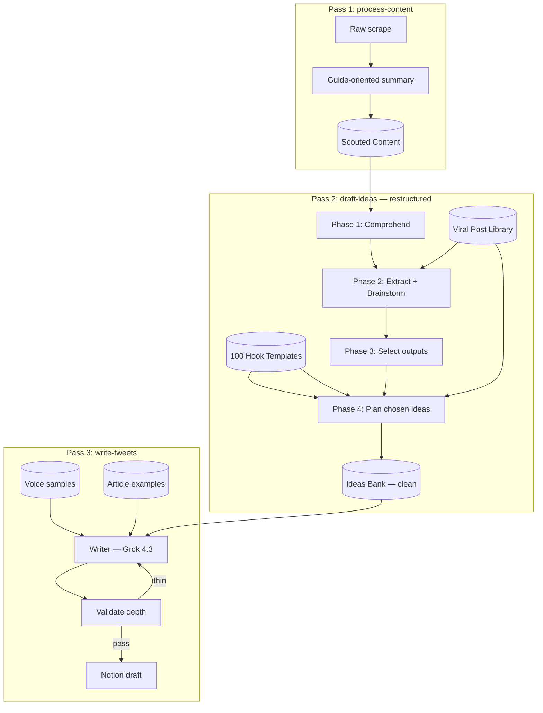

# Idea Scout v4 — Comprehension-First Implementation Plan

> **Supersedes:** Gemini's "Writer Depth Overhaul + LLM Switch + Notion Cleanup" plan  
> **Core insight:** The pipeline was form-filling (`ValueBrief` slot extraction), not studying content.  
> **New cognitive model:** Comprehend → Extract value bombs → Brainstorm formats → Plan → Write → Validate

---

## Executive Summary

The shallow output problem is not primarily a writer prompt problem. It is a **strategist architecture problem**:

1. Pass 1 (`process-content`) frames sources as "tweet ideas" before anyone studies them.
2. Pass 2 (`draft-ideas`) asks the model to fill ~20 JSON fields in one shot — compliance bias, not comprehension.
3. Pass 3 (`write-tweets`) receives thin briefs + short-tweet voice DNA + zero article examples.

**This plan restructures the strategist into three explicit phases**, keeps Gemini's valid fixes (LLM routing, Notion cleanup, format-specific writer DNA), and adds everything we identified as missing: audience/pain/value-bomb thinking, format-native brainstorming, resource role separation, and output validation.

---

## Decisions Locked (from our discussion)

| Decision | Choice | Rationale |
|----------|--------|-----------|
| 100 Hooks vs Viral Library | **Supplement** | Hooks = opener (lines 1–2). Viral Library = body skeleton + flow. Different layers, not competing. |
| Hooks storage | **Local JSON** (`src/data/viral-hook-templates.json`) | Already extracted (100/100). Fast, no Notion API overhead. |
| Article examples | **3 full articles, no truncation** | User requirement. Writer must see real depth/length. |
| LLM routing | **MiniMax M3** (strategist) + **Grok 4.3** (writer) via **TokenRouter** | Drop OpenRouter from Idea Scout pipeline. |
| Article length target | **1,500–3,000 words** minimum | Matches collected X article corpus. |
| Thread length target | **8–15 posts**, each with concrete source-backed value | Not filler intros. |
| Mid-length target | **15–25 lines**, one complete value bomb | |
| Primary output bias | **Valuable guides, threads, articles** over shorts | YT/IG depth should default up-format, not down-format. |

---

## Architecture: Before vs After

### Before (broken)

```
scrape → summarize-for-tweets → extract 20 JSON fields → pick format (char cap) → write
```

### After (comprehension-first)

```
scrape → summarize-for-guides
       → COMPREHEND (prose: what is it, who for, pain, value, teachable units)
       → EXTRACT (value bombs + publishable angles + format fit per unit)
       → BRAINSTORM (article / thread / mid / short products from same source)
       → SELECT (1–2 outputs to execute)
       → PLAN (structured brief + outline + hook + viral skeleton)
       → WRITE (format-specific DNA + examples)
       → VALIDATE (length/depth gate, retry if thin)
```



---

## Component 0: New Type System (`src/lib/content-intelligence.ts`)

Centralize all new schemas. Do not bolt onto `ValueBrief` alone — comprehension is a separate artifact.

### `SourceComprehension` (Phase 1 output — prose-first, JSON storage)

```typescript
interface TeachableUnit {
  unit: string;
  audienceRelevance: string;
  painItSolves: string;
  depthAvailable: "low" | "medium" | "high";
  sourceEvidence: string;
  formatFit: {
    article: "weak" | "moderate" | "strong";
    thread: "weak" | "moderate" | "strong";
    midLength: "weak" | "moderate" | "strong";
    short: "weak" | "moderate" | "strong";
  };
}

interface SourceComprehension {
  // What is this?
  contentAbout: string;
  creatorDoing: string;
  contentType: ContentArchetype;
  creatorIntent: string;
  narrativeArc: string;

  // Who is it for?
  sourceAudience: string;
  yourAudience: string;
  audienceOverlap: string;
  audienceSophistication: "beginner" | "intermediate" | "advanced";

  // Pain
  primaryPain: string;
  secondaryPains: string[];
  painEvidence: string[];
  costOfInaction: string;

  // Value
  coreValue: string;
  valueType: "workflow" | "framework" | "warning" | "tool-discovery" | "mindset-shift" | "case-proof" | "how-to-guide";
  readerOutcome: string;
  whyNow: string;

  // Depth inventory
  teachableUnits: TeachableUnit[];
  transcriptOnlyGems: string[];
  specificTools: string[];
  specificSteps: string[];
  specificMistakes: string[];
  specificProof: string[];
  unsupportedClaims: string[];
}

type ContentArchetype =
  | "workflow-walkthrough"
  | "tool-demo"
  | "tool-comparison"
  | "case-study"
  | "contrarian-essay"
  | "operator-principle"
  | "news-reaction"
  | "listicle"
  | "personal-story";
```

### `ValueBomb` + `BrainstormedOutput` (Phase 2 output)

```typescript
interface ValueBomb {
  insight: string;
  pain: string;
  mechanism: string;
  proof: string;
  bestFormat: ContentFormat;
  whyThisFormat: string;
  sourceEvidence: string[];
}

interface BrainstormedOutput {
  workingTitle: string;
  format: ContentFormat;
  angle: string;
  isPrimaryValueBomb: boolean;
  targetAudience: string;
  painAddressed: string;
  valueProposition: string;
  readerOutcome: string;
  hookDirection: string;
  sourceUnitsUsed: string[];
  transcriptGemsUsed: string[];
  estimatedDepth: string;
  priority: "🔥 Hot" | "💡 Good" | "📝 Maybe";
  rationale: string;
  formatFitScore: number; // 1-10, from teachable unit aggregation
}
```

### `ExecutionPlan` (Phase 4 output — replaces thin ValueBrief for writer)

Extends current `ValueBrief` with comprehension lineage:

```typescript
interface ExecutionPlan extends ValueBrief {
  // Lineage — writer can trace every claim
  comprehensionSummary: string;
  creatorDoing: string;
  contentArchetype: ContentArchetype;
  primaryValueBomb?: ValueBomb;

  // Planning
  detailedOutline: OutlineSection[];
  hookTemplate: string;           // from 100 hooks
  hookFilledExample: string;
  hookRationale: string;
  viralTemplateId?: string;       // required when viral templates available
  viralTweetStructure: string;    // from Viral Library — writer sees this
  viralWhyItWorks: string;        // strategist-only for selection; optional in writer

  // Quality
  minWordTarget: number;
  minSectionCount?: number;       // articles
  minPostCount?: number;          // threads
}

interface OutlineSection {
  heading: string;
  purpose: string;
  sourceUnits: string[];
  mustInclude: string[];
  targetWords?: number;
}
```

---

## Component 1: Fix Pass 1 — Guide-Oriented Scouting (`process-content.ts`)

**Problem:** Summary prompt says "for a Twitter creator looking for tweet ideas" — anchors everything to shorts.

### Changes

1. **Rewrite summary prompt** to extract guide-worthy material:
   - What is the creator doing?
   - Who is this for?
   - What's the core workflow/guide/argument?
   - List teachable units (not tweet bullets)
   - Transcript-only details the title/summary would miss

2. **Update summary JSON schema:**
   ```json
   {
     "summary": "...",
     "creatorDoing": "...",
     "contentType": "workflow-walkthrough | ...",
     "targetAudience": "...",
     "primaryPain": "...",
     "teachableUnits": ["...", "..."],
     "transcriptGems": ["...", "..."],
     "guidePotential": "low | medium | high",
     "keyTakeaways": "..."
   }
   ```

3. **Store new fields** in Scouted Content (new Notion properties or page body section `## Scout Analysis`).

4. **Keep** full transcript in page body toggle (already works).

---

## Component 2: Comprehension-First Strategist (`draft-ideas.ts`)

**This is the core restructure.** Replace single `generateValueBriefsForSource()` call with a phased pipeline.

### New file: `src/trigger/idea-scout/comprehend-source.ts`

Exported functions (testable in isolation):

| Function | Model | Temp | Output |
|----------|-------|------|--------|
| `comprehendSource()` | MiniMax M3 | 0.4 | `SourceComprehension` |
| `brainstormOutputs()` | MiniMax M3 | 0.5 | `BrainstormedOutput[]` |
| `planExecution()` | MiniMax M3 | 0.45 | `ExecutionPlan` |

### Phase 1 prompt: `comprehendSource`

**System:** You are a senior content strategist. Your job is to STUDY source material like a human who watched the full video/read the full transcript. Do NOT brainstorm tweet ideas yet. Do NOT fill generic slots. Describe what the creator is actually doing and what value exists for a builder/founder audience.

**User prompt structure (critical ordering):**
```
1. SOURCE METADATA (title, platform, URL, depth)
2. FULL TRANSCRIPT / SOURCE TEXT  ← FIRST, authoritative
3. SCOUT ANALYSIS (summary, teachable units from pass 1)  ← helper only, may be wrong
4. INSTRUCTION: If scout analysis contradicts transcript, transcript wins.
```

**Validation gate:** Reject comprehension if:
- `contentAbout` < 80 words
- `teachableUnits.length` < 2
- `transcriptOnlyGems.length` < 1 (for sources > 2000 chars)
- `creatorDoing` is generic ("explains a topic") — retry once with stricter prompt

### Phase 2 prompt: `brainstormOutputs`

**Input:** `SourceComprehension` + 8 viral library templates (packaging reference) + user content mission:

> Primary outputs: valuable **articles** (guides), **threads** (teachable sequences), **mid-length tweets** (one complete value bomb). Short tweets only when source has one punchy standalone insight.

**Output:** 2–5 `BrainstormedOutput` objects spanning **multiple formats** when source supports it. Must include:
- At least 1 `primaryValueBomb` candidate (usually mid-length or thread opener)
- Format recommendation with `formatFitScore` derived from teachable unit scores
- Explicit rationale per output

**Format selection rules (replace char-count-only logic):**

| Signal | Weight |
|--------|--------|
| Teachable units with `article: strong` count ≥ 3 | Strong article candidate |
| Teachable units with `thread: strong` count ≥ 5 | Strong thread candidate |
| `primaryValueBomb` with single mechanism + proof | Mid-length candidate |
| `rawSourceDepth` < 500 | Short only |
| YT/IG platform + `guidePotential: high` | Bias up (article/thread), never auto-downgrade to mid |
| X Article source text | Article candidate by default |

**Char-count caps become soft signals, not hard overrides.** Hard override only: `< 500 chars → Short only`.

### Phase 3: `selectOutputs`

Deterministic (no LLM):
- Pick 1–2 outputs per source (configurable)
- Priority: `🔥 Hot` first, then format diversity (don't pick 2 mid-length from same source if article is available)
- Default distribution target per YT/IG source: prefer 1 long-form (article or thread) + optionally 1 mid-length value bomb

### Phase 4 prompt: `planExecution`

**Input:** chosen `BrainstormedOutput` + `SourceComprehension` + matched viral template + matched hook template

**Must produce:**
- `detailedOutline` — section-by-section for articles, post-by-post for threads
- `hookTemplate` + `hookFilledExample` — from filtered 100 hooks (10–15 candidates pre-matched by pain/angle keywords)
- `viralTemplateId` + `viralTweetStructure` + `stealablePattern` — from Viral Library (required)
- All `mustUseDetails` traced to `transcriptGems` or `teachableUnits`
- `minWordTarget` / `minPostCount` per format

**Hook matching (`src/lib/hook-matcher.ts`):**
- Score 100 templates against `primaryPain` + `mechanism` + `contentType`
- Return top 12 to strategist prompt
- Strategist picks 1, fills example

**Viral template matching (enhance existing `getTemplatesForPillar`):**
- Filter by pillar category (existing)
- Prefer templates where `format` matches chosen output format
- Pass full `tweetStructure` + `whyItWorks` into plan (not just stealable pattern paraphrase)

### Source text ordering fix (`notion.ts`)

**Modify `buildSourceTextFromScoutedContentFields`:**
```
FULL TRANSCRIPT / SOURCE TEXT  ← first
---
SCOUT ANALYSIS (summary, creator doing, teachable units)  ← second
---
METADATA (title, platform, URL)
```

---

## Component 3: Writer Depth Overhaul (`voice-dna.ts` + `write-tweets.ts`)

### 3a. Format-specific Voice DNA

**Split `VOICE_DNA_PROMPT` into:**
- `VOICE_DNA_SHORT` — existing staccato rules (Short, Mid-length)
- `VOICE_DNA_LONG` — full paragraphs, 3–6 sentences, conversational guide tone (Article, Thread)

`buildWriterPrompt()` selects DNA by format. Article/Thread explicitly state:
> IGNORE short-tweet line constraints. Do NOT apply 6–12 words per line. Write full paragraphs.

### 3b. Deep format contracts (`getFormatInstructions`)

| Format | Contract highlights |
|--------|---------------------|
| **Article** | 1,500–3,000 words. Opening hook → problem → 5–8 titled sections → each section: mechanism + example + takeaway → actionable close. Markdown `##` / `###`. Guide tone, not tweet-with-headers. |
| **Thread** | 8–15 posts. `[n/m]` markers. Post 1 = hook. Posts 2–n = one teachable unit each with source proof. Final post = summary + reader action. No "thread incoming" filler. |
| **Mid-length** | 15–25 lines. ONE complete value bomb: pain → mechanism → proof → takeaway. |
| **Short** | Unchanged. 4–9 lines. |

### 3c. Voice mode × format interaction

Add mode-specific long-form guidance:

| Voice Mode | Article emphasis | Thread emphasis |
|------------|------------------|-----------------|
| Builder-Retrospective | First-person commentary on workflow, scar tissue | "I tried X" lessons per post |
| Tool-Curator | Spec-dense guide with → lists, pricing, setup | One tool feature/capability per post |
| Case-Study | Operator essay, lowercase openers, business mechanics | Principle per post, "bro" for emphasis only |

### 3d. Few-shot examples by format

| Format | Examples injected |
|--------|-------------------|
| Short / Mid | Existing `creator-voice-samples.json` (5 per mode) |
| Thread | Add 2–3 thread samples from voice samples (> `[1/` markers) — filter in `selectVoiceSamples` |
| Article | **3 full articles** from `src/data/article-examples.json` (parsed from `X-Creators-2026-All-Native-Articles-Full.md`, uncut) |

**Do NOT truncate article examples** (user requirement).

### 3e. Writer prompt enrichment

Writer receives `ExecutionPlan`, not thin `ValueBrief`:

```
COMPREHENSION CONTEXT (what this content is about, who it's for)
DETAILED OUTLINE (section/post level — follow this)
HOOK (template + filled example — line 1-2 MUST adapt this)
VIRAL STRUCTURE (tweetStructure from library — body flow)
MUST-USE DETAILS (from transcript gems)
DO NOT INVENT
FORMAT CONTRACT
VOICE DNA (format-appropriate)
FEW-SHOT EXAMPLES (format-appropriate)
FULL SOURCE TEXT (transcript first)
```

Writer does **not** receive all 100 hooks — only the 1 chosen hook.

### 3f. Output validation (`src/lib/draft-validator.ts`)

After generation, validate:

| Format | Pass criteria | On fail |
|--------|---------------|---------|
| Article | ≥ 1,200 words, ≥ 4 `##` sections, ≥ 3 source-specific details (tools/numbers/steps) | Retry once with "expand sections X, Y" |
| Thread | ≥ 8 numbered posts, each ≥ 2 sentences | Retry once |
| Mid-length | ≥ 12 lines, contains mechanism + proof | Retry once |
| Short | ≥ 4 lines | Retry once |

Log validation metrics to Trigger.dev for monitoring.

---

## Component 4: LLM Provider Switch (`llm.ts`)

### Changes

1. **Add `generateTextTokenRouter(model, ...)`** — uses `getTokenRouterClient()`, configurable model string.

2. **Model constants:**
   ```typescript
   export const MODELS = {
     STRATEGIST: "MiniMax-M3",
     WRITER: "grok-4.3",  // confirm exact TokenRouter model slug
   } as const;
   ```

3. **Strategist path:** All `comprehendSource`, `brainstormOutputs`, `planExecution` use `generateJSONFree` → MiniMax M3. Fallback: log error, skip source (do not silently fall back to OpenRouter for Idea Scout).

4. **Writer path:** `generateTextTokenRouter(MODELS.WRITER, ...)` with `timeout: 180_000`, `max_tokens` unset (model default).

5. **Deprecate OpenRouter** from `draft-ideas.ts` and `write-tweets.ts`. Keep OpenRouter client in `llm.ts` for other tasks (`research-tweets` fallback, scripts) until separately migrated.

6. **Env vars:**
   ```env
   TOKENROUTER_API_KEY=        # required for Idea Scout
   # OPENROUTER_API_KEY=       # optional, non-idea-scout only
   ```

7. **Verify TokenRouter Grok slug** before deploy — run `scripts/test-tokenrouter-grok.ts` (new).

---

## Component 5: Resource Integration

### 5a. 100 Hook Templates (supplement)

| Step | Usage |
|------|-------|
| `hook-matcher.ts` | Score/filter 100 templates → top 12 per source |
| `planExecution` | Pick 1, fill `hookFilledExample` |
| `write-tweets` | Inject chosen hook only |
| **Not used** | Viral library replacement, writer dump of all 100 |

**File:** `src/data/viral-hook-templates.json` ✅ exists (100/100)

### 5b. Viral Post Library (macro structure)

| Step | Usage |
|------|-------|
| `brainstormOutputs` | Reference patterns for format ideas |
| `planExecution` | **Require** `viralTemplateId` + pass `tweetStructure` to writer |
| `createIdea` | Set `Inspired By (Library)` relation |
| Ideas Bank | `Steal-able Pattern`, `Tweet Structure` properties |

**Enhancement:** If strategist omits `viralTemplateId`, pick best-match programmatically from pillar-filtered templates (don't proceed with generic fallback).

### 5c. Article Examples

**New:** `src/data/article-examples.json`

**Selection criteria (3 articles):**
1. One workflow/how-to guide (closest to YT pipeline content)
2. One tool breakdown / curator style
3. One operator essay / case study

**Source:** `X-Creators-2026-All-Native-Articles-Full.md` — full verbatim text per article.

**New script:** `scripts/build-article-examples.ts` — parses markdown, outputs JSON with `{ title, author, pillar, wordCount, text }`.

### 5d. No contradiction matrix

| Resource | Layer | When | Contradicts? |
|----------|-------|------|--------------|
| 100 hooks | Opener | Plan + Write (line 1–2) | No — micro |
| Viral `hookType` | Label | Library analytics only | No — taxonomy |
| `stealablePattern` | Skeleton | Plan + Write (body) | No — macro |
| `tweetStructure` | Flow | Plan + Write (body) | No — macro |
| `whyItWorks` | Psychology | Plan (selection) | No — meta |
| Voice samples | Tone | Write | No — style |
| Article examples | Depth | Write (Article only) | No — calibration |

---

## Component 6: Notion Output Cleanup (`draft-ideas.ts`)

### Ideas Bank page body — new structure

**Remove:**
- `Full ValueBrief JSON` dump
- Writer-internal fields from human view (`doNotInvent`, raw `mustUseDetails` arrays)

**Replace with readable sections:**

```markdown
## What This Source Is About
{comprehensionSummary / contentAbout}

## Who It's For
{yourAudience} — {primaryPain}

## Creator Is Doing
{creatorDoing}

## Value Bomb
{primaryValueBomb.insight} → {format}

## Chosen Output
{format} — {workingTitle}

## Outline
{detailedOutline as bullet list}

## Hook
{hookFilledExample}

## Packaging
Pattern: {stealablePattern}
Structure: {viralTweetStructure}

## Key Source Details
- {transcript gems as bullets}
```

**Properties unchanged:** Idea, Source, Category, Hook Angle, Format Idea, Steal-able Pattern, Tweet Structure, Priority, Inspired By relations.

---

## Component 7: Config & Distribution Targets

**New:** `src/lib/idea-scout-config.ts`

```typescript
export const IDEA_SCOUT_CONFIG = {
  outputsPerSource: 2,           // max ideas created per scouted item
  preferFormatDiversity: true,   // article + mid from same YT video OK
  minComprehensionWords: 80,
  minTeachableUnits: 2,
  formatDepthSoftThresholds: {
    article: 3000,   // chars — soft, not hard cap
    thread: 1500,
  },
  formatWordTargets: {
    article: { min: 1500, ideal: 2500 },
    thread: { minPosts: 8, idealPosts: 12 },
    midLength: { minLines: 15 },
  },
  platformFormatBias: {
    YouTube: ["Article", "Thread", "Mid-length"],
    Instagram: ["Thread", "Article", "Mid-length"],
    X: ["Mid-length", "Thread", "Short"],
  },
};
```

---

## File Change Summary

| File | Action | Component |
|------|--------|-----------|
| `src/lib/content-intelligence.ts` | **NEW** | Types for comprehension, brainstorm, execution plan |
| `src/lib/hook-matcher.ts` | **NEW** | Score/filter 100 hooks |
| `src/lib/draft-validator.ts` | **NEW** | Post-write depth validation |
| `src/lib/idea-scout-config.ts` | **NEW** | Distribution targets, thresholds |
| `src/trigger/idea-scout/comprehend-source.ts` | **NEW** | Phases 1–4 strategist logic |
| `src/trigger/idea-scout/draft-ideas.ts` | **MODIFY** | Orchestrate phases, clean Notion output |
| `src/trigger/idea-scout/process-content.ts` | **MODIFY** | Guide-oriented summary |
| `src/trigger/idea-scout/write-tweets.ts` | **MODIFY** | ExecutionPlan, validation, Grok via TokenRouter |
| `src/lib/voice-dna.ts` | **MODIFY** | Split DNA, deep format contracts, mode×format |
| `src/lib/llm.ts` | **MODIFY** | TokenRouter text gen, model constants |
| `src/lib/notion.ts` | **MODIFY** | Source text ordering, scout analysis fields |
| `src/data/article-examples.json` | **NEW** | 3 full articles |
| `src/data/viral-hook-templates.json` | **EXISTS** | No change |
| `scripts/build-article-examples.ts` | **NEW** | Parse articles MD → JSON |
| `scripts/test-tokenrouter-grok.ts` | **NEW** | Verify Grok 4.3 slug |
| `scripts/test-comprehension-pipeline.ts` | **NEW** | Local end-to-end comprehension test (no Notion) |
| `directives/idea-scout.md` | **MODIFY** | Document v4 architecture |
| `README.md` | **MODIFY** | LLM routing, new pipeline description |

---

## Implementation Order (PR stack)

Execute in this order — each PR is independently testable.

### PR 1: Foundation (types + config + data)
- `content-intelligence.ts`, `idea-scout-config.ts`, `hook-matcher.ts`
- `build-article-examples.ts` → `article-examples.json`
- `test-tokenrouter-grok.ts`

### PR 2: Pass 1 reframe
- `process-content.ts` guide-oriented summary
- `notion.ts` store scout analysis + source text reordering

### PR 3: Comprehension strategist (core)
- `comprehend-source.ts` — phases 1–4
- `draft-ideas.ts` — wire phases, remove old single-pass JSON
- `test-comprehension-pipeline.ts`

### PR 4: Writer depth
- `voice-dna.ts` — split DNA, format contracts, mode×format
- `write-tweets.ts` — ExecutionPlan, format-specific examples
- `draft-validator.ts`

### PR 5: LLM switch
- `llm.ts` — TokenRouter writer path
- Remove OpenRouter from idea-scout tasks
- Update env docs

### PR 6: Notion cleanup + directive
- `buildIdeaPageRawData` → human-readable comprehension layout
- `directives/idea-scout.md`, `README.md`

---

## What Gemini's plan got right (keep)

- ✅ Format-specific writer contracts
- ✅ Split short vs long voice DNA
- ✅ TokenRouter MiniMax + Grok routing
- ✅ Notion JSON dump removal
- ✅ `viral-hook-templates.json` (100 hooks)
- ✅ Full article examples (user corrected truncation)
- ✅ `detailedOutline` concept
- ✅ Relax depth thresholds (we go further — soft signals, not just lower numbers)

## What Gemini's plan missed (now included)

- ✅ Comprehension → brainstorm → plan as separate phases
- ✅ `contentAbout`, `creatorDoing`, audience, pain, value bombs
- ✅ Teachable units with per-format fit scoring
- ✅ Multi-format brainstorm from one source
- ✅ Pass 1 guide-oriented reframing
- ✅ Transcript-first source ordering
- ✅ Viral library `tweetStructure` passed to writer
- ✅ Hooks supplement (not replace) with clear roles
- ✅ Output validation / retry on thin drafts
- ✅ Voice mode × format interaction
- ✅ Platform format bias (YT/IG → article/thread default)
- ✅ Quality gates on comprehension (reject shallow study)
- ✅ Remove generic `normalizeValueBrief` fallbacks that mask shallow strategist output

---

## Verification Plan

### Automated

```bash
npx tsc --noEmit
npm test                                    # existing tests
npx tsx scripts/test-tokenrouter-grok.ts   # Grok 4.3 responds via TokenRouter
npx tsx scripts/test-comprehension-pipeline.ts  # comprehension → brainstorm on fixture
npx tsx scripts/build-article-examples.ts  # 3 articles, word counts logged
```

### Manual (post-deploy)

1. Trigger `scout-content` on a known rich YT workflow video.
2. In Trigger.dev logs, confirm:
   - `comprehendSource` → word count, teachable units ≥ 2
   - `brainstormOutputs` → multiple formats proposed
   - `planExecution` → `detailedOutline` with ≥ 5 sections for article
   - Writer → MiniMax not used; Grok 4.3 used
   - Validator → word/post counts logged
3. In Notion Ideas Bank, verify:
   - Page body readable (no JSON, no `\n\n` escapes)
   - Article draft ≥ 1,500 words with sections
   - Thread ≥ 8 posts with source-specific details
   - Mid-length is one complete value bomb
   - `Inspired By (Library)` relation populated
4. Regression: short X tweet source still produces Short format only.

### Success criteria

| Metric | Target |
|--------|--------|
| Article word count | ≥ 1,500 words in 80% of article-format outputs |
| Thread post count | ≥ 8 posts in 80% of thread outputs |
| Comprehension rejection rate | 10–30% of thin sources skipped (expected) |
| Notion page readability | Zero raw JSON blocks |
| Viral template linkage | ≥ 70% of ideas have Library relation |
| Source-specific details in draft | ≥ 3 per long-form output (manual spot check) |

---

## Risks & Mitigations

| Risk | Mitigation |
|------|------------|
| 3-phase strategist = 3× LLM calls per source | Acceptable cost on MiniMax free tier; batch only 1–2 outputs executed |
| Full article examples blow token budget | 3 articles only, Article format only; monitor Grok context |
| MiniMax comprehension quality | Validation gate + retry; fixture tests before deploy |
| TokenRouter Grok slug wrong | `test-tokenrouter-grok.ts` before PR 5 merge |
| Comprehension still shallow | Min word/unit gates; ban generic `creatorDoing` on retry |
| Too many ideas per run | `outputsPerSource: 2` cap |

---

## Open Items (confirm before PR 3)

1. **TokenRouter Grok 4.3 exact model slug** — run discovery script, confirm with API.
2. **Scout analysis Notion fields** — new properties vs page body section (recommend page body section first, no schema migration).
3. **Outputs per source** — default 2 (1 long-form + 1 value bomb). Adjust if too many ideas.

---

*Plan authored after comprehension-first design session. Ready for execution on approval.*