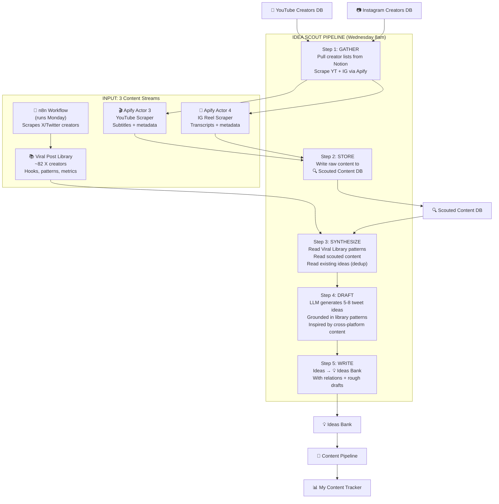
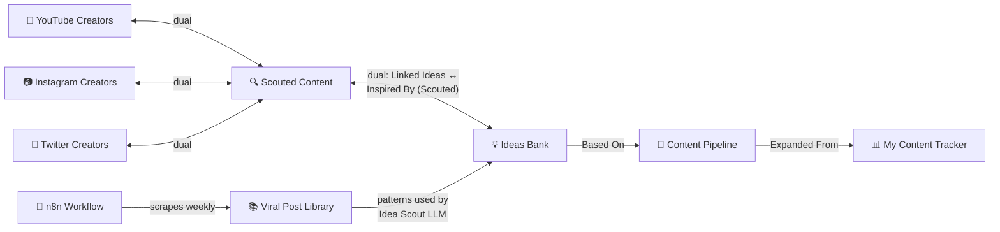

# 🔍 Idea Scout — System Design (v2)

> Scrapes content from X, YouTube, and Instagram creators → finds the best ideas → drafts tweet concepts. That's it.

---

## The Big Picture

You have **4 content sources** across **3 platforms**:

| Platform | Source | How content gets in |
|----------|--------|-------------------|
| **X/Twitter** | 📚 Viral Post Library | **n8n workflow** — scrapes ALL ~82 creators weekly, filters by 3k views + 10 bookmarks, populates library with hooks, patterns, engagement metrics |
| **X/Twitter** | 👤 Twitter Creators (Focus) | **Idea Scout scrapes** 48 focus creators directly via TwitterAPI.io — bypasses the viral score filter so strategically valuable tweets aren't lost |
| **YouTube** | 🎥 YouTube Creators | **Idea Scout scrapes** via Apify Actor 3 (subtitles/transcripts) |
| **Instagram** | 📷 Instagram Creators | **Idea Scout scrapes** via Apify Actor 4 (Reel transcripts) |

The Idea Scout is the **ONE agent** that pulls all four sources together, finds the best ideas, and drafts tweet concepts for you.

> [!NOTE]
> **Why scrape X twice?** n8n finds **what went viral** (top 100 by score). Idea Scout finds **what's strategically useful** from your 48 focus creators — even if it only got 500 views. Different purpose, complementary data.

**What's gone:**
- ~~Trend Scout~~ — replaced by Idea Scout
- ~~Creator Pulse~~ — was inside Trend Scout, no longer needed
- ~~Pattern Miner~~ — absorbed into Idea Scout

---

## Content Pillars & The Relevance Filter

### The 9 Active Pillars

| # | Pillar | What it covers |
|---|--------|---------------|
| 1 | **Automation** | n8n workflows, Make.com, AI agents, agentic pipelines |
| 2 | **AI Creative** | AI video/image generation, UGC, ad creative, faceless content |
| 3 | **AI Prompting & Tools** | Prompt engineering, tool tips, Claude/ChatGPT features, hidden settings |
| 4 | **Vibe Coding** | Cursor, Claude Code, Windsurf, shipping products with AI |
| 5 | **Web3** | Crypto, NFTs, Web3 x AI intersections |
| 6 | **Creator Economy** | X growth, monetization, audience building, digital products |
| 7 | **Copywriting & Storytelling** | Hooks, persuasion, narrative structure, sales copy |
| 8 | **Personal/Vulnerability** | Personal stories, lessons, behind-the-scenes |
| 9 | **Building in Public** | Shipping updates, revenue sharing, founder journey |

> [!NOTE]
> **Psychology** still exists in Notion (we didn't delete it to avoid breaking existing data). But the Idea Scout will **NOT** filter for it or generate ideas under it. It's frozen — any existing Psychology ideas stay, but no new ones get created.

### How the Relevance Filter Works

Every piece of content — whether it's a YouTube video, Instagram Reel, or Viral Library post — goes through the same filter before it becomes an idea.

**The filter prompt:**

```
You are a content relevance filter.

Here is a piece of content:
- Title: {title}
- Platform: {platform}
- Transcript/Content: {first 1500 chars of transcript}

Does this content relate to ANY of these 9 pillars?
1. Automation
2. AI Creative
3. AI Prompting & Tools
4. Vibe Coding
5. Web3
6. Creator Economy
7. Copywriting & Storytelling
8. Personal/Vulnerability
9. Building in Public

Respond with:
- "relevant": true/false
- "pillars": [which pillar(s) it maps to]
- "confidence": high/medium/low
- "reason": one-sentence explanation
```

**What happens per platform:**

| Platform | Input to Filter | What Gets Filtered OUT |
|----------|----------------|----------------------|
| **YouTube** | Video title + description + first 1,500 chars of transcript | A cooking tutorial, a gaming video, anything unrelated to the 9 pillars |
| **Instagram Reels** | Reel caption + first 1,500 chars of transcript | A gym reel, a travel vlog, lifestyle content with no overlap |
| **Viral Library (X)** | Already filtered by n8n — the library only contains relevant posts | Very rarely filtered out; but the LLM can skip weak patterns (low engagement + weak hook) |

**Example: PASS ✅**
```
Input: Fireship video — "I built an AI agent in 10 minutes"
Transcript: "...using Claude Code's agentic mode, I created a fully 
functional agent that handles file operations, testing..."

Result: relevant = true
        pillars = ["Vibe Coding", "Automation"]
        confidence = high
        reason = "Demonstrates AI-assisted coding with agentic tooling"
```

**Example: FAIL ❌**
```
Input: IG Reel — "My morning routine for productivity"
Transcript: "I wake up at 5am, cold plunge, journal for 20 minutes..."

Result: relevant = false
        pillars = []
        confidence = high  
        reason = "Generic productivity/lifestyle content, doesn't map 
                  to any technical or creator-focused pillar"
→ DISCARDED. No Scouted Content entry. No idea generated.
```

---

## How It All Works Together (Step by Step)

### The Weekly Cycle

```
Monday: n8n workflow runs → scrapes X creators → updates Viral Post Library
Wednesday: Idea Scout runs → scrapes YT + IG creators → reads Viral Library → drafts ideas
Throughout the week: You review Ideas Bank → develop ideas → move to Content Pipeline → post
```

### The Detailed Flow



---

## Step-by-Step Walkthrough

### Step 1: GATHER — Pull Creators + Scrape Content

**What happens:**

The Idea Scout wakes up Wednesday 8am. First, it needs to know WHO to watch.

```
1. Query 🎥 YouTube Creators DB
   → Filter: Status = "Active"
   → Sort: Last Checked ascending (oldest first = natural rotation)
   → Limit: 10 creators per run (~2 week rotation with 22 creators)
   → Example: Gets channels like @nateherk, @fireship, @aichrislee
   
2. Query 📷 Instagram Creators DB  
   → Filter: Status = "Active"
   → Sort: Last Checked ascending
   → Limit: 10 creators per run (~5 week rotation with 51 creators)
   → Example: Gets handles like @rourke, @thedankoe, @sabrina_ramonov

3. Query 👤 Twitter Creators DB
   → Filter: Status = "Active"
   → Sort: Last Checked ascending
   → Limit: 24 creators per run (~2 week rotation with 48 creators)
   → Example: Gets handles like @WorkflowWhisper, @gregisenberg, @mho_23

4. Scrape YouTube via Actor 3 (for each of the 10 YT creators):
   Input:
   {
     "startUrls": ["https://youtube.com/@nateherk"],
     "maxItems": 5,
     "getSubtitles": true,
     "getComments": false
   }
   
   Returns: video title, description, view count, likes, 
   publish date, subtitles/transcript, URL

5. Scrape Instagram Reels via Actor 4 (for each of the 10 IG creators):
   Input:
   {
     "username": ["rourke"],
     "resultsLimit": 5,
     "onlyPostsNewerThan": "1 week",
     "includeTranscript": true,
     "includeDownloadedVideo": false,
     "includeSharesCount": false
   }
   
   Returns: caption, hashtags, mentions, likes, views, comments,
   audio info, transcript, publish date, URL

6. Scrape X/Twitter via TwitterAPI.io (for each of the 24 X creators):
   Query: "from:{handle} -filter:replies -filter:retweets since:{7_days_ago}"
   → Up to 10 tweets per creator
   
   Returns: tweet text, likes, retweets, bookmarks, views,
   reply count, created date, URL
```

**End of Step 1:** You now have up to **~340 pieces of fresh content** (50 YT videos + 50 IG Reels + ~240 X tweets) with full transcripts/text.

---

### Step 2: STORE — Write Raw Content to Scouted Content

**What happens:**

For each piece of scraped content, the LLM does a quick relevance check (does this map to any of the 9 active Content Pillars?) and generates a summary.

```
For each content item:

1. AI Relevance Filter
   → LLM: "Does this video about 'Building an AI agent with Claude Code' 
            relate to any of these 9 pillars: Automation, AI Creative, 
            AI Prompting & Tools, Vibe Coding, Web3, Creator Economy, 
            Copywriting & Storytelling, Personal/Vulnerability, Building in Public"
   → If NO: skip, don't store
   → If YES: proceed

2. AI Summary Generation  
   → LLM reads the transcript + metadata
   → Generates: 
     - AI Summary (2-3 sentences, core insight)
     - Key Takeaways (3-5 actionable bullets)

3. Write to 🔍 Scouted Content DB:
   {
     Title: "Building an AI Agent in 10 Minutes with Claude Code",
     Platform: "YouTube",
     URL: "https://youtube.com/watch?v=xyz",
     Likes: 45200,
     Views: 892000,
     Comments: 1203,
     Published Date: "2026-05-19",
     Scouted Date: "2026-05-21",
     AI Summary: "Fireship demonstrates building a functional AI agent 
                  using Claude Code's agentic mode, completing in under 
                  10 minutes what traditionally required a full dev team...",
     Key Takeaways: "• Claude Code's agent loop handles file creation, 
                      testing, and iteration autonomously\n• The key is 
                      writing clear specs, not code...",
     Transcript: [first 2000 chars of video transcript],
     YouTube Creators: [relation → Fireship's page in YT Creators DB]
   }
```

**End of Step 2:** Scouted Content DB now has ~15-30 fresh entries (after relevance filtering removes irrelevant content). Each has a summary, takeaways, and transcript.

---

### Step 3: SYNTHESIZE — Cross-Reference Everything

This is where the three streams **converge**. The Idea Scout now has access to:

```
STREAM 1: 📚 Viral Post Library (X/Twitter — populated by n8n)
├── Top 15 posts rated ⭐⭐⭐⭐ and ⭐⭐⭐⭐⭐
├── Each with: Hook Type, Why It Works, Stealable Pattern, Tweet Structure
├── Real engagement metrics: views, bookmarks, likes, RTs
└── Purpose: PROVEN FORMATS — hooks, why it works, stealable pattern templates (basically a bible for X anatomy tweets)

STREAM 2: 🔍 Scouted Content (YouTube — just scraped)
├── 10-15 fresh videos from this week
├── Each with: AI Summary, Key Takeaways, Transcript
└── Purpose: LONG-FORM IDEAS — deep dives condensed into tweetable concepts

STREAM 3: 🔍 Scouted Content (Instagram Reels — just scraped)  
├── 10-15 fresh reels from this week
├── Each with: AI Summary, Key Takeaways, Transcript
└── Purpose: SHORT-FORM IDEAS — punchy angles and framings from visual-first creators

STREAM 4: 🔍 Scouted Content (X/Twitter — just scraped)
├── ~50-100 tweets from 24 focus creators (after relevance filter)
├── Each with: tweet text, engagement metrics, AI summary
└── Purpose: NICHE IDEAS — what focus creators are thinking about, basically content ideas from X creators
    (includes strategically valuable tweets regardless of engagement)

DEDUP LAYER: 💡 Ideas Bank (last 30 days of existing ideas)
├── List of idea titles already generated
└── Prevents the LLM from generating duplicates

BALANCE LAYER: 💡 Ideas Bank pillar distribution (last 14 days)
├── Counts ideas per Content Pillar
└── Identifies underserved pillars so the LLM can fill gaps
```

**The magic:** The LLM sees all three streams simultaneously. It can:
- Take Fireship's "AI agent in 10 mins" insight + Hormozi's "automate the boring stuff" angle + the "Config/Default Broken" hook from the Viral Library
- And draft: *"CRITICAL: if you're still hand-coding AI agents, you've been doing it wrong. Claude Code's agentic mode builds in 10 minutes what took my dev team 3 weeks. But here's what nobody tells you — automate the boring parts first..."*

**That's cross-platform synthesis.** One idea, three sources, one proven hook format.

---

### Step 4: DRAFT — LLM Generates Tweet Ideas

The LLM receives all three streams in a single prompt and generates **5-8 tweet ideas**.

**For EACH idea, the LLM outputs:**

| Field | What it is | Example |
|-------|-----------|---------|
| `idea` | Compelling title | "The $0 Technical Co-Founder" |
| `pillar` | Content Pillar | "Vibe Coding" |
| `hookAngle` | Specific hook approach | "Loss aversion — most people are paying $15k for what Claude Code does in 10 minutes for free" |
| `stealablePattern` | Adapted from a library pattern | "[Urgency/Alert] + [Cost Comparison] + [Step-by-Step Proof] + [Transformation]" |
| `tweetStructure` | Verbatim from the library pattern used | "Hook (Urgency) -> Problem (Cost) -> Solution (Tool) -> Benefits (Speed) -> Transformation" |
| `whyItWorks` | Psychological mechanism | "Utility Arbitrage — $0 vs $15,000 comparison triggers immediate FOMO" |
| `priority` | Urgency | "🔥 Hot" |
| `formatIdea` | Post format | "Thread" |
| `sourceContent` | Which scouted items inspired it | "Fireship YT: AI Agent in 10 min + Hormozi IG: Automate the boring stuff" |
| `tweetDraft` | Rough draft of the actual tweet | "CRITICAL: stop paying developers to build AI agents..." |

**Key rules the LLM follows:**
1. Every idea MUST be traceable to at least one scouted content item (YT or IG)
2. Every idea MUST use a stealable pattern from the Viral Library (X/Twitter)
3. The LLM does NOT invent new structures — it adapts proven ones
4. Ideas must NOT duplicate anything already in the Ideas Bank

**This is the core synthesis formula:**
```
FRESH INSIGHT (from YT/IG creators)  
    × PROVEN FORMAT (from Viral Library/X)  
    = TWEET IDEA (for your Ideas Bank)
```

---

### Step 5: WRITE — Save Ideas to the Ideas Bank

Each idea is written to the 💡 Ideas Bank with full metadata:

```
💡 Ideas Bank entry:
{
  Idea: "The $0 Technical Co-Founder",
  Source: "Idea Scout",                         ← new select option
  Category: ["Vibe Coding"],
  Hook Angle: "Loss aversion — $0 vs $15k...",
  Status: "💭 Raw",
  Priority: "🔥 Hot",
  Format Idea: "Thread",
  Steal-able Pattern: "[Urgency/Alert] + [Cost Comparison] + ...",
  Tweet Structure: "Hook (Urgency) -> Problem -> Solution -> ...",
  Inspired By (Scouted): [relation → Fireship's scouted content page],
  
  Page Body:
  ┌─────────────────────────────────────────────┐
  │ ## 🔍 Source Content                        │
  │ **Fireship** (YouTube): "AI Agent in 10 min"│
  │ > Claude Code's agentic mode builds in 10   │
  │ > minutes what took a dev team 3 weeks...   │
  │                                             │
  │ **Hormozi** (Instagram Reel): "Automate..."  │
  │ > Automate the boring stuff first, not the  │
  │ > creative stuff...                         │
  │                                             │
  │ ## ✍️ Rough Draft                           │
  │ CRITICAL: stop paying developers $15k to    │
  │ build AI agents.                            │
  │                                             │
  │ Claude Code's agentic mode built mine in    │
  │ exactly 10 minutes and 23 seconds.          │
  │ ...                                         │
  │                                             │
  │ ## 💡 Why It Works                          │
  │ Utility Arbitrage — $0 vs $15,000 triggers  │
  │ immediate FOMO without saying "FOMO"        │
  │                                             │
  │ ## 📐 Pattern Applied                       │
  │ Config/Default Broken hook (Viral Library    │
  │ post #47 — 7,380 bookmarks)                 │
  └─────────────────────────────────────────────┘
}
```

---

## The Complete Content Lifecycle

Here's how the entire system works **end to end**, with the Idea Scout at the center:

```
WEEK FLOW:

Monday
├── n8n workflow scrapes ALL ~82 X/Twitter creators
├── Updates Viral Post Library with top viral posts
└── Library now has fresh hooks, patterns, engagement data

Wednesday  
├── IDEA SCOUT runs
├── Step 1: Scrapes 10 YT + 10 IG (Apify) + 24 X (TwitterAPI.io)
├── Step 2: Stores in Scouted Content (with AI summaries)
├── Step 3: Reads Viral Library (proven patterns) + Scouted Content (YT/IG/X)
├── Step 4: LLM drafts 5-8 ideas (cross-platform synthesis)
└── Step 5: Writes to Ideas Bank with rough drafts + full lineage

Thursday-Sunday
├── YOU review Ideas Bank
├── Develop raw ideas → Status: "✏️ Developed"  
├── Move to Content Pipeline → Status: "📅 Scheduled"
└── Post on X → Status: "🚀 Posted"

Daily 10pm
├── PERFORMANCE TRACKER pulls your tweet metrics
├── Updates My Content Tracker with engagement scores
└── Flags Winners (🏆) for expansion

NEXT Monday
├── n8n refreshes the Viral Library with new data
├── YOUR winners from last week are now in My Content Tracker
├── The cycle continues — each week the library grows,
│   the patterns get stronger, and the ideas get sharper
```

---

## The Agent Landscape (Simplified)

```
┌──────────────────────────────────────────────────────┐
│                    CONTENT BRAIN                      │
├──────────────────────────────────────────────────────┤
│                                                      │
│  📥 INPUTS                                           │
│  ├── n8n workflow → Viral Post Library (X/Twitter)   │
│  ├── Apify Actor 3 → YouTube videos + subtitles      │
│  └── Apify Actor 4 → Instagram Reels + transcripts   │
│                                                      │
│  🤖 AGENTS                                           │
│  ├── IDEA SCOUT (Wed 8am)                            │
│  │   └── Scrape → Store → Synthesize → Draft → Write │
│  │                                                   │
│  ├── PERFORMANCE TRACKER (Daily 10pm)                │
│  │   └── Pull metrics → Score → Flag winners         │
│  │                                                   │
│  └── LIGHTER AGENTS (future)                         │
│      ├── Balance Checker (weekly ratio report)       │
│      └── The Reminder (un-expanded winners alert)    │
│                                                      │
│  📤 OUTPUTS                                          │
│  ├── 🔍 Scouted Content (raw cross-platform data)    │
│  ├── 💡 Ideas Bank (actionable tweet ideas)          │
│  ├── 📅 Content Pipeline (scheduled posts)           │
│  └── 📊 My Content Tracker (performance data)        │
│                                                      │
└──────────────────────────────────────────────────────┘
```

---

## Database Relations (Updated — No Trend Scout)



> [!NOTE]
> The `👤 Twitter Creators` ↔ `Scouted Content` relation is now **actively used** by the Idea Scout. When scouted X tweets are stored, they link back to the originating creator — just like YT and IG.

---

## Trigger.dev Task Registry (Updated)

| Task ID | Type | Schedule | Max Duration | Status |
|---------|------|----------|-------------|--------|
| `scout-content` | `schedules.task` | `0 8 * * 3` (Wed 8am) | 300s | **NEW** |
| `process-content` | `task` | on-demand (triggered by scout-content) | 180s | **NEW** |
| `draft-ideas` | `task` | on-demand (triggered after processing) | 180s | **NEW** |
| ~~`fetch-trends-daily`~~ | ~~schedules.task~~ | ~~daily 7am~~ | — | **REMOVED** |
| ~~`filter-and-generate-idea`~~ | ~~task~~ | — | — | **REMOVED** |
| ~~`mine-library-weekly`~~ | ~~schedules.task~~ | ~~Mon 9am~~ | — | **ABSORBED into Idea Scout** |
| ~~`generate-evergreen-idea`~~ | ~~task~~ | — | — | **ABSORBED into Idea Scout** |
| `pull-metrics` | `schedules.task` | `0 22 * * *` (daily 10pm) | 300s | Existing (Phase 2) |
| `update-scores` | `task` | on-demand | 120s | Existing (Phase 2) |

---

## Cost Estimate (Per Weekly Run)

| Item | Count | Cost |
|------|-------|------|
| YouTube scraper (Actor 3) | 10 creators × 5 videos = 50 events | ~$0.50–$2.50 |
| IG Reel scraper (Actor 4) base | 50 reels | ~$0.14 |
| IG Reel transcripts | ~38 min audio | ~$1.80 |
| X/Twitter (TwitterAPI.io) | 24 creator searches | ~$0.50 |
| LLM calls (Moonshot) | ~40 calls | ~40 Moonshot requests |
| Notion API | ~250 reads/writes | Free |
| **Weekly total** | | **~$5.00–$7.50** |
| **Monthly total** | | **~$20–$30** |

---

## Open Questions

> [!IMPORTANT]
> **1. New "Source" option:** Ideas Bank needs `"Idea Scout"` added to the Source select. Auto-add or manual?

> [!IMPORTANT]
> **2. Idea volume:** 5-8 ideas per weekly run — right amount? Too many means noise, too few means you're starving the pipeline.

> [!IMPORTANT]
> **3. Rough drafts:** The Idea Scout produces a rough tweet draft in the page body. Comfortable with this, or stop at hook angles + patterns only?

> [!IMPORTANT]  
> **4. Creator lists:** ✅ RESOLVED — 22 YouTube, 51 Instagram, 48 X/Twitter (focus) creators identified. Ready to populate.

> [!IMPORTANT]
> **5. n8n timing:** The plan assumes n8n runs Monday and Idea Scout runs Wednesday. What day does your n8n workflow actually run?

---

## Proposed File Structure

```
src/trigger/
  idea-scout/                      ← NEW (replaces trend-scout/ + pattern-miner/)
    scout-content.ts               ← Orchestrator: weekly cron, scrapes YT + IG
    process-content.ts             ← Processor: filters, summarizes, writes to Scouted Content
    draft-ideas.ts                 ← Processor: synthesizes all 3 streams, drafts ideas

src/lib/
    apify.ts                       ← MODIFY: add scrapeYouTube() + scrapeReels()
    notion.ts                      ← MODIFY: add createScoutedContent(), getScoutedBatch()
    constants.ts                   ← MODIFY: add YT/IG/Scouted Content DB + DS IDs
    llm.ts                         ← MODIFY: update system prompt for cross-platform synthesis

DELETE (after migration):
    src/trigger/trend-scout/       ← entire folder
    src/trigger/pattern-miner/     ← entire folder
    src/lib/hackernews.ts          ← no longer needed
    src/lib/web-search.ts          ← no longer needed (was for Serper)
    src/lib/creators.ts            ← absorbed into idea-scout
```

---

## Verification Plan

### Automated Tests
1. `npx tsc --noEmit` — TypeScript compiles clean
2. Trigger `scout-content` manually → verify Apify scrapers return data
3. Check Scouted Content DB → entries with AI summaries, transcripts, correct relations
4. Check Ideas Bank → entries with `Source: "Idea Scout"`, Stealable Pattern, rough drafts
5. Run twice → verify idempotency (no duplicates)

### Manual Verification
1. Trace one idea: Creator → Scouted Content → Idea → verify the lineage is clear
2. Check rough draft quality — does it sound like your voice?
3. Check pattern application — is the stealable pattern actually adapted, not generic?
4. Verify the Viral Library patterns are being used (not invented)
