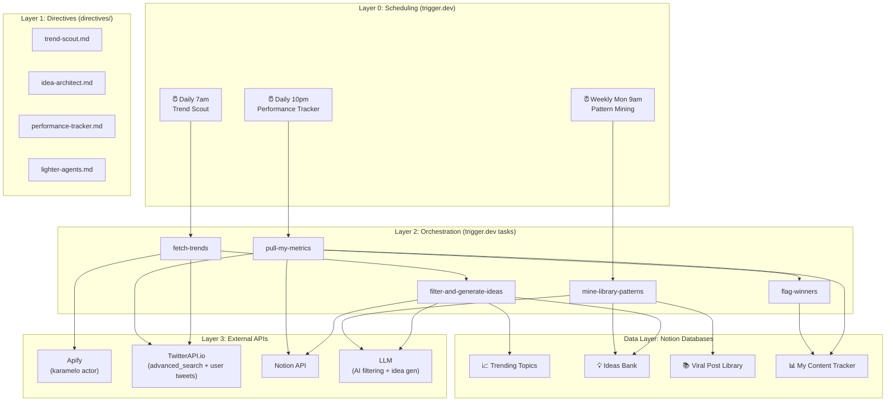

# 🏗️ Ultimate Creator Brain — Full System Design

> The complete automation architecture for turning the Creator Brain Notion workspace into a self-running content flywheel.

---

## Goal

Automate the "Ultimate Creator Brain" content lifecycle — from trend discovery to idea generation to performance tracking — using **trigger.dev** as the scheduling/orchestration engine, **TypeScript tasks** as the execution layer, and **Notion + external APIs** as the data layer.

---

## System Architecture



---

## The Agents

### Agent 1: Trend Scout + Idea Architect (Combined Pipeline)

**Purpose:** Discover trending topics relevant to your pillars, then immediately generate actionable content ideas — not just log trends.

**Two input streams, two outputs:**

| Stream | Trigger | Source | Process | Output |
|--------|---------|--------|---------|--------|
| **A: Trend-Driven** | Daily cron (7am) | Apify (global trends) + TwitterAPI.io (niche keyword search) | Filter by 10 Content Pillars → cross-match with Viral Library patterns → generate ideas with hooks | → Trending Topics DB + Ideas Bank |
| **B: Pattern-Driven** | Weekly cron (Mon 9am) | Viral Post Library (⭐⭐⭐⭐+ rated posts) | Find recurring patterns across creators → generate evergreen content ideas | → Ideas Bank |

**Trigger.dev Task Structure (Orchestrator + Processor pattern):**

```
src/trigger/
  trend-scout/
    fetch-trends.ts          ← Cron: pulls from Apify + TwitterAPI.io
    filter-and-generate.ts   ← Processor: filters by pillar, generates idea, writes to Notion
  pattern-miner/
    mine-library.ts          ← Cron: queries Viral Library for high-performers
    generate-evergreen.ts    ← Processor: generates ideas from library patterns
```

**Data flow:**
1. `fetch-trends` (scheduled) → pulls raw trends → dispatches each to `filter-and-generate` with idempotency key
2. `filter-and-generate` (per-trend) → AI checks if trend matches any pillar → if yes, queries Viral Library for related patterns → generates idea + hook angle → writes to Trending Topics DB AND Ideas Bank
3. `mine-library` (scheduled) → queries Viral Library for ⭐⭐⭐⭐+ posts not yet mined → dispatches to `generate-evergreen`
4. `generate-evergreen` (per-pattern) → generates evergreen content idea → writes to Ideas Bank with Source = "Library Pattern"

**APIs used:**
- Apify (`karamelo/twitter-trends-scraper`) — global trending, 8 time periods, $0.39/1K
- TwitterAPI.io `GET /twitter/tweet/advanced_search` — niche keyword search within pillars
- Notion API — read Viral Library, write to Trending Topics + Ideas Bank
- LLM (OpenAI/Anthropic) — filter relevance, generate ideas and hooks

---

### Agent 2: Performance Tracker

**Purpose:** Close the feedback loop. Pull YOUR tweet metrics automatically, calculate Performance Score, and flag Winners.

**Trigger:** Daily cron (10pm — gives the day's tweets time to accumulate engagement)

**Task Structure:**

```
src/trigger/
  performance-tracker/
    pull-metrics.ts           ← Cron: fetches your recent tweets from TwitterAPI.io
    update-scores.ts          ← Processor: calculates Performance Score, flags Winners
```

**Data flow:**
1. `pull-metrics` (scheduled) → calls TwitterAPI.io `GET /twitter/user/last_tweets` for your account → for each tweet, dispatches to `update-scores`
2. `update-scores` (per-tweet) → calculates Performance Score using the formula from the Notion manual → updates My Content Tracker → if score exceeds Winner threshold, sets Status = "🏆 Winner" and Expand status = "⬜ Not Started"

**Performance Score formula** (from the manual):
```
Score = (Likes × 1) + (Retweets × 3) + (Replies × 2) + (Bookmarks × 5) + (Views × 0.01)
```

**APIs used:**
- TwitterAPI.io `GET /twitter/user/last_tweets` — your own tweets + metrics
- Notion API — read Content Pipeline (to match tweets), write to My Content Tracker

---

### Agent 3: Lighter Agents (Post-Phase 2)

These are simpler scheduled tasks, quick to build once the core infrastructure is in place:

| Agent | Trigger | Logic | Output |
|-------|---------|-------|--------|
| **Balance Checker** | Weekly (Sun 6pm) | Query Content Pipeline for the last 7 days, count Proven vs Experiment posts, calculate ratio | Notification report (console log / email / Notion note) |
| **The Reminder** | Weekly (Wed 9am) | Query My Content Tracker for Winners where Expand = "⬜ Not Started" for 7+ days | Notification listing un-expanded winners |

---

### Agent 4: The Drafter (Future — Needs Discussion)

**Purpose:** Take an idea from Ideas Bank, follow its Viral Library lineage, and auto-generate hook variations for you to choose from.

> [!IMPORTANT]
> This agent requires deeper design discussion. Key questions:
> - How much AI involvement is acceptable in the writing process?
> - Should it generate full draft tweets, or just hook options + structure outlines?
> - What's the human review step before anything moves to Content Pipeline?
>
> **Parked for post-Phase 2 discussion.**

---

## Tech Stack

| Layer | Tool | Purpose |
|-------|------|---------|
| **Scheduling** | trigger.dev (v4 SDK) | Cron jobs, retries, orchestration, observability |
| **Code** | TypeScript (tasks in `src/trigger/`) | All execution logic |
| **Deployment** | GitHub → trigger.dev auto-sync | Push to master = auto-deploy to production |
| **APIs** | Apify, TwitterAPI.io, Notion API, LLM | Data sources and sinks |
| **Dev environment** | Local trigger.dev worker (`npm run dev`) | Test tasks before deploying |
| **Secrets** | [.env](file:///c:/Users/Dreys/OneDrive/Documents/Antigravity%20workspace/Agentic%20Workflows/.env) + trigger.dev dashboard env vars | API keys never committed |
| **MCP** | trigger.dev MCP server ([mcp.json](file:///c:/Users/Dreys/OneDrive/Documents/Antigravity%20workspace/Agentic%20Workflows/mcp.json)) | AI IDE can test runs directly |

---

## Environment Variables Required

```env
# Trigger.dev
TRIGGER_SECRET_KEY=tr_dev_...
TRIGGER_STAGING_KEY=tr_dev_...
TRIGGER_PROJECT_ID=proj_...

# Apify
APIFY_TOKEN=apify_api_...

# TwitterAPI.io
TWITTER_API_KEY=...

# Notion
NOTION_API_KEY=ntn_...

# LLM (Kimi K2.5 via Moonshot API)
MOONSHOT_API_KEY=...
MOONSHOT_BASE_URL=https://api.moonshot.cn/v1
MOONSHOT_MODEL=kimi-k2.5

# Your Twitter handle (for Performance Tracker)
MY_TWITTER_HANDLE=...
```

---

## Project Structure

```
Agentic Workflows/
├── .env                          # Secrets (never committed)
├── .gitignore                    # Excludes .env, node_modules, .tmp/
├── AGENTS.md                     # 3-layer architecture methodology
├── mcp.json                      # Trigger.dev MCP server config
├── trigger-ref.md                # SDK v4 API reference (for AI context)
├── package.json                  # [NEW] Node.js project (trigger.dev SDK + deps)
├── tsconfig.json                 # [NEW] TypeScript config
│
├── directives/                   # Layer 1: SOPs
│   ├── trend-scout.md            # [NEW] Trend Scout + Idea Architect directive
│   ├── performance-tracker.md    # [NEW] Performance Tracker directive
│   └── lighter-agents.md         # [NEW] Balance Checker + Reminder directive
│
├── src/trigger/                  # Layer 3: Trigger.dev tasks (TypeScript)
│   ├── trend-scout/
│   │   ├── fetch-trends.ts       # [NEW] Orchestrator: daily trend fetch
│   │   └── filter-and-generate.ts # [NEW] Processor: filter + idea gen + Notion write
│   ├── pattern-miner/
│   │   ├── mine-library.ts       # [NEW] Orchestrator: weekly library scan
│   │   └── generate-evergreen.ts # [NEW] Processor: evergreen idea gen
│   └── performance-tracker/
│       ├── pull-metrics.ts       # [NEW] Orchestrator: daily metric pull
│       └── update-scores.ts      # [NEW] Processor: score calc + winner flagging
│
├── lib/                           # [NEW] Shared utilities
│   ├── notion.ts                 # Notion API helper (read/write databases)
│   ├── twitter.ts                # TwitterAPI.io helper
│   ├── apify.ts                  # Apify actor trigger helper
│   ├── llm.ts                    # LLM abstraction (OpenAI/Anthropic)
│   └── constants.ts              # Content Pillars, DB IDs, thresholds
│
├── Notion Knowledge/             # Reference docs (unchanged)
├── Apify actors/                 # Actor reference docs (unchanged)
└── .tmp/                         # Intermediate files
```

---

## Notion Database IDs (From Live MCP Mapping)

These IDs will be stored in `lib/constants.ts`:

| Database | ID |
|----------|----|
| Viral Post Library | `1baa4476-9b5e-8038-b785-ef7a39d7e927` |
| Ideas Bank | `1baa4476-9b5e-80fa-97a2-dd2a1f66b8fe` |
| Content Pipeline | `1baa4476-9b5e-805f-a0e0-dbb0f22ff891` |
| My Content Tracker | `1baa4476-9b5e-800d-81c2-d72530dba2b6` |
| Creators | `1baa4476-9b5e-80cf-9cb1-d1a10e29cec7` |
| Trending Topics | `1baa4476-9b5e-806f-a4b1-fc27e4b7f7f9` |

---

## Phased Build Plan

### Phase 1: Foundation + Trend Scout/Idea Architect
1. Initialize trigger.dev project (`package.json`, `tsconfig.json`, SDK install)
2. Set up shared `lib/` utilities (Notion, TwitterAPI.io, Apify, LLM helpers)
3. Write `directives/trend-scout.md` directive
4. Build `fetch-trends.ts` orchestrator (cron daily)
5. Build `filter-and-generate.ts` processor (filter by pillar, generate idea, write to Notion)
6. Build `mine-library.ts` + `generate-evergreen.ts` (weekly pattern mining)
7. Test in trigger.dev dev environment
8. Deploy to production via GitHub

### Phase 2: Performance Tracker
1. Write `directives/performance-tracker.md` directive
2. Build `pull-metrics.ts` orchestrator (cron daily)
3. Build `update-scores.ts` processor (Performance Score formula, Winner flagging)
4. Test → deploy

### Phase 3: Lighter Agents
1. Build Balance Checker (single scheduled task, weekly ratio report)
2. Build The Reminder (single scheduled task, weekly un-expanded Winners check)
3. Test → deploy

### Phase 4: The Drafter (Requires Discussion)
1. Design session on AI writing boundaries
2. Build draft generation pipeline
3. Human review integration

---

## Verification Plan

### Automated Testing
- **Trigger.dev dev environment:** Each task can be tested locally via `npm run dev` before deploying
- **Trigger.dev MCP:** Use the MCP server to trigger test runs directly from the IDE
- **Idempotency checks:** Run tasks twice with the same data → verify no duplicates in Notion

### Manual Verification
1. **After Phase 1 deploy:**
   - Check trigger.dev dashboard → confirm `fetch-trends` cron is registered and fires
   - Check Notion Trending Topics DB → verify new trend entries appear
   - Check Notion Ideas Bank → verify new ideas are generated with correct Source tags
   - Run the pattern miner manually → verify it reads from Viral Library and generates evergreen ideas

2. **After Phase 2 deploy:**
   - Post a test tweet → wait for cron to fire
   - Check My Content Tracker → verify the tweet appears with correct Performance Score
   - Manually verify the score calculation against the formula

3. **After Phase 3 deploy:**
   - Check Balance Checker output → verify the 30/70 ratio is calculated correctly
   - Add a Winner with Expand = "⬜ Not Started" → verify The Reminder surfaces it

---

## User Review Required

> [!IMPORTANT]
> **Trigger.dev account:** You'll need a trigger.dev account with a project created. Do you already have one, or should we set this up first?

> [!IMPORTANT]
> **LLM choice:** ✅ Using Kimi K2.5 via Moonshot API ($15 credits available). OpenAI-compatible SDK.

> [!IMPORTANT]
> **Your Twitter handle:** The Performance Tracker needs your Twitter username to pull your tweets. Please confirm.

> [!WARNING]
> **Apify account:** The Apify karamelo actor costs $0.39/1K results. Do you have an Apify account with credits, or should we set this up?
