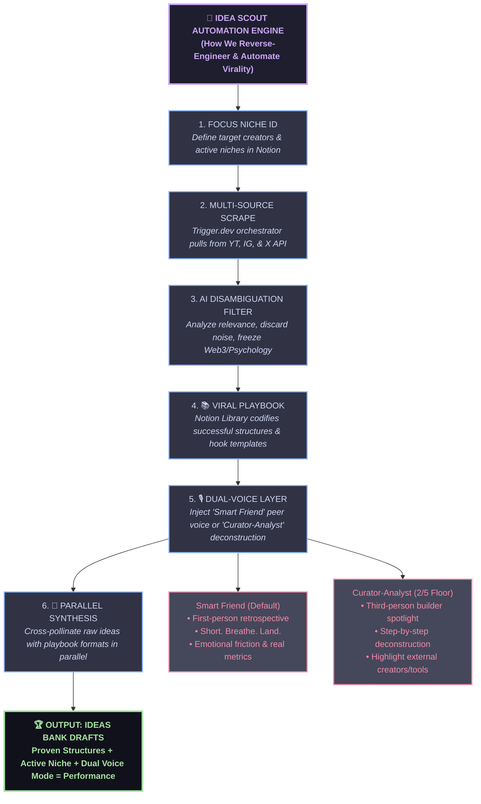

# 🧠 Idea Scout — Automated Virality Engine

This document outlines the visual architecture of the automated content system we have built, tailored to your exact Trigger.dev, Notion, and OpenRouter stack.

## 📊 Tailored System Architecture

Below is the Mermaid representation of the pipeline. If you copy this code block, you can import it directly into **Excalidraw** using their `Insert -> Mermaid` tool to generate an instantly editable and styled diagram!

---

## ⚙️ How the 6 Steps Map to Our Codebase

### 1. Focus Niche ID
* **Notion Database:** `Focus Creators`
* **Tailored Mapping:** Instead of generic target handles, your system groups creators into active content pillars (niches). Outdated niches (like **Web3** and **Psychology**) are automatically filtered out during active runs.

### 2. Multi-Source Scrape
* **Scraper Engine:** Trigger.dev Orchestrator (`scout-content.ts`)
* **Tailored Mapping:** 
  * **YouTube:** Sequential creator scraping + transcript mapper in `src/lib/apify.ts`.
  * **Instagram:** official Reel scraper pulling the top 5 freshest + 5 most viral Reels.
  * **X (Twitter):** High-speed direct search REST API (`twitterapi.io`) running a throttled 5.5s loop to stay under rate limits.

### 3. AI Disambiguation Filter
* **Filtering Pipeline:** `process-content.ts`
* **Tailored Mapping:** An active LLM evaluates confidence scores ($\ge 0.6$) and eliminates common keyword collisions (e.g. discarding athlete/driver name overlaps and focusing exclusively on tech, vibe coding, automation, and builder topics).

### 4. 📚 Viral Playbook
* **Notion Database:** `📚 Viral Post Library`
* **Tailored Mapping:** Codifies real high-performing structures, ratings ($4\star$ and $5\star$), hook categories, and steal-able layouts derived from our manual research pipeline.

### 5. 🎙️ Dual-Voice Layer
* **Prompt Framework:** `src/lib/llm.ts` & `src/trigger/idea-scout/draft-ideas.ts`
* **Tailored Mapping:**
  * **Smart Friend (Default):** First-person retrospect, "Short. Breathe. Land." spacing, and concrete metric formatting ($65,897 over "$65k").
  * **Curator-Analyst (Floor of 2/5):** Third-person builder breakdowns that dissect exactly *how* a successful tool was built or a milestone was hit.

### 6. Parallel Synthesis
* **Creative Runner:** `draft-ideas.ts`
* **Tailored Mapping:** Groups scouted raw posts, pulls matching playbook templates, fires parallel OpenRouter prompts chunked to a concurrency of 3, normalizes output JSON using our custom `repairJson()` helper, and writes drafts cleanly to your Notion Ideas Bank with a throttled 350ms delay.
