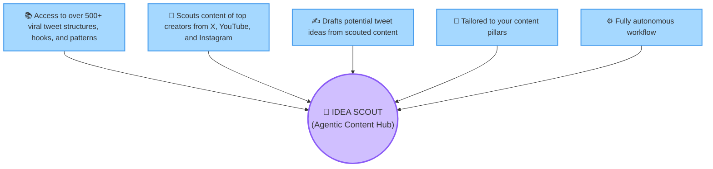

# 🧠 Idea Scout — Core Feature & Value Map

This document outlines the user-facing feature map for the **Idea Scout** agentic workspace.

*   **Interactive Excalidraw Diagrams**:
    *   🔵 [Circle Features Version](https://excalidraw.com/#json=Au20X6e1JTVNxwsR712ZY,cGYoez5njXerUwcJuSoU-w) 
    *   ⬜ [Rectangle Features Version](https://excalidraw.com/#json=R_wmTfjZZwW4SBD8_gxaj,7rnQ8w-FECXdNaHO7PhnNA) (Fully updated with spacious 300x150 rounded rectangles and comfortable arrow spacing)

Open the **Markdown Preview** in your IDE to see the Mermaid diagram version.

---

## 🌟 Diagram Layout (5-Spoke Pentagonal Star)

